# Exception Handling

---

## Why Exception Handling?

Traditional error handling approaches:
- Return codes (error-prone, ignored)
- Global error variables (not thread-safe)
- Assertions (debug-only)
- Callbacks (complex control flow)

**Exceptions provide:**
- Automatic error propagation
- Separation of error handling from normal logic
- Type-safe error information
- Stack unwinding with cleanup

---

## Exception Handling Fundamentals

```cpp
#include <stdexcept>
#include <iostream>

void riskyOperation() {
    throw std::runtime_error("Something went wrong!");
}

int main() {
    try {
        riskyOperation();
        std::cout << "This won't be printed\n";
    }
    catch (const std::exception& e) {
        std::cout << "Caught exception: " << e.what() << '\n';
    }
    return 0;
}
```

---

## Exception Flow Control



---

## Classifying Exceptions

**By Recoverability:**
- **Recoverable**: Network timeout, file not found
- **Programming errors**: Null pointer, array bounds
- **System failures**: Out of memory, hardware failure

**By Source:**
- **Standard library exceptions**
- **User-defined exceptions**
- **System exceptions**

---

## The Standard Exception Hierarchy


---

## Standard Exception Types

```cpp
#include <stdexcept>

// Logic errors (programming bugs)
throw std::invalid_argument("Invalid parameter value");
throw std::out_of_range("Index out of bounds");
throw std::logic_error("Logic error occurred");

// Runtime errors (external conditions)
throw std::runtime_error("Runtime error occurred");
throw std::overflow_error("Arithmetic overflow");
throw std::underflow_error("Arithmetic underflow");

// System errors
throw std::system_error(errno, std::system_category());
```

---

## Catching Exceptions

```cpp
void demonstrateCatching() {
    try {
        // Code that might throw
        riskyOperation();
    }
    catch (const std::invalid_argument& e) {
        // Handle specific exception
        std::cerr << "Invalid argument: " << e.what() << '\n';
    }
    catch (const std::runtime_error& e) {
        // Handle runtime errors
        std::cerr << "Runtime error: " << e.what() << '\n';
    }
    catch (const std::exception& e) {
        // Handle any standard exception
        std::cerr << "Standard exception: " << e.what() << '\n';
    }
    catch (...) {
        // Handle any exception
        std::cerr << "Unknown exception caught\n";
    }
}
```

---

## Exception Matching Rules

1. **Exact match** first
1. **Base class match** (inheritance hierarchy)
1. **Ellipsis catch** (`...`) matches anything
1. **First match wins** - order matters!

```cpp
try {
    throw std::invalid_argument("test");
}
catch (const std::exception& e) {    // This catches it
    // Handle base class
}
catch (const std::invalid_argument& e) {  // Never reached!
    // Handle derived class
}
```

---

## Throwing Exceptions

```cpp
class BankAccount {
private:
    double balance;

public:
    void withdraw(double amount) {
        // Input validation
        if (amount < 0) {
            throw std::invalid_argument("Negative withdrawal amount");
        }

        // Business logic validation
        if (amount > balance) {
            throw std::runtime_error("Insufficient funds");
        }

        balance -= amount;
    }
};
```

---

## Custom Exception Classes

```cpp
class InsufficientFundsException : public std::runtime_error {
private:
    double requested;
    double available;

public:
    InsufficientFundsException(double req, double avail)
        : std::runtime_error("Insufficient funds")
        , requested(req), available(avail) {}

    double getRequested() const { return requested; }
    double getAvailable() const { return available; }

    const char* what() const noexcept override {
        static std::string msg = "Insufficient funds: requested " +
                                std::to_string(requested) +
                                ", available " + std::to_string(available);
        return msg.c_str();
    }
};
```

---

## Exception Safety Levels


---

## Basic Exception Safety

```cpp
class Vector {
private:
    int* data;
    size_t size;
    size_t capacity;

public:
    void push_back(int value) {
        if (size == capacity) {
            // Basic safety: no resource leaks
            int* newData = new int[capacity * 2];

            // Copy existing elements
            for (size_t i = 0; i < size; ++i) {
                newData[i] = data[i];
            }

            delete[] data;
            data = newData;
            capacity *= 2;
        }

        data[size++] = value;
    }
};
```

---

## Strong Exception Safety

```cpp
class Vector {
public:
    void push_back(int value) {
        if (size == capacity) {
            // Strong safety: all-or-nothing
            int* newData = new int[capacity * 2];

            try {
                // Copy all elements
                for (size_t i = 0; i < size; ++i) {
                    newData[i] = data[i];
                }

                // Only commit if everything succeeded
                delete[] data;
                data = newData;
                capacity *= 2;
            }
            catch (...) {
                delete[] newData;  // Clean up on failure
                throw;             // Re-throw
            }
        }

        data[size++] = value;
    }
};
```

---

## Resource Acquisition Is Initialization (RAII)

```cpp
class FileManager {
private:
    std::FILE* file;

public:
    FileManager(const char* filename)
        : file(std::fopen(filename, "r")) {
        if (!file) {
            throw std::runtime_error("Failed to open file");
        }
    }

    ~FileManager() {
        if (file) {
            std::fclose(file);
        }
    }

    // Non-copyable
    FileManager(const FileManager&) = delete;
    FileManager& operator=(const FileManager&) = delete;
};
```

---

## RAII with Multiple Resources

```cpp
class DatabaseConnection {
private:
    Connection* conn;
    Transaction* trans;

public:
    DatabaseConnection(const std::string& connectionString)
        : conn(nullptr), trans(nullptr) {

        conn = new Connection(connectionString);
        try {
            trans = new Transaction(*conn);
        }
        catch (...) {
            delete conn;  // Clean up if second allocation fails
            throw;
        }
    }

    ~DatabaseConnection() {
        delete trans;
        delete conn;
    }
};
```

---

## Modern RAII with Smart Pointers

```cpp
class ModernDatabaseConnection {
private:
    std::unique_ptr<Connection> conn;
    std::unique_ptr<Transaction> trans;

public:
    ModernDatabaseConnection(const std::string& connectionString) {
        conn = std::make_unique<Connection>(connectionString);
        trans = std::make_unique<Transaction>(*conn);
        // Automatic cleanup on exception!
    }

    // Compiler-generated destructor is perfect
};
```

---

## Stack Unwinding

```cpp
class Resource {
public:
    Resource(const std::string& name) : name(name) {
        std::cout << "Acquiring " << name << '\n';
    }

    ~Resource() {
        std::cout << "Releasing " << name << '\n';
    }

private:
    std::string name;
};

void demonstrateUnwinding() {
    Resource r1("Resource1");
    Resource r2("Resource2");

    throw std::runtime_error("Something went wrong!");

    // r2 and r1 destructors called automatically
}
```

---

## Exceptions and Constructors

```cpp
class CompositeResource {
private:
    std::unique_ptr<ResourceA> resA;
    std::unique_ptr<ResourceB> resB;
    std::unique_ptr<ResourceC> resC;

public:
    CompositeResource() {
        resA = std::make_unique<ResourceA>();
        resB = std::make_unique<ResourceB>();  // If this throws,
        resC = std::make_unique<ResourceC>();  // resA is cleaned up
    }

    // If constructor throws, destructor is NOT called
    // But member destructors ARE called for initialized members
};
```

---

## Constructor Exception Safety

```cpp
class SafeComposite {
private:
    std::unique_ptr<ResourceA> resA;
    std::unique_ptr<ResourceB> resB;

public:
    SafeComposite() try
        : resA(std::make_unique<ResourceA>())
        , resB(std::make_unique<ResourceB>()) {
        // Constructor body
    }
    catch (...) {
        // Function-try-block for constructors
        // resA and resB are already cleaned up
        std::cerr << "Construction failed\n";
        throw;  // Must re-throw for constructors
    }
};
```

---

## Copy-Before-Release Idiom

```cpp
class Container {
private:
    std::vector<Item> items;

public:
    void replaceItem(size_t index, const Item& newItem) {
        if (index >= items.size()) {
            throw std::out_of_range("Index out of range");
        }

        // Copy before release - strong exception safety
        Item backup = items[index];

        try {
            items[index] = newItem;  // Might throw
        }
        catch (...) {
            items[index] = backup;   // Restore on failure
            throw;
        }
    }
};
```

---

## Exceptions and Destructors

```cpp
class ProblematicResource {
public:
    ~ProblematicResource() {
        // DON'T DO THIS!
        try {
            cleanup();  // Might throw
        }
        catch (...) {
            // Log error but don't re-throw
            std::cerr << "Cleanup failed\n";
        }
    }

private:
    void cleanup() {
        // Operations that might throw
    }
};
```

---

## Safe Destructor Pattern

```cpp
class SafeResource {
public:
    ~SafeResource() noexcept {
        try {
            close();
        }
        catch (const std::exception& e) {
            // Log but don't throw
            std::cerr << "Error in destructor: " << e.what() << '\n';
        }
        catch (...) {
            std::cerr << "Unknown error in destructor\n";
        }
    }

    // Provide explicit cleanup method for error handling
    void close() {
        if (isOpen) {
            performCleanup();  // Might throw
            isOpen = false;
        }
    }

private:
    bool isOpen = true;
    void performCleanup();
};
```

---

## Commit or Rollback Idiom

```cpp
class TransactionalOperation {
public:
    void performComplexOperation() {
        // Phase 1: Prepare all changes
        auto backup = createBackup();

        try {
            // Phase 2: Apply changes
            step1();
            step2();
            step3();

            // Phase 3: Commit
            commit();
        }
        catch (...) {
            // Phase 4: Rollback on any failure
            rollback(backup);
            throw;
        }
    }

private:
    State createBackup();
    void step1(), step2(), step3();
    void commit();
    void rollback(const State& backup);
};
```

---

## Exception Specifications (Deprecated)

```cpp
// C++98 style (deprecated, don't use)
void oldFunction() throw(std::runtime_error);  // Can throw runtime_error
void noThrowFunction() throw();                // Cannot throw

// C++11+ style
void modernFunction() noexcept(false);  // Might throw (default)
void noThrowFunction() noexcept;        // Cannot throw
void conditionalNoThrow() noexcept(sizeof(int) == 4);  // Conditional
```

---

## noexcept Specification

```cpp
class ModernContainer {
public:
    // Move operations should be noexcept
    ModernContainer(ModernContainer&& other) noexcept
        : data(std::move(other.data)) {}

    ModernContainer& operator=(ModernContainer&& other) noexcept {
        data = std::move(other.data);
        return *this;
    }

    // Query operations often noexcept
    size_t size() const noexcept { return data.size(); }
    bool empty() const noexcept { return data.empty(); }

    // Modifying operations might throw
    void push_back(const Item& item);  // Might throw

private:
    std::vector<Item> data;
};
```

---

## STL Exception Guarantees

**Strong Guarantee:**
- `std::vector::push_back()` (if move constructor is noexcept)
- `std::list::insert()`
- `std::map::insert()`

**Basic Guarantee:**
- `std::vector::push_back()` (if move constructor can throw)
- Most STL algorithms

**No-throw Guarantee:**
- `std::vector::size()`
- `std::vector::empty()`
- Move operations (when properly implemented)

---

## Exception Safety in Algorithms

```cpp
template<typename Container, typename Predicate>
void remove_if_safe(Container& container, Predicate pred) {
    auto it = std::remove_if(container.begin(), container.end(), pred);

    try {
        container.erase(it, container.end());
    }
    catch (...) {
        // If erase throws, container is in valid but unspecified state
        // This is basic exception safety
        throw;
    }
}
```

---

## Uncaught Exceptions

```cpp
#include <exception>

void handleUncaughtException() {
    try {
        // Try to clean up critical resources
        saveImportantData();
        closeConnections();
    }
    catch (...) {
        // Even cleanup failed
    }

    std::cerr << "Uncaught exception - terminating\n";
    std::abort();
}

int main() {
    std::set_terminate(handleUncaughtException);

    // Your program...

    return 0;
}
```

---

## Exception Handling Best Practices

**Do:**
- Use RAII for resource management
- Catch exceptions by const reference
- Throw by value, catch by reference
- Use standard exception types when appropriate
- Provide strong exception safety when possible

**Don't:**
- Throw exceptions from destructors
- Catch everything with `catch(...)`
- Use exceptions for normal control flow
- Ignore exceptions silently
- Throw raw pointers

---

## Performance Considerations

```cpp
// Exception handling has zero cost when no exception is thrown
void performanceTest() {
    // This loop has no exception overhead
    for (int i = 0; i < 1000000; ++i) {
        normalOperation();  // No try/catch needed
    }
}

// Cost only occurs when exception is actually thrown
void expensiveWhenThrown() {
    try {
        rarelyThrowingOperation();
    }
    catch (const std::exception& e) {
        // This path is expensive, but rarely taken
        handleException(e);
    }
}
```

---

## Exception Handling Guidelines

1. **Use exceptions for exceptional conditions**
1. **Don't use exceptions for expected conditions**
1. **Provide appropriate exception safety level**
1. **Use RAII for automatic resource management**
1. **Make move operations noexcept when possible**
1. **Document exception behavior**
1. **Test exception paths**

---

## Testing Exception Safety

```cpp
#include <gtest/gtest.h>

TEST(VectorTest, ExceptionSafety) {
    Vector<ThrowingType> vec;
    vec.push_back(ThrowingType(1));
    vec.push_back(ThrowingType(2));

    // Save state before operation
    auto originalSize = vec.size();
    auto originalCapacity = vec.capacity();

    try {
        vec.push_back(ThrowingType(3, true));  // Throws during copy
        FAIL() << "Expected exception";
    }
    catch (const std::exception&) {
        // Verify strong exception safety
        EXPECT_EQ(originalSize, vec.size());
        EXPECT_EQ(originalCapacity, vec.capacity());
    }
}
```

---

## Summary

Exception handling in modern C++ provides:
- **Robust error propagation**
- **Automatic resource cleanup**
- **Clear separation of concerns**
- **Type-safe error information**

Key concepts:
- RAII for resource management
- Exception safety guarantees
- Stack unwinding
- Standard exception hierarchy

Remember: Exceptions are for exceptional conditions, not normal program flow!
