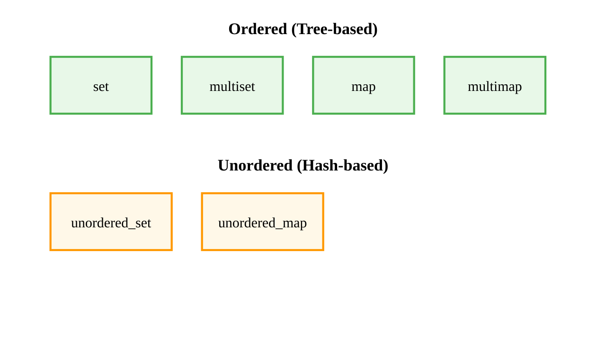

# Containers

## The Standard Template Library (STL)
The STL provides a comprehensive set of container classes that manage collections of objects. These containers handle memory management automatically and provide consistent interfaces for common operations.

---

## Container Categories

STL containers are organized into three main categories:
1. **Sequence Containers** - Elements in linear order
1. **Associative Containers** - Elements organized by keys
1. **Container Adapters** - Specialized interfaces built on other containers

---

## Sequence Containers Overview



---

## std::vector

Dynamic array that grows as needed:
```cpp
std::vector<int> numbers;
numbers.push_back(10);
numbers.push_back(20);
numbers.push_back(30);

// Direct access
int first = numbers[0];
int second = numbers.at(1);  // bounds checked
```

---

## vector Memory Layout


---

## vector Performance Characteristics

1. **Random Access**: O(1)
1. **Insert/Delete at end**: Amortized O(1)
1. **Insert/Delete at beginning/middle**: O(n)
1. **Memory**: Contiguous, cache-friendly

```cpp
// Efficient operations
vec.push_back(value);     // Usually O(1)
int x = vec[index];       // Always O(1)

// Expensive operations
vec.insert(vec.begin(), value);  // O(n)
```

---

## std::deque

Double-ended queue - efficient insertion/deletion at both ends:
```cpp
std::deque<std::string> messages;
messages.push_front("First");
messages.push_back("Last");

// Access from both ends
std::string& front = messages.front();
std::string& back = messages.back();

messages.pop_front();  // Remove first
messages.pop_back();   // Remove last
```

---

## deque Memory Layout


---

## std::list

Doubly-linked list for efficient insertion/deletion anywhere:
```cpp
std::list<int> numbers = {1, 2, 3, 4, 5};

// Insert in middle
auto it = numbers.begin();
std::advance(it, 2);  // Move to position 2
numbers.insert(it, 99);  // O(1) insertion

// Remove specific element
numbers.remove(3);  // Removes all 3s
```

---

## list Memory Layout



---

## std::forward_list

Singly-linked list for memory efficiency:
```cpp
std::forward_list<int> flist = {1, 2, 3};

// Insert after specific position
auto pos = flist.before_begin();
flist.insert_after(pos, 0);  // Insert at beginning

// No size() method - O(n) to calculate
int count = std::distance(flist.begin(), flist.end());
```

---

## std::array

Fixed-size array with STL interface:
```cpp
std::array<int, 5> fixed_array = {1, 2, 3, 4, 5};

// Size known at compile time
constexpr size_t size = fixed_array.size();

// Works with STL algorithms
std::sort(fixed_array.begin(), fixed_array.end());

// No dynamic allocation
static_assert(sizeof(fixed_array) == 5 * sizeof(int));
```

---

## Associative Containers Overview



---

## std::set

Ordered collection of unique elements:
```cpp
std::set<int> unique_numbers;
unique_numbers.insert(3);
unique_numbers.insert(1);
unique_numbers.insert(4);
unique_numbers.insert(1);  // Duplicate ignored

// Always sorted
for (int n : unique_numbers) {
    std::cout << n << " ";  // Output: 1 3 4
}

// Logarithmic search
if (unique_numbers.find(3) != unique_numbers.end()) {
    std::cout << "Found 3\n";
}
```

---

## std::map

Ordered key-value pairs:
```cpp
std::map<std::string, int> word_count;
word_count["hello"] = 1;
word_count["world"] = 2;

// Increment count
word_count["hello"]++;

// Check existence
if (word_count.count("hello") > 0) {
    std::cout << "hello: " << word_count["hello"] << "\n";
}

// Iterate in sorted order (by key)
for (const auto& [word, count] : word_count) {
    std::cout << word << ": " << count << "\n";
}
```

---

## std::unordered_map

Hash table for O(1) average access:
```cpp
std::unordered_map<std::string, double> prices;
prices["apple"] = 1.99;
prices["banana"] = 0.59;

// Fast lookup
auto it = prices.find("apple");
if (it != prices.end()) {
    std::cout << "Price: $" << it->second << "\n";
}

// No guaranteed order
for (const auto& [item, price] : prices) {
    std::cout << item << ": $" << price << "\n";
}
```

---

## Container Adapters


---

## std::stack

LIFO (Last In, First Out) adapter:
```cpp
std::stack<int> s;
s.push(10);
s.push(20);
s.push(30);

while (!s.empty()) {
    std::cout << s.top() << " ";  // 30 20 10
    s.pop();
}

// Default uses deque, can specify:
std::stack<int, std::vector<int>> vec_stack;
```

---

## std::queue

FIFO (First In, First Out) adapter:
```cpp
std::queue<std::string> tasks;
tasks.push("Task 1");
tasks.push("Task 2");
tasks.push("Task 3");

while (!tasks.empty()) {
    std::cout << "Processing: " << tasks.front() << "\n";
    tasks.pop();
}
```

---

## std::priority_queue

Heap-based priority queue:
```cpp
// Max heap by default
std::priority_queue<int> pq;
pq.push(10);
pq.push(30);
pq.push(20);

while (!pq.empty()) {
    std::cout << pq.top() << " ";  // 30 20 10
    pq.pop();
}

// Min heap
std::priority_queue<int, std::vector<int>, std::greater<int>> min_pq;
```

---

## Container Selection Guide

| Container | Use When |
|-----------|----------|
| vector | Default sequential container |
| deque | Need push_front/pop_front |
| list | Frequent insertion/deletion in middle |
| set/map | Need sorted unique elements |
| unordered_set/map | Fast lookup, order doesn't matter |

---

## Performance Comparison


---

## Common Container Functions

All containers support:
```cpp
container.size();        // Number of elements
container.empty();       // Check if empty
container.clear();       // Remove all elements
container.begin();       // Iterator to first
container.end();         // Iterator past last

// C++11 additions
container.cbegin();      // Const iterator
container.cend();        // Const past-the-end
```

---

## Container-Specific Functions

Sequence containers:
```cpp
// vector/deque
vec.push_back(val);
vec.pop_back();
vec.resize(n);
vec.reserve(n);  // vector only

// list
lst.push_front(val);
lst.splice(pos, other_list);
lst.merge(other_list);
lst.unique();  // Remove consecutive duplicates
```

---

## Associative Container Functions

```cpp
// set/map
auto [it, success] = set.insert(val);
set.erase(key);
set.find(key);
set.count(key);  // 0 or 1 for set
set.lower_bound(key);
set.upper_bound(key);

// map specific
map[key] = value;  // Insert or update
map.at(key);       // Throws if not found
```

---

## Iterators

All containers provide iterator support:
```cpp
std::vector<int> vec = {1, 2, 3, 4, 5};

// Range-based for (C++11)
for (int val : vec) {
    std::cout << val << " ";
}

// Iterator loop
for (auto it = vec.begin(); it != vec.end(); ++it) {
    std::cout << *it << " ";
}

// Reverse iteration
for (auto rit = vec.rbegin(); rit != vec.rend(); ++rit) {
    std::cout << *rit << " ";
}
```

---

## Iterator Categories


---

## Algorithms with Containers

STL algorithms work with all containers:
```cpp
std::vector<int> vec = {3, 1, 4, 1, 5, 9};

// Sort
std::sort(vec.begin(), vec.end());

// Find
auto it = std::find(vec.begin(), vec.end(), 4);

// Count
int ones = std::count(vec.begin(), vec.end(), 1);

// Transform
std::transform(vec.begin(), vec.end(), vec.begin(),
               [](int x) { return x * 2; });
```

---

## Container Memory Management

Containers handle memory automatically:
```cpp
{
    std::vector<std::string> strings;
    strings.reserve(100);  // Pre-allocate space
    for (int i = 0; i < 50; ++i) {
        strings.push_back("String " + std::to_string(i));
    }
    strings.shrink_to_fit();  // Release unused memory
}  // All memory freed here
```

---

## Emplace Operations

Construct elements in-place for efficiency:
```cpp
struct Point {
    int x, y;
    Point(int x, int y) : x(x), y(y) {}
};

std::vector<Point> points;

// Old way - creates temporary
points.push_back(Point(10, 20));

// New way - constructs in-place
points.emplace_back(10, 20);

// Works with all containers
std::map<int, Point> map;
map.emplace(1, Point(5, 5));
```

---

## Container Best Practices

1. **Use vector by default** - Most cache-friendly
1. **Reserve space when size is known** - Avoids reallocations
1. **Prefer emplace over insert** - Avoids copies
1. **Use const iterators** - When not modifying
1. **Consider unordered containers** - For large datasets

```cpp
// Good practice
std::vector<int> data;
data.reserve(1000);  // If you know the size
for (int i = 0; i < 1000; ++i) {
    data.emplace_back(i);
}
```

---

## Summary

1. STL provides comprehensive container library
1. Choose containers based on usage patterns
1. All containers have consistent interfaces
1. Iterators provide uniform access patterns
1. Algorithms work with all containers
1. Modern C++ adds efficiency features (move, emplace)
1. Let containers manage memory automatically
