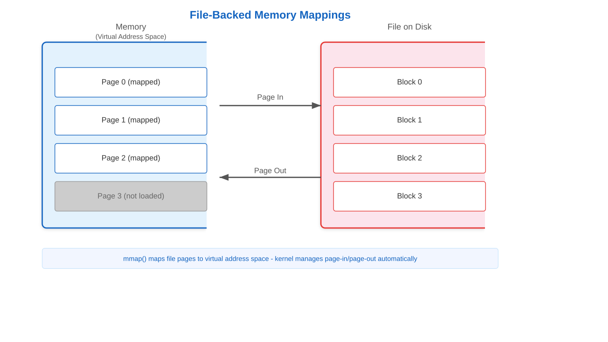

# Memory Mappings

---

## What Are Memory Mappings?

- Memory mapping is a mechanism that maps a file or device into memory
- Provides a way to access files as if they were in memory
- Core technique in modern operating systems
- Enables efficient I/O and inter-process communication

---

## Virtual Memory Fundamentals

- Abstraction that provides each process with its own address space
- Decouples logical addresses from physical addresses
- Enables memory protection between processes
- Allows programs to use more memory than physically available

---

## Memory Mapping Mechanism

- Creates a region in virtual address space
- Links this region to a file or device
- Allows file access through memory operations
- The kernel handles the actual I/O operations

---

## Key Components

- Virtual Memory Manager (VMM)
- Memory Management Unit (MMU)
- Page Tables
- Translation Lookaside Buffer (TLB)
- Page faults and handlers

---

## Page Tables

- Data structures that map virtual addresses to physical addresses
- Organized hierarchically in modern systems
- Each process has its own page table structure
- Managed by the operating system kernel

---

## mmap() System Call

- Primary interface for memory mapping in UNIX-like systems
- Prototype: `void *mmap(void *addr, size_t length, int prot, int flags, int fd, off_t offset)`
- Maps a file or device into memory
- Returns a pointer to the mapped region

---

## mmap() Parameters

- `addr`: Suggested address for mapping (or NULL)
- `length`: Size of the mapping in bytes
- `prot`: Memory protection flags (READ, WRITE, EXEC)
- `flags`: Mapping flags (SHARED, PRIVATE, etc.)
- `fd`: File descriptor for file to map
- `offset`: Offset within the file

---

## Types of Memory Mappings

- File-backed mappings
  1. Map a file into memory
  1. Changes may be written back to the file
- Anonymous mappings
  1. No backing file
  1. Used for program data (heap, stack)
- Shared vs. Private mappings

---

## File-Backed Mappings

- Maps a file directly into memory
- Reads happen on demand (page faults)
- Writes may be cached and flushed later
- Enables efficient file I/O without explicit read/write calls

---

## Anonymous Mappings

- Not backed by any file
- Used for process data structures
- Typically zeroed when created
- Common use cases: malloc implementation, stack growth

---

## Shared vs. Private Mappings

- Shared (MAP_SHARED)
  1. Changes visible to all processes mapping the same file
  1. Updates written back to the backing file
- Private (MAP_PRIVATE)
  1. Copy-on-write semantics
  1. Changes are private to the process
  1. No updates to the backing file

---

## Copy-on-Write (CoW)

- Optimization technique for memory mappings
- Mappings share physical pages until write occurs
- On write, a private copy is created for the process
- Reduces memory consumption and improves performance

---

## Benefits of Memory Mappings

- Reduced CPU usage (no explicit read/write system calls)
- Potential for zero-copy I/O
- Lazy loading of file contents
- Simplified programming model for file access
- Efficient sharing of memory between processes

---

## Performance Considerations

- Page size affects granularity and overhead
- Large mappings may cause thrashing
- Fragmentation can reduce efficiency
- Proper alignment can improve performance
- TLB misses can be costly

---

## Memory-Mapped Files Use Cases

- Databases (for data files and indexes)
- High-performance I/O operations
- Inter-process communication
- Loading executable files and libraries
- Real-time data processing

---

## Implementation in Linux

- VMA (Virtual Memory Area) structures
- Page fault handler
- Support for huge pages
- Kernel functions: do_mmap(), handle_mm_fault()
- File system integration

---

## Memory Mapping Security Implications

- Possible data leakage through improper unmapping
- Race conditions in shared mappings
- Careful permission management required
- Side-channel attacks via timing analysis
- Protection against unauthorized access

---

## Advanced Features

- MAP_HUGETLB for huge pages
- Kernel samepage merging (KSM)
- Non-uniform memory access (NUMA) awareness
- Direct I/O mappings
- Remote memory mappings (RDMA)

---

## Debugging Memory Mappings

- /proc/[pid]/maps file shows process mappings
- Tools: pmap, cat /proc/[pid]/smaps
- GDB commands for memory inspection
- Valgrind for tracking memory issues
- Memory mapping core dumps

---

## Memory Mappings vs. Read/Write

- Memory mappings:
  1. Better for random access patterns
  1. Lower overhead for multiple accesses
  1. More complex API
- Traditional read/write:
  1. Better for sequential access
  1. Simpler programming model
  1. Works for non-seekable files

---

## Summary

- Memory mappings provide a powerful I/O mechanism
- Enable efficient memory sharing between processes
- Support various use cases from databases to IPC
- Performance benefits for certain access patterns
- Require careful management for optimal performance
