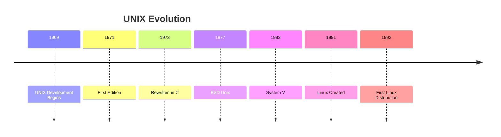
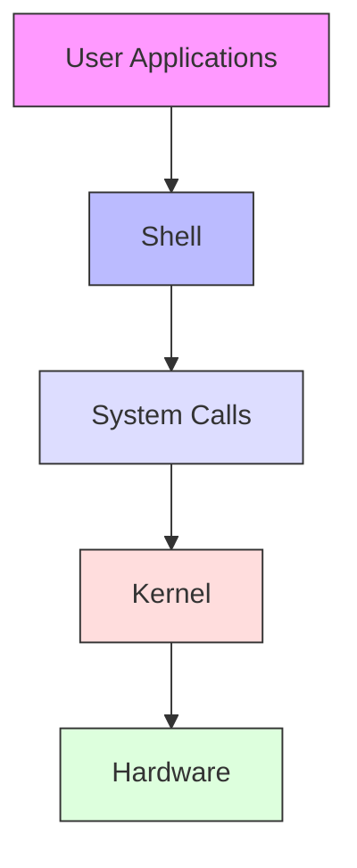
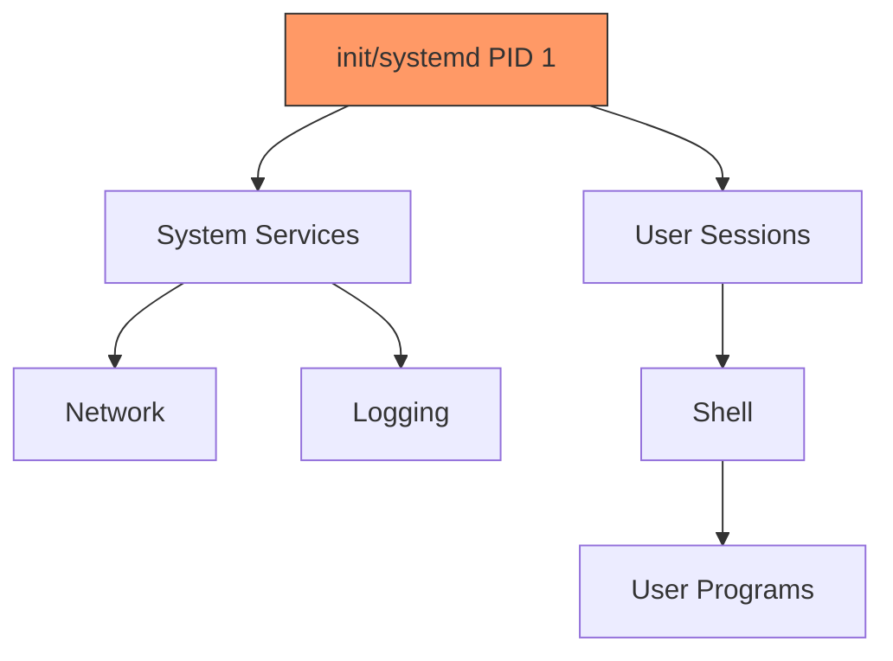
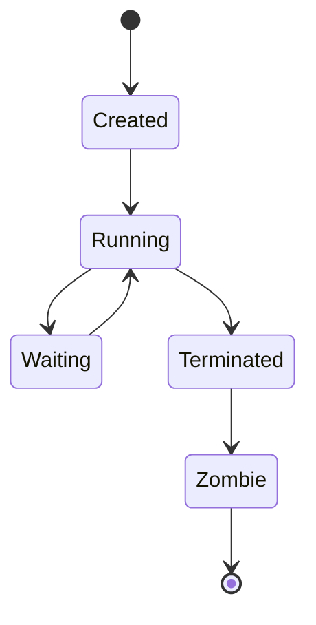
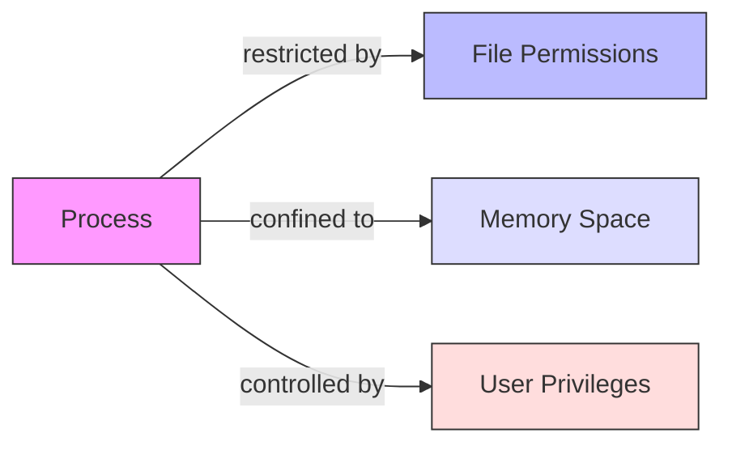
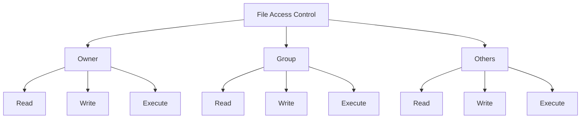
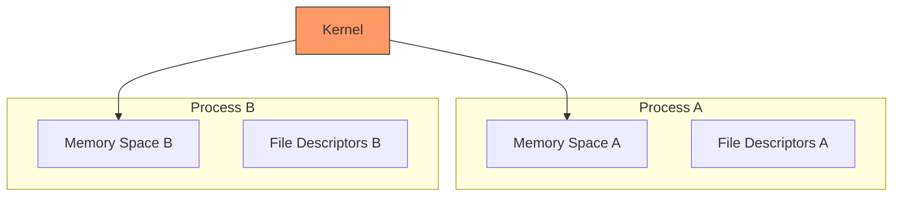

# Introduction to UNIX
## Understanding the Fundamentals

---

# What is UNIX?

- Multi-user operating system
- Built in the 1970s at AT&T Bell Labs
- Key characteristics:
  - Modularity
  - Simple tools that do one thing well
  - Text-based configuration
  - Everything is a file philosophy

---

# History of UNIX



---

# Operating System Core Structure



---

# The Process Tree



## Why is it important?
- Process management
- Resource tracking
- System organization
- Parent-child relationships

---

# Process Lifecycle



## Zombie Processes
- Terminated but not yet cleaned up
- Parent must read exit status
- Adopted by init if parent dies

---

# System Calls

Example of a simple system call in C:
```c
#include <unistd.h>
#include <fcntl.h>

int main() {
    // Open system call
    int fd = open("file.txt", O_RDONLY);
    
    // Read system call
    char buffer[100];
    read(fd, buffer, 100);
    
    // Close system call
    close(fd);
    return 0;
}
```

---

# Basic Security Model



## Key Security Features:
- File system permissions
- Process isolation
- User/group-based access control

---

# The Root User

- UID 0
- Special characteristics:
  - Bypasses permission checks
  - Can access all files
  - Can manipulate all processes
  
```bash
# Example of root privileges
sudo su -
whoami  # Returns "root"
touch /root/test_file  # Succeeds
chmod 777 /some/system/file  # Succeeds
```

---

# File System Security



Example permission setting:
```bash
# Setting permissions
chmod 755 file.txt  # rwxr-xr-x
chown user:group file.txt
```

---

# Process Isolation



- Each process has its own:
  - Memory space
  - File descriptors
  - Security context
  - Resource limits
