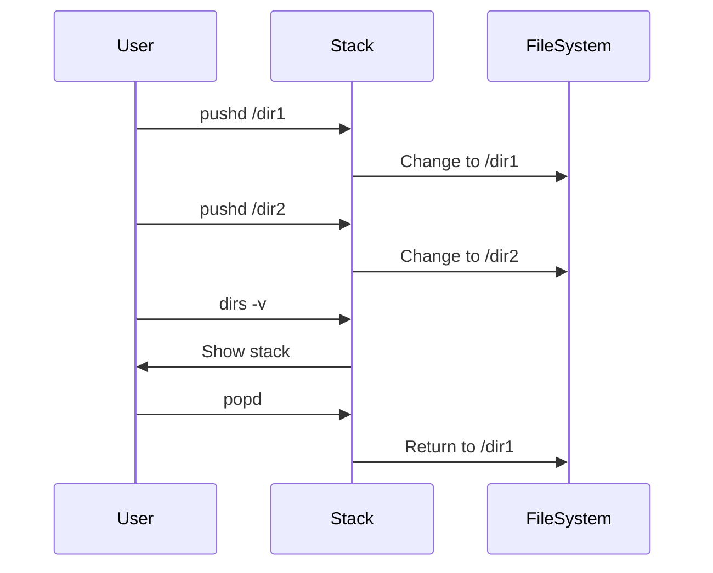
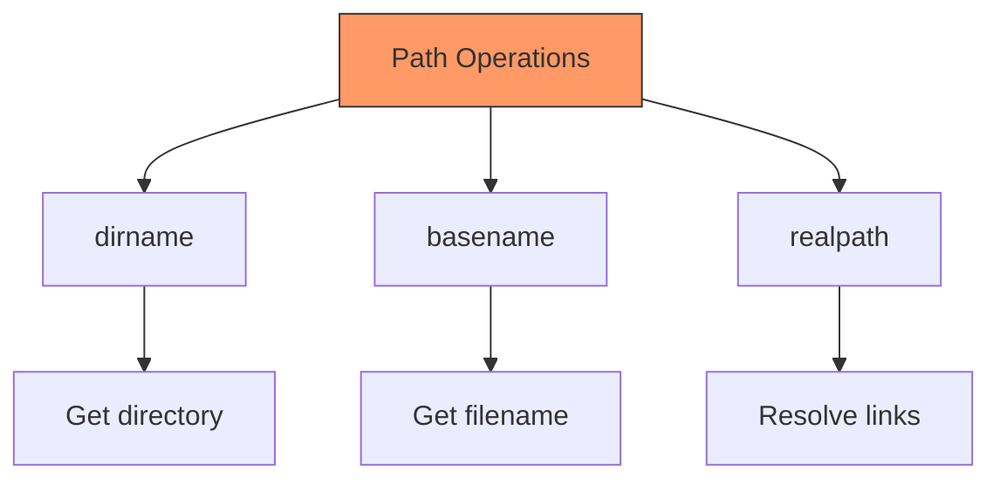

# UNIX File System
## Understanding Structure and Navigation

---

## Basic File System Structure

```mermaid
graph TD
    A[/] --> B[/bin]
    A --> C[/etc]
    A --> D[/home]
    A --> E[/usr]
    A --> F[/var]
    D --> G[/home/user1]
    D --> H[/home/user2]
    E --> I[/usr/bin]
    E --> J[/usr/lib]
    F --> K[/var/log]
    F --> L[/var/spool]
    style A fill:#f96,stroke:#333
```

Key Directories:
- `/bin`: Essential commands
- `/etc`: System configuration
- `/home`: User directories
- `/usr`: User programs
- `/var`: Variable data

---

## Important System Directories

| Directory | Purpose |
|-----------|---------|
| `/bin`    | Essential commands |
| `/sbin`   | System binaries |
| `/etc`    | Configuration files |
| `/dev`    | Device files |
| `/proc`   | Process information |
| `/tmp`    | Temporary files |
| `/var`    | Variable data |
| `/root`   | Root user's home |

---

## Understanding Paths

```mermaid
graph LR
    A[Path Types] --> B[Absolute]
    A --> C[Relative]
    B --> D[/home/user/docs]
    C --> E[./docs]
    C --> F[../user2/docs]
    style A fill:#f96,stroke:#333
    style B fill:#bbf,stroke:#333
    style C fill:#bbf,stroke:#333
```

Examples:
```bash
# Absolute path
cd /home/user/documents

# Relative path
cd ./documents
cd ../user2/documents

# Special paths
cd ~        # Home directory
cd -        # Previous directory
```

---

## Path Navigation Examples

```bash
# Current location
pwd
/home/user1

# Move to subdirectory
cd documents

# Move up one level
cd ..

# Absolute path navigation
cd /usr/local/bin

# Return home
cd ~

# Go to previous directory
cd -
```

---

## Home Directories

```mermaid
graph TD
    A[/home] --> B[user1]
    A --> C[user2]
    B --> D[.bashrc]
    B --> E[Documents]
    B --> F[Downloads]
    C --> G[.bashrc]
    C --> H[Documents]
    C --> I[Downloads]
    style A fill:#f96,stroke:#333
```

Access methods:
```bash
# Using tilde
cd ~
cd ~/Documents

# Using $HOME
cd $HOME
cd $HOME/Documents

# Using absolute path
cd /home/username
```

---

## Moving Around Commands

## Basic Navigation

```bash
# Print working directory
pwd

# Change directory
cd /path/to/directory

# List directory contents
ls
ls -la
```

## Directory Stack

```bash
# Push directory to stack
pushd /path/to/dir

# Pop directory from stack
popd

# Show directory stack
dirs -v
```

---

## Directory Stack Management



---

## Practical Directory Navigation

```bash
# Start in home directory
cd ~

# Create and navigate test directory structure
mkdir -p projects/{docs,src,tests}
pushd projects/docs

# Create some files
touch readme.txt
pushd ../src

# View stack
dirs -v

# Return to previous directory
popd

# View current location
pwd
```

---

## Path Manipulation Tips

```bash
# Get directory name
dirname /path/to/file

# Get base name
basename /path/to/file

# Normalize path
realpath ./relative/path

# Expand home directory
echo ~
echo $HOME
```

---

## Common Path Operations



Examples:
```bash
# Extract components
path="/home/user/docs/file.txt"
echo $(dirname "$path")  # /home/user/docs
echo $(basename "$path") # file.txt
```

---

## Practice Exercises

1. Directory Navigation
```bash
# Create test directory structure
mkdir -p ~/test/{a,b,c}/{1,2,3}

# Navigate and list
cd ~/test/a/1
pwd
ls ../../b

# Use pushd/popd
pushd ~/test/c/3
pushd ~/test/b/2
dirs -v
popd
pwd
```

1. Path Manipulation
```bash
# Create test files
touch ~/test/a/1/file.txt
echo $(dirname ~/test/a/1/file.txt)
echo $(basename ~/test/a/1/file.txt)
```

---

## Advanced Topics

## Symbolic Links
```bash
# Create symbolic link
ln -s target_file link_name

# Follow symbolic link
readlink link_name
```

## Hard Links
```bash
# Create hard link
ln target_file link_name

# Find same inodes
find . -samefile target_file
```
