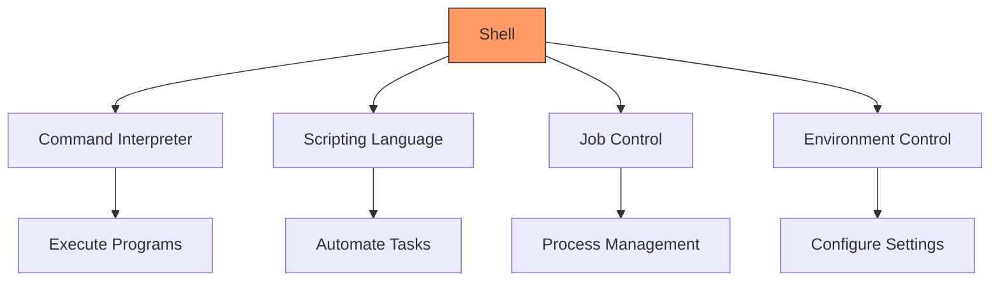
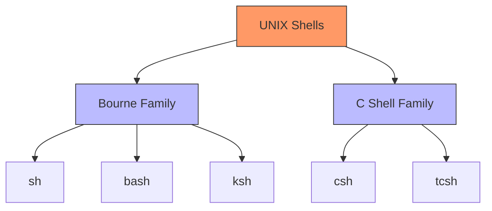
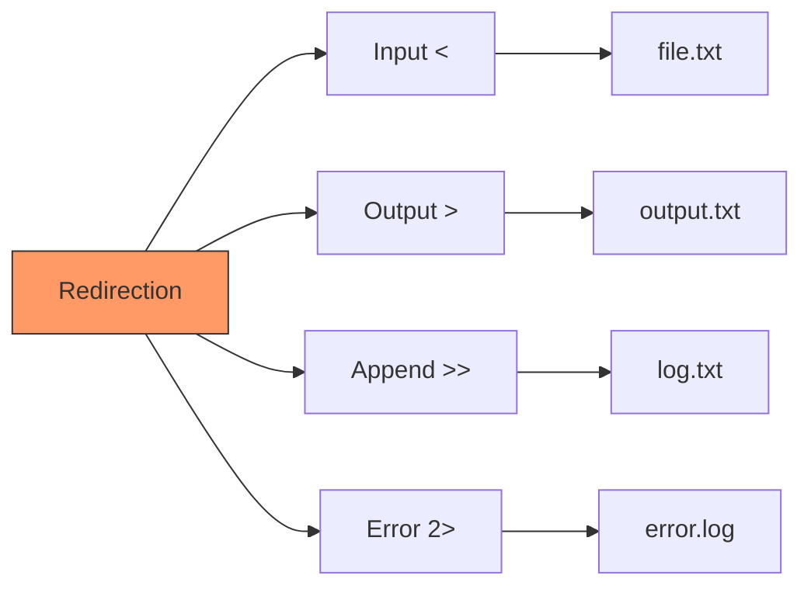
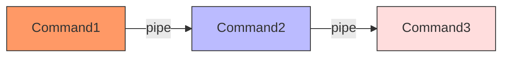

# UNIX Shells
## Understanding Shell Types and Usage

---

## Why Use a Shell?



The shell is your interface to the system:
- Command interpretation
- Script execution
- Process control
- Environment management

---

## Shell Families



---

## Shell Variables: Bourne Family (sh/ksh/bash)

```bash
# Setting variables
name="John"
age=25

# Using variables
echo $name
echo ${name}

# Environment variables
export PATH=$PATH:/new/path
echo $PATH
```

```mermaid
graph LR
    A[Variable Types] --> B[Local]
    A --> C[Environment]
    B --> D[name="value"]
    C --> E[export name="value"]
    style A fill:#f96,stroke:#333
```

---

## Shell Variables: C Shell Family (csh/tcsh)

```bash
# Setting variables
set name = "John"
set age = 25

# Using variables
echo $name

# Environment variables
setenv PATH "$PATH:/new/path"
echo $PATH
```

Key differences:
- `set` for local variables
- `setenv` for environment variables
- Different syntax for assignment

---

## Command Line Substitution

### Bourne Family
```bash
# Backticks
files=`ls`

# Modern syntax
current_date=$(date)
files=$(ls)

# Arithmetic
result=$((5 + 3))
```

### C Shell Family
```bash
# Command substitution
set files = `ls`

# Arithmetic
@ result = (5 + 3)
```

---

## Glob Patterns

```mermaid
graph TD
    A[Glob Patterns] --> B[* Wildcard]
    A --> C[? Single Char]
    A --> D[[] Character Class]
    B --> E[*.txt]
    C --> F[file?.txt]
    D --> G[[a-z]]
    style A fill:#f96,stroke:#333
```

Examples:
```bash
# List all text files
ls *.txt

# Match single character
ls file?.txt

# Match character range
ls [a-z]*.txt
```

---

## Input/Output Redirection



Examples:
```bash
# Redirect input
sort < input.txt

# Redirect output
ls > output.txt

# Append output
echo "new line" >> file.txt

# Redirect error
command 2> error.log

# Redirect both
command > output.txt 2> error.log
```

---

## Aliases

### Bourne Family
```bash
# Create alias
alias ll='ls -l'
alias gs='git status'

# List aliases
alias

# Remove alias
unalias ll
```

### C Shell Family
```bash
# Create alias
alias ll 'ls -l'
alias gs 'git status'

# List aliases
alias

# Remove alias
unalias ll
```

---

## Pipes



Examples:
```bash
# Count files
ls | wc -l

# Find specific processes
ps aux | grep nginx

# Sort and unique
cat file.txt | sort | uniq

# Complex pipeline
find . -type f | grep ".txt" | xargs wc -l
```

---

## Command History

### Bourne Family
```bash
# View history
history

# Search history
Ctrl+R

# Execute previous command
!!

# Execute specific command
!number
```

### C Shell Family
```bash
# View history
history

# Previous command
!!

# Command number
!number
```

---

## Session Initialization

```mermaid
graph TD
    A[Login Shell] --> B[/etc/profile]
    B --> C[~/.profile]
    A --> D[/etc/bash.bashrc]
    D --> E[~/.bashrc]
    style A fill:#f96,stroke:#333
```

Files for Bourne Family:
```bash
/etc/profile            # System-wide
~/.profile             # User login
~/.bashrc              # Interactive bash
~/.bash_profile        # Login specific
```

Files for C Shell Family:
```bash
/etc/csh.cshrc         # System-wide
~/.cshrc               # User specific
~/.login               # Login specific
```

---

## Practical Examples

```bash
# Pipeline processing
find . -type f -name "*.log" | \
  xargs grep "ERROR" | \
  sort | \
  uniq -c

# Command substitution
for file in $(ls *.txt); do
  echo "Processing $file"
  wc -l "$file"
done

# Error redirection
make 2> error.log > output.log
```

---

## Shell Features Comparison

| Feature | Bourne Family | C Shell Family |
|---------|--------------|----------------|
| Variables | name=value | set name = value |
| Environment | export name=value | setenv name value |
| Arithmetic | $((expr)) | @ result = (expr) |
| History | !command | !command |
| Aliases | alias name='cmd' | alias name 'cmd' |

---

## Practice Exercises

1. Variable Management
```bash
# Bourne family
name="test"
echo "Hello, $name"
export PATH="$PATH:/new/path"

# C shell family
set name = "test"
echo "Hello, $name"
setenv PATH "$PATH:/new/path"
```

1. Redirection and Pipes
```bash
# Create test data
ls -l > files.txt
sort < files.txt | uniq | wc -l
```
