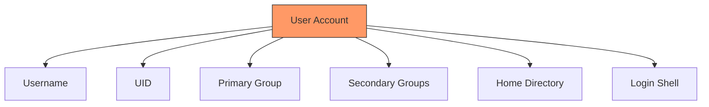
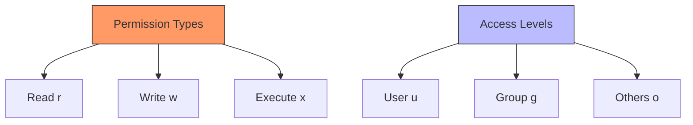
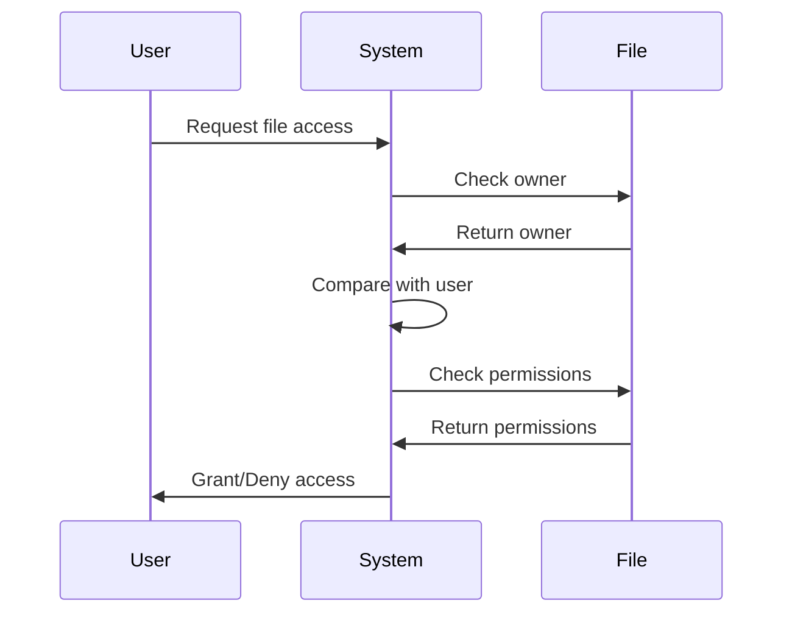
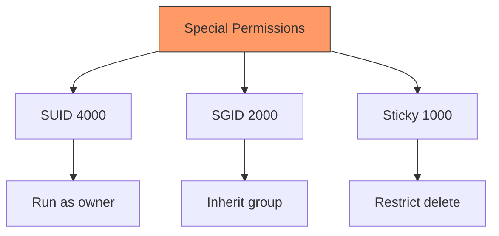
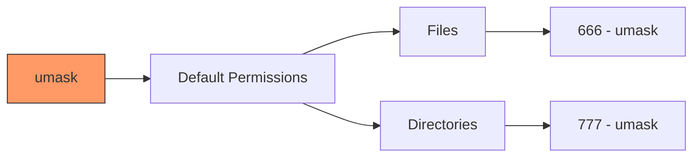
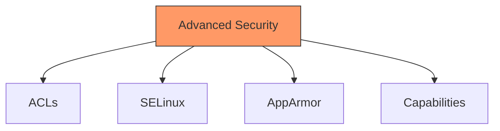

# Security in Practice
## Understanding UNIX Security Mechanisms

---

# UNIX Accounts



Key components:
- Username (human readable)
- UID (system identifier)
- Group memberships
- Home directory
- Default shell

---

# The /etc/passwd File

Structure:
```
username:x:UID:GID:comment:home:shell
```

Example entries:
```bash
root:x:0:0:root:/root:/bin/bash
john:x:1000:1000:John Doe:/home/john:/bin/bash
nginx:x:998:998:Nginx web server:/var/www:/sbin/nologin
```

View entries:
```bash
# View all entries
cat /etc/passwd

# Get specific user
grep "^john:" /etc/passwd

# Count users
wc -l /etc/passwd
```

---

# The /etc/shadow File

```mermaid
graph LR
    A[/etc/shadow] --> B[Username]
    A --> C[Encrypted Password]
    A --> D[Last Change]
    A --> E[Min Age]
    A --> F[Max Age]
    A --> G[Warning]
    A --> H[Inactive]
    A --> I[Expire]
    style A fill:#f96,stroke:#333
```

Structure:
```
username:password:lastchg:min:max:warn:inactive:expire:
```

Example:
```bash
john:$6$xyz...:18900:0:99999:7:::
```

---

# File Ownership

```bash
# View file ownership
ls -l file.txt

# Change owner
chown john file.txt

# Change group
chgrp developers file.txt

# Change both
chown john:developers file.txt

# Recursive change
chown -R john:developers directory/
```

Output example:
```
-rw-r--r-- 1 john developers 4096 Nov 19 10:00 file.txt
```

---

# Directory and File Access Modes



Symbolic notation:
```
rwxr-xr--
│││││││││
││││││││└─ Others: no execute
│││││││└── Others: no write
││││││└─── Others: read
│││││└──── Group: no execute
││││└───── Group: no write
│││└────── Group: read
││└─────── User: execute
│└──────── User: write
└───────── User: read
```

---

# Understanding Permission Bits

Permission calculation:
```
r = 4 (100 binary)
w = 2 (010 binary)
x = 1 (001 binary)
```

Examples:
```
rwx = 7 (4+2+1)
rw- = 6 (4+2+0)
r-x = 5 (4+0+1)
r-- = 4 (4+0+0)
```

Full permission string:
```
chmod 754 file.txt
# rwxr-xr--
# 7   5   4
```

---

# How File Access is Determined



Access check order:
1. Is user the owner?
1. Is user in the group?
1. What are "other" permissions?

---

# Changing Modes and Ownership

Symbolic mode:
```bash
# Add execute for user
chmod u+x file.txt

# Remove write for group
chmod g-w file.txt

# Set read-write for all
chmod a=rw file.txt

# Add execute for user and group
chmod ug+x file.txt
```

Octal mode:
```bash
# rwxr-xr--
chmod 754 file.txt

# rwxrwxrwx
chmod 777 file.txt

# r--------
chmod 400 file.txt
```

---

# Special Permissions



Examples:
```bash
# Set SUID
chmod u+s file.txt
chmod 4755 file.txt

# Set SGID
chmod g+s directory
chmod 2755 directory

# Set sticky bit
chmod +t directory
chmod 1755 directory
```

---

# The umask Command



Common umask values:
```bash
# View current umask
umask

# Set stricter permissions
umask 027  # rwxr-x---

# Set common permissions
umask 022  # rwxr-xr-x
```

---

# Practical Security Examples

1. Setting up a shared directory:
```bash
# Create directory
mkdir /shared
# Set ownership
chown root:developers /shared
# Set permissions
chmod 2775 /shared  # SGID + rwxrwxr-x
```

1. Securing sensitive files:
```bash
# Create private directory
mkdir ~/.private
# Set restrictive permissions
chmod 700 ~/.private
# Set secure umask
umask 077
```

---

# Security Best Practices

1. File Permissions:
```bash
# Secure configuration files
chmod 600 ~/.ssh/config
chmod 644 ~/.bashrc

# Secure directories
chmod 755 ~/public_html
chmod 700 ~/.ssh
```

1. Group Management:
```bash
# Create group
sudo groupadd developers

# Add user to group
sudo usermod -aG developers john

# Check group membership
groups john
```

---

# Advanced Security Topics



Example with ACLs:
```bash
# Set ACL
setfacl -m u:john:rx file.txt

# View ACLs
getfacl file.txt

# Remove ACL
setfacl -x u:john file.txt
```
