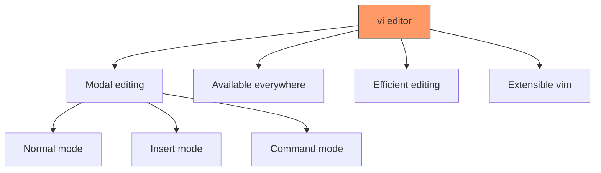
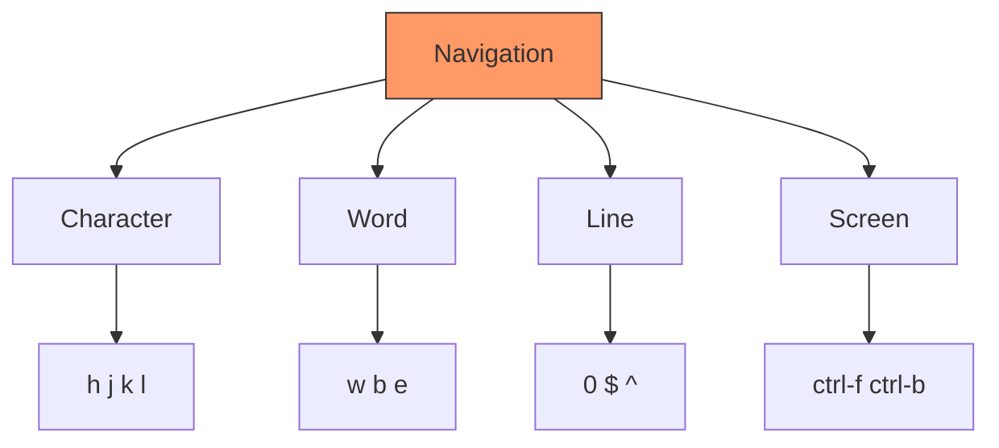
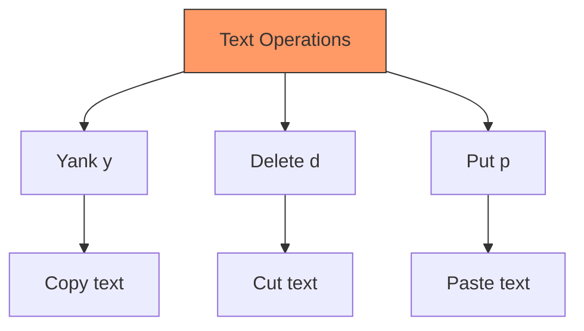
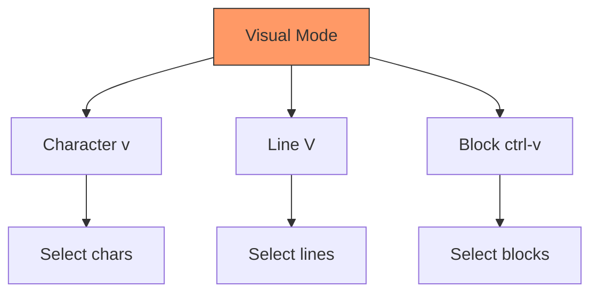
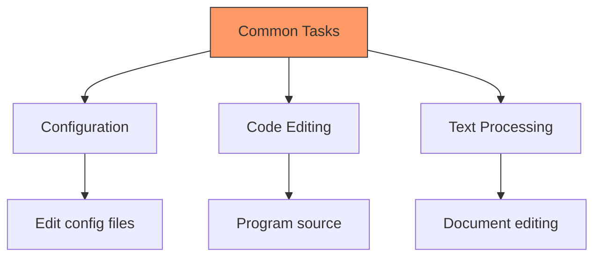

# The vi Text Editor
## Mastering the Universal UNIX Editor

---

## Introduction to vi



Why learn vi?
- Present on all UNIX systems
- Fast and efficient
- No need for mouse
- Powerful features

---

## Starting vi

Basic commands:
```bash
# Open file
vi filename.txt

# Open multiple files
vi file1.txt file2.txt

# Open at specific line
vi +10 filename.txt

# Open at pattern
vi +/pattern filename.txt

# Open in read-only mode
view filename.txt
```

---

## vi Modes

```mermaid
stateDiagram-v2
    [*] --> Normal
    Normal --> Insert: i, a, o
    Insert --> Normal: Esc
    Normal --> Command: :
    Command --> Normal: Enter
    Normal --> Visual: v, V
    Visual --> Normal: Esc
```

Mode indicators:
- Normal: No indicator
- Insert: "-- INSERT --"
- Command: ":"
- Visual: "-- VISUAL --"

---

## Basic Navigation



Character movement:

```vi
h - left
j - down
k - up
l - right
```

Word movement:

```vi
w - next word
b - previous word
e - end of word
```

---

## Insert Mode Commands

Entering insert mode:

```vi
i - insert before cursor
a - append after cursor
I - insert at line start
A - append at line end
o - open line below
O - open line above
```

Example sequence:

```vi
i    # Enter insert mode
type your text
<Esc>  # Return to normal mode
```

---

## Moving Around

Line navigation:

```vi
0     - start of line
$     - end of line
^     - first non-blank
G     - last line
1G    - first line
nG    - line n
```

Screen navigation:
```vi
ctrl-f - page forward
ctrl-b - page backward
ctrl-u - half page up
ctrl-d - half page down
H     - top of screen
M     - middle of screen
L     - bottom of screen
```

---

## Command Mode Operations

```mermaid
graph LR
    A[Command Mode] --> B[File Operations]
    A --> C[Search/Replace]
    A --> D[Settings]
    B --> E[w q x wq]
    C --> F[/ ? n N]
    D --> G[set number]
    style A fill:#f96,stroke:#333
```

Common commands:

```vi
:w        - save file
:q        - quit
:q!       - quit without saving
:wq       - save and quit
:set nu   - show line numbers
:help     - get help
```

---

## Search and Replace

Search:

```vi
/pattern     - search forward
?pattern     - search backward
n            - next match
N            - previous match
```

Replace:

```vi
:s/old/new         - replace first on line
:s/old/new/g       - replace all on line
:%s/old/new/g      - replace all in file
:%s/old/new/gc     - replace with confirm
```

---

## Copy, Cut, and Paste



Operations:

```vi
yy    - yank line
dd    - delete line
p     - put after cursor
P     - put before cursor
3yy   - yank 3 lines
2dd   - delete 2 lines
```

---

## Text Objects and Motions

Word operations:

```vi
dw    - delete word
cw    - change word
yw    - yank word
```

Sentence/Paragraph:

```vi
das   - delete a sentence
dap   - delete a paragraph
cis   - change inside sentence
```

Brackets/Quotes:

```vi
di"   - delete inside quotes
ci(   - change inside parentheses
yi{   - yank inside braces
```

---

## Visual Mode



Operations:

```vi
v      - visual character mode
V      - visual line mode
ctrl-v - visual block mode
```

After selection:

```vi
d - delete selection
y - yank selection
c - change selection
```

---

## Advanced Features

Marks:

```vi
ma     - set mark 'a'
'a     - jump to mark 'a'
```

Macros:

```vi
qa     - record macro 'a'
q      - stop recording
@a     - play macro 'a'
```

Registers:

```vi
"ay    - yank to register 'a'
"ap    - paste from register 'a'
```

---

## Practical Examples

1. Edit Configuration File:

```vi
vi /etc/config.conf
i        # enter insert mode
<edit>   # make changes
<Esc>    # return to normal mode
:wq      # save and quit
```

1. Search and Replace:

```vi
:%s/oldconfig/newconfig/g
```

1. Copy Multiple Lines:

```vi
10G     # go to line 10
5yy     # yank 5 lines
p       # paste them
```

---
## Common Tasks



Configuration:

```vi
:set number        # show line numbers
:set ignorecase   # case-insensitive search
:set hlsearch     # highlight search
```
