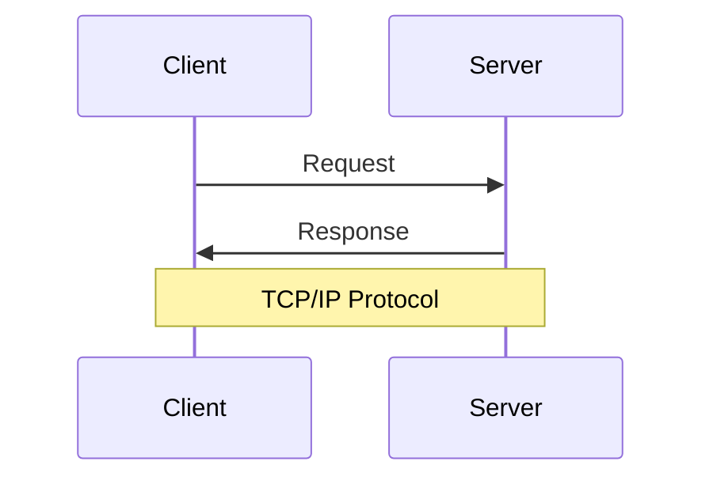
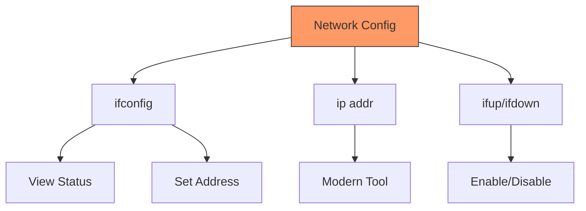
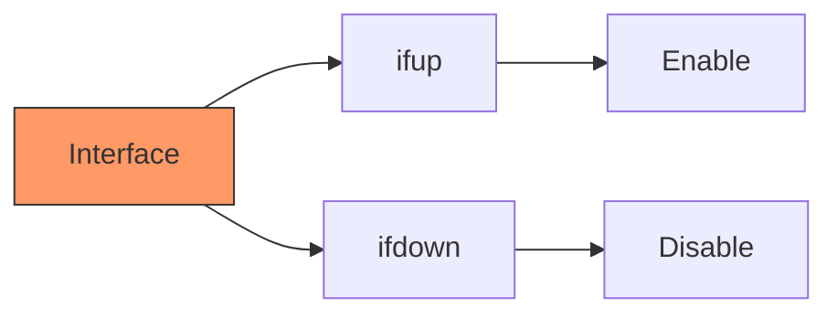
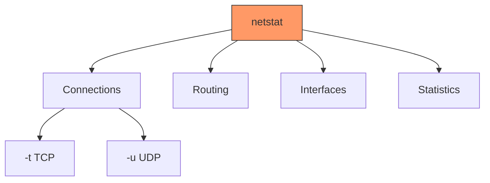
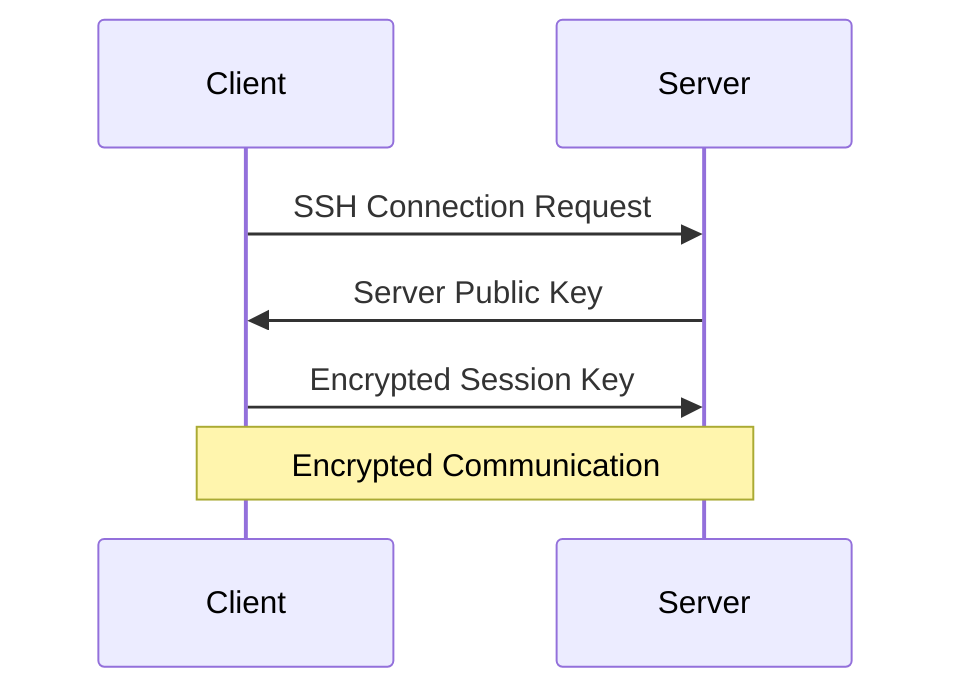
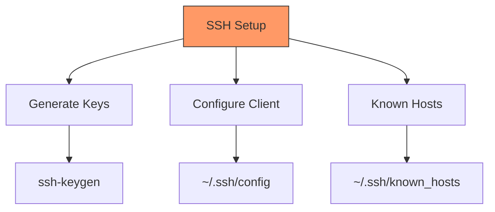
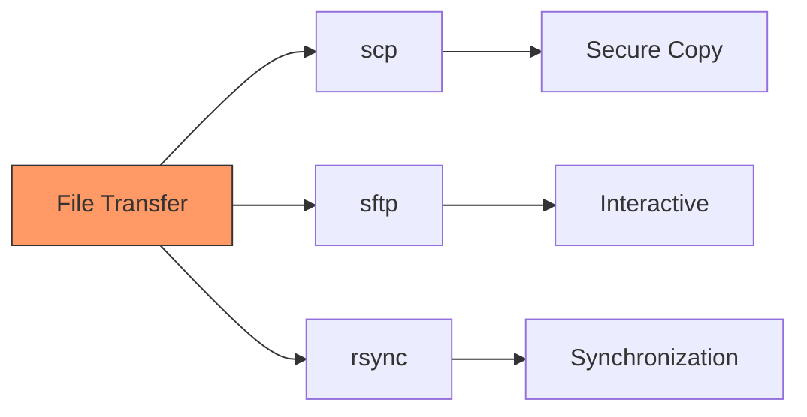
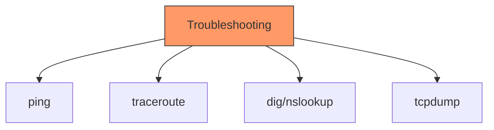
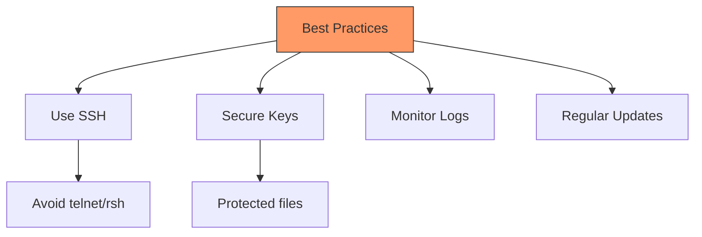

# Networking Basics
## Understanding UNIX Network Configuration and Tools

---

# The Client/Server Model



Common examples:
- Web servers (HTTP)
- File transfer (FTP)
- Remote login (SSH)
- Email (SMTP/POP3)

---

# Network Interface Configuration



Using ifconfig:
```bash
# Show all interfaces
ifconfig

# Configure interface
ifconfig eth0 192.168.1.100 netmask 255.255.255.0

# Enable/disable interface
ifconfig eth0 up
ifconfig eth0 down
```

---

# Modern IP Command

```bash
# Show IP addresses
ip addr show

# Add IP address
ip addr add 192.168.1.100/24 dev eth0

# Delete IP address
ip addr del 192.168.1.100/24 dev eth0

# Show routing
ip route show

# Add route
ip route add default via 192.168.1.1
```

---

# Interface Management



Basic commands:
```bash
# Bring interface up
ifup eth0

# Bring interface down
ifdown eth0

# Check status
ifconfig eth0
ip link show eth0
```

---

# Network Statistics (netstat)



Common options:
```bash
# Show all connections
netstat -a

# Show TCP connections
netstat -t

# Show listening ports
netstat -l

# Show statistics
netstat -s

# Show routing table
netstat -r
```

---

# SSH (Secure Shell)



Basic usage:
```bash
# Connect to remote host
ssh user@remote.host

# Use specific port
ssh -p 2222 user@remote.host

# Run remote command
ssh user@remote.host 'ls -l'
```

---

# SSH Configuration and Keys



Key management:
```bash
# Generate key pair
ssh-keygen -t rsa -b 4096

# Copy public key to server
ssh-copy-id user@remote.host

# SSH config file
Host server1
    HostName remote.host
    User username
    Port 2222
```

---

# Remote File Transfer



Examples:
```bash
# Copy file to remote
scp file.txt user@remote.host:~/

# Copy from remote
scp user@remote.host:file.txt .

# Sync directories
rsync -av local/ user@remote.host:backup/
```

---

# Legacy Remote Commands

```bash
# Remote login
rlogin remote.host

# Remote copy
rcp file remote.host:

# Remote shell
rsh remote.host command

# Remote execution
rexec remote.host command
```

Note: These commands are insecure and should be avoided in favor of SSH.

---

# Trust Relationships

```mermaid
graph TD
    A[Trust Setup] --> B[Host Based]
    A --> C[User Based]
    B --> D[/etc/hosts.equiv]
    C --> E[~/.rhosts]
    style A fill:#f96,stroke:#333
```

Configuration files:
```bash
# System-wide trust
/etc/hosts.equiv

# User-specific trust
~/.rhosts

# SSH trust
~/.ssh/authorized_keys
```

---

# Network Troubleshooting



Common commands:
```bash
# Test connectivity
ping google.com

# Trace route
traceroute google.com

# DNS lookup
dig google.com
nslookup google.com

# Packet capture
tcpdump -i eth0
```

---

# Network Security Basics

```bash
# Check open ports
netstat -tuln

# Configure firewall
iptables -L
ufw status

# Check SSH access attempts
tail -f /var/log/auth.log

# Monitor network traffic
iftop -i eth0
```

---

# Practical Examples

1. Remote Server Setup:
```bash
# Generate SSH key
ssh-keygen -t rsa

# Copy key to server
ssh-copy-id user@server

# Create SSH config
cat >> ~/.ssh/config << EOF
Host myserver
    HostName server.example.com
    User admin
    Port 2222
EOF
```

1. File Synchronization:
```bash
# Sync with remote
rsync -avz --progress /local/dir/ \
    user@remote:/backup/
```

---

# Best Practices



Key points:
- Always use encrypted protocols
- Regularly update system
- Monitor access attempts
- Maintain secure configurations
- Keep backups
