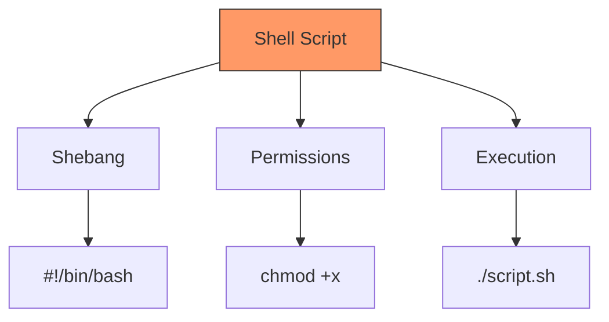
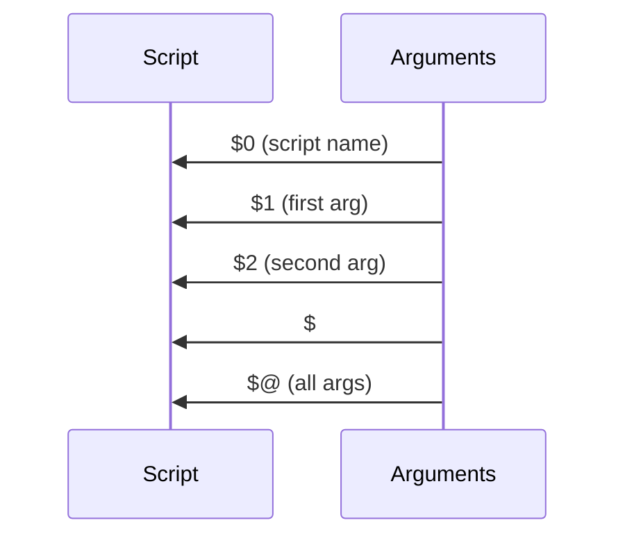
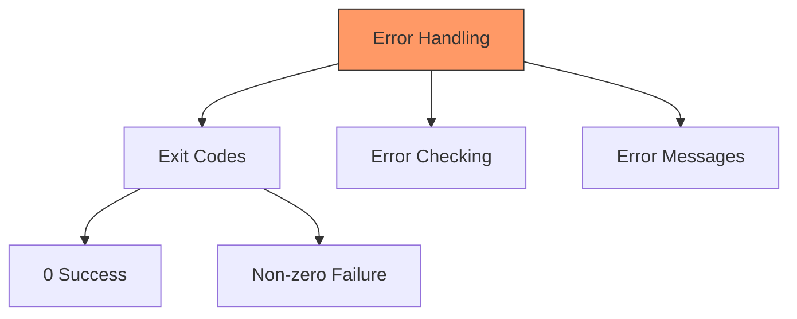
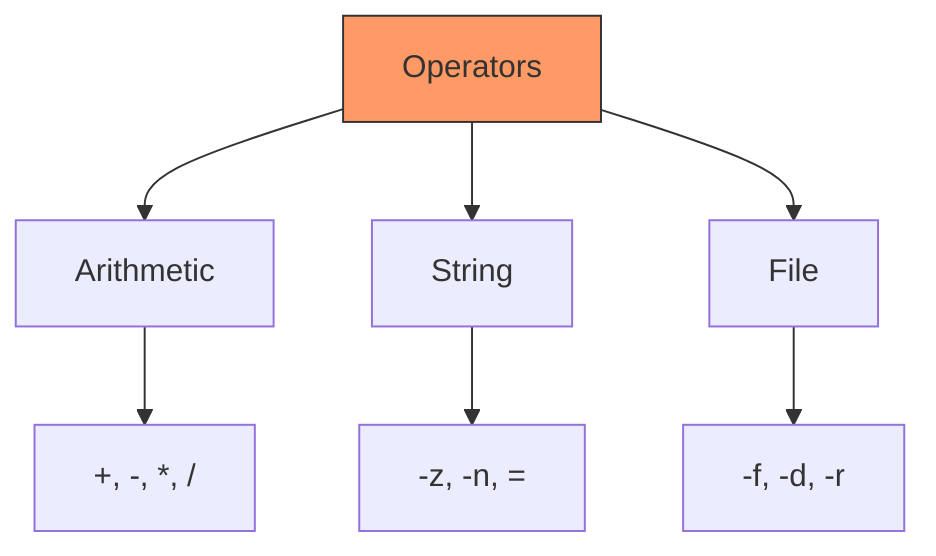
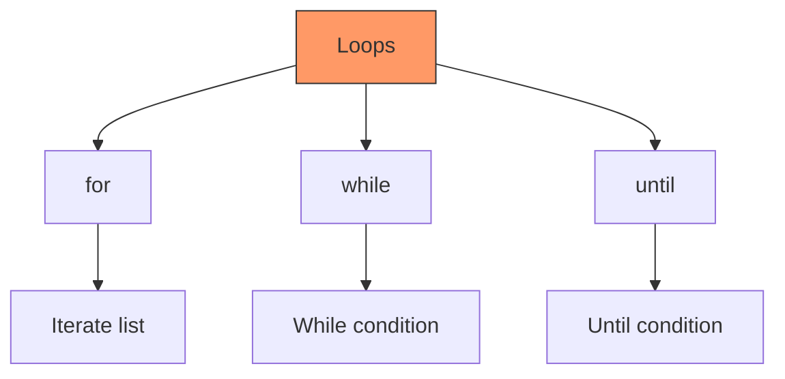

# Shell Scripting Introduction
## Getting Started with Shell Programming
---
## Your First Shell Script



Basic script:
```bash
#!/bin/bash
# My first script
echo "Hello, World!"
```

Running the script:
```bash
chmod +x script.sh
./script.sh
```

---

## Script Structure

```bash
#!/bin/bash

# Comments and documentation
# Author: Your Name
# Date: 2024-11-19
# Purpose: Example script

# Constants
readonly MAX_COUNT=10

# Variables
name="John"

# Main logic
echo "Starting script..."
echo "Hello, $name"

# Exit with status
exit 0
```

---

## Variables

```mermaid
graph TD
    A[Variables] --> B[Assignment]
    A --> C[Usage]
    A --> D[Scope]
    B --> E[name=value]
    C --> F[$name ${name}]
    D --> G[local/export]
    style A fill:#f96,stroke:#333
```

Variable examples:
```bash
# Assignment
name="John"
age=25

# Using variables
echo "Name: $name"
echo "Age: ${age}"

# Command output
current_date=$(date)
files=`ls`

# Read user input
read -p "Enter name: " user_name
```

---

## Command Line Arguments



Argument handling:
```bash
#!/bin/bash

echo "Script name: $0"
echo "First argument: $1"
echo "Second argument: $2"
echo "Number of arguments: $#"
echo "All arguments: $@"

# Shift arguments
shift
echo "New first argument: $1"
```

---

## Mathematical Operations

```bash
# Basic arithmetic
result=$((5 + 3))
echo $result

# Using let
let "a = 5"
let "b = a + 3"

# Using expr (legacy)
result=`expr 5 + 3`

# Floating point with bc
result=$(echo "5.5 + 3.2" | bc)

# Increment/Decrement
let "count++"
let "count--"
```

---

## Exit Status and Error Handling



Error handling:
```bash
#!/bin/bash

# Check command success
if ! command -v git &> /dev/null; then
    echo "Error: git not found"
    exit 1
fi

# Check previous command
some_command
if [ $? -ne 0 ]; then
    echo "Error occurred"
    exit 1
fi
```

---

## Expressions and Operators



Examples:
```bash
# Arithmetic
[ $a -eq $b ]  # Equal
[ $a -lt $b ]  # Less than

# String
[ -z "$str" ]  # Empty
[ "$a" = "$b" ] # Equal

# File
[ -f "file" ]  # Exists and regular
[ -d "dir" ]   # Directory exists
```

---

## Flow Control: If Statements

```bash
# Basic if
if [ "$a" -eq "$b" ]; then
    echo "Equal"
fi

# If-else
if [ "$count" -gt 10 ]; then
    echo "Greater than 10"
else
    echo "Less than or equal to 10"
fi

# If-elif-else
if [ "$grade" -ge 90 ]; then
    echo "A"
elif [ "$grade" -ge 80 ]; then
    echo "B"
else
    echo "C"
fi
```

---

## Case Statements

```bash
case "$option" in
    start)
        echo "Starting service"
        start_service
        ;;
    stop)
        echo "Stopping service"
        stop_service
        ;;
    restart)
        echo "Restarting service"
        restart_service
        ;;
    *)
        echo "Usage: $0 {start|stop|restart}"
        exit 1
        ;;
esac
```

---

## Loops



Examples:
```bash
# For loop
for i in 1 2 3 4 5; do
    echo "Number: $i"
done

# While loop
count=0
while [ $count -lt 5 ]; do
    echo "Count: $count"
    let count++
done

# Until loop
until [ "$answer" = "yes" ]; do
    read -p "Continue? " answer
done
```

---

## Functions

```bash
# Function definition
greeting() {
    local name="$1"
    echo "Hello, $name!"
}

# Function with return
is_number() {
    [[ "$1" =~ ^[0-9]+$ ]]
    return $?
}

# Using functions
greeting "John"

if is_number "123"; then
    echo "Valid number"
fi
```

---

## Practical Script Example

```bash
#!/bin/bash

# Backup script
backup_files() {
    local source_dir="$1"
    local backup_dir="$2"
    local timestamp=$(date +%Y%m%d_%H%M%S)
    
    # Check directories
    if [ ! -d "$source_dir" ]; then
        echo "Error: Source directory not found"
        return 1
    fi
    
    # Create backup
    tar -czf "$backup_dir/backup_$timestamp.tar.gz" \
        -C "$source_dir" .
    
    if [ $? -eq 0 ]; then
        echo "Backup created successfully"
        return 0
    else
        echo "Backup failed"
        return 1
    fi
}

# Main script
backup_files "/path/to/source" "/path/to/backup"
```

---

## Debugging Scripts

```bash
# Enable debugging
set -x  # Print commands
set -e  # Exit on error
set -u  # Error on undefined variables

# Run with debug
bash -x script.sh

# Debug specific section
set -x
# debugging starts
commands here
set +x
# debugging ends
```
