# TCP/IP Fundamentals
## Understanding the Internet's Core Protocols
---

## What is TCP/IP?
- Transmission Control Protocol/Internet Protocol
- Foundation of the internet and modern networking
- Suite of protocols that enable reliable data transmission
- Developed in the 1970s by DARPA

---

## The TCP/IP Protocol Stack

---

## Protocol Stack Details
- Application Layer: HTTP, FTP, SMTP, DNS
- Transport Layer: TCP, UDP
- Internet Layer: IP, ICMP, ARP
- Network Access Layer: Ethernet, Wi-Fi

---

## IP Addressing
- Unique identifier for devices on a network
- IPv4: 32-bit address (e.g., 192.168.1.1)
- IPv6: 128-bit address (e.g., 2001:0db8:85a3:0000:0000:8a2e:0370:7334)
- Divided into network and host portions

---

## IP Address Classes (IPv4)

---

## Subnetting
- Dividing networks into smaller networks
- Uses subnet masks to define network boundaries
- Enhances network management and security
- Example: 255.255.255.0 (/24 notation)

---

## IP Packet Structure

---

## TCP vs UDP
### Key Differences

| TCP | UDP |
|-----|-----|
| Connection-oriented | Connectionless |
| Reliable | Best effort |
| Ordered delivery | No order guarantee |
| Flow control | No flow control |

---

## TCP Three-Way Handshake

---

## TCP Flow Control
- Prevents overwhelming receivers
- Uses sliding window mechanism
- Window size adjusts dynamically
- Enables efficient data transfer

---

## TCP Congestion Control
- Slow Start
- Congestion Avoidance
- Fast Retransmit
- Fast Recovery

---

## UDP Characteristics
- Lightweight protocol
- No connection establishment
- No guarantee of delivery
- Ideal for real-time applications

---

## Common Applications

| Protocol | Port | Use Case |
|----------|------|----------|
| HTTP | 80 | Web browsing |
| HTTPS | 443 | Secure web |
| FTP | 21 | File transfer |
| DNS | 53 | Name resolution |

---

## Domain Name System (DNS)

---

## ARP (Address Resolution Protocol)
- Maps IP addresses to MAC addresses
- Essential for local network communication
- Maintains ARP cache for efficiency
- Broadcast-based protocol

---

## ICMP (Internet Control Message Protocol)
- Network diagnostic tool
- Error reporting
- Echo request/reply (ping)
- Path MTU discovery

---

## Network Security Basics
- Firewalls
- Access Control Lists
- Encryption (IPSec)
- Network Address Translation (NAT)

---

## NAT Operation

---

## IPv6 Features
- Larger address space
- Built-in security (IPSec)
- Simplified header format
- Better QoS support
- No need for NAT

---

## IPv6 Address Types
- Unicast
- Multicast
- Anycast
- Link-local
- Site-local

---

## Quality of Service (QoS)
- Traffic prioritization
- Bandwidth allocation
- Delay management
- Loss prevention
- Service guarantees

---

## Common Network Issues
- Packet loss
- Latency
- Jitter
- Congestion
- DNS resolution problems

---

## Troubleshooting Tools
- ping
- traceroute/tracert
- nslookup/dig
- netstat
- Wireshark

---

## Best Practices
- Regular monitoring
- Security updates
- Documentation
- Redundancy
- Backup systems

---

## Future of TCP/IP
- IPv6 adoption
- QUIC protocol
- Network automation
- SDN integration
- Enhanced security

---

## Review & Key Takeaways
- TCP/IP is fundamental to networking
- Understanding layers helps troubleshooting
- Security is critical
- Protocol selection matters
- Continuous evolution
