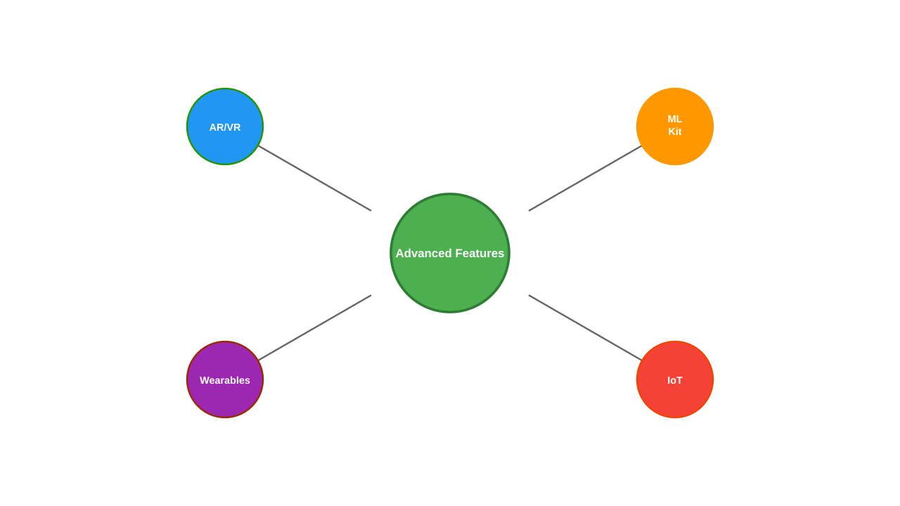

# Advanced Features and Integrations
## Enhancing Android Applications with Advanced Capabilities

---

## Feature Overview



---

## ML Kit Integration

```java
public class TextRecognizer {
    private final TextRecognizer recognizer;

    public void recognizeText(Bitmap image) {
        InputImage inputImage = InputImage.fromBitmap(image, 0);

        recognizer.process(inputImage)
            .addOnSuccessListener(text -> {
                for (Text.TextBlock block : text.getTextBlocks()) {
                    String blockText = block.getText();
                    Point[] blockCornerPoints = block.getCornerPoints();
                    Rect blockFrame = block.getBoundingBox();

                    for (Text.Line line : block.getLines()) {
                        // Process each line
                        processTextLine(line);
                    }
                }
            })
            .addOnFailureListener(e -> {
                // Handle any errors
                handleError(e);
            });
    }
}
```

---

## ARCore Implementation

```java
public class ARManager implements Scene.OnUpdateListener {
    private ArFragment arFragment;
    private ModelRenderable modelRenderable;

    public void setupAR(FragmentActivity activity) {
        arFragment = (ArFragment) activity
            .getSupportFragmentManager()
            .findFragmentById(R.id.ar_fragment);

        ModelRenderable.builder()
            .setSource(activity, R.raw.model)
            .build()
            .thenAccept(renderable ->
                modelRenderable = renderable)
            .exceptionally(throwable -> {
                handleError(throwable);
                return null;
            });

        arFragment.setOnTapArPlaneListener(
            (HitResult hitResult, Plane plane, MotionEvent motion) -> {
                placeObject(hitResult.createAnchor());
            });
    }

    private void placeObject(Anchor anchor) {
        AnchorNode anchorNode = new AnchorNode(anchor);
        anchorNode.setParent(arFragment.getArSceneView().getScene());

        TransformableNode node = new TransformableNode(
            arFragment.getTransformationSystem());
        node.setParent(anchorNode);
        node.setRenderable(modelRenderable);
        node.select();
    }
}
```

---

## Push Notification System

```java
public class NotificationManager {
    public void setupFCM() {
        FirebaseMessaging.getInstance().getToken()
            .addOnCompleteListener(task -> {
                if (task.isSuccessful()) {
                    String token = task.getResult();
                    sendTokenToServer(token);
                }
            });
    }

    @Override
    public void onMessageReceived(RemoteMessage message) {
        if (message.getData().size() > 0) {
            handleDataMessage(message.getData());
        }

        if (message.getNotification() != null) {
            showNotification(
                message.getNotification().getTitle(),
                message.getNotification().getBody()
            );
        }
    }

    private void showNotification(String title, String body) {
        NotificationCompat.Builder builder =
            new NotificationCompat.Builder(this, CHANNEL_ID)
                .setSmallIcon(R.drawable.ic_notification)
                .setContentTitle(title)
                .setContentText(body)
                .setPriority(NotificationCompat.PRIORITY_DEFAULT)
                .setAutoCancel(true);

        NotificationManagerCompat.from(this)
            .notify(NOTIFICATION_ID, builder.build());
    }
}
```

---

## Social Integration

```java
public class SocialIntegration {
    private GoogleSignInClient googleSignInClient;

    public void setupGoogleSignIn() {
        GoogleSignInOptions gso = new GoogleSignInOptions.Builder(
            GoogleSignInOptions.DEFAULT_SIGN_IN)
            .requestEmail()
            .requestId()
            .requestProfile()
            .build();

        googleSignInClient = GoogleSignIn.getClient(activity, gso);
    }

    public void shareContent() {
        Intent shareIntent = new Intent(Intent.ACTION_SEND)
            .setType("text/plain")
            .putExtra(Intent.EXTRA_SUBJECT, "Share Title")
            .putExtra(Intent.EXTRA_TEXT, "Content to share");

        activity.startActivity(Intent.createChooser(
            shareIntent,
            "Share via"
        ));
    }

    public void handleDeepLink(Uri deepLinkUri) {
        String path = deepLinkUri.getPath();
        String id = deepLinkUri.getQueryParameter("id");

        switch (path) {
            case "/product":
                openProduct(id);
                break;
            case "/profile":
                openProfile(id);
                break;
        }
    }
}
```

---

## TensorFlow Lite Integration

```java
public class ImageClassifier {
    private Interpreter tflite;
    private List<String> labels;

    public void initializeInterpreter(Context context) {
        try {
            MappedByteBuffer modelFile = loadModelFile(context);
            tflite = new Interpreter(modelFile);
            labels = loadLabels(context);
        } catch (IOException e) {
            handleError(e);
        }
    }

    public String classifyImage(Bitmap bitmap) {
        // Preprocess the image
        ByteBuffer inputBuffer = convertBitmapToByteBuffer(bitmap);

        // Output array for classification results
        float[][] outputArray = new float[1][labels.size()];

        // Run inference
        tflite.run(inputBuffer, outputArray);

        // Process results
        return processResults(outputArray[0]);
    }

    private String processResults(float[] probabilities) {
        int maxIndex = 0;
        float maxProb = 0;

        for (int i = 0; i < probabilities.length; i++) {
            if (probabilities[i] > maxProb) {
                maxProb = probabilities[i];
                maxIndex = i;
            }
        }

        return labels.get(maxIndex);
    }
}
```

---

## Rich Notifications

```java
public class RichNotificationManager {
    public void showRichNotification(
            Context context,
            String title,
            String content,
            Bitmap largeIcon) {

        // Create notification channel for Android O and above
        createNotificationChannel(context);

        // Build rich notification
        NotificationCompat.Builder builder =
            new NotificationCompat.Builder(context, CHANNEL_ID)
                .setSmallIcon(R.drawable.ic_notification)
                .setContentTitle(title)
                .setContentText(content)
                .setLargeIcon(largeIcon)
                .setStyle(new NotificationCompat.BigPictureStyle()
                    .bigPicture(largeIcon)
                    .bigLargeIcon(null))
                .addAction(R.drawable.ic_reply, "Reply",
                    getReplyPendingIntent())
                .setPriority(NotificationCompat.PRIORITY_HIGH)
                .setAutoCancel(true);

        NotificationManagerCompat.from(context)
            .notify(NOTIFICATION_ID, builder.build());
    }
}
```

---

## Integration Best Practices



---

## Assignment Preview
### Advanced Features Implementation

Create an application that:
1. Implements ML Kit features
1. Integrates AR functionality
1. Sets up push notifications
1. Implements social sharing
1. Handles deep links
1. Uses TensorFlow Lite

---

## Resources

- ML Kit Documentation
- ARCore Guide
- Firebase Cloud Messaging
- TensorFlow Lite Documentation
- Social Integration Guides
