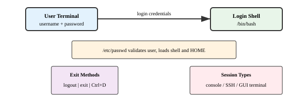

# UNIX Basics
## Getting Started with the Command Line
---
## Logging In and Out



Common commands:

```bash
logout    # Clean shell exit
exit      # Exit current shell
Ctrl+D    # EOF (same as exit)
```

---
## Password Management

```bash
# Change your password
passwd

# View password status
passwd -S

# Force password change on next login (root only)
chage -d 0 username
```


---
## Command Structure

Basic syntax:

```bash
command [options] [arguments]
```

Examples:

```bash
ls -l /home
cp -r source_dir destination_dir
find /home -name "*.txt"
```


---
## Simple Commands

Common basic commands:

```bash
# Display current directory
pwd

# List files
ls

# Create directory
mkdir new_directory

# Remove file
rm file.txt

# Copy file
cp source.txt destination.txt

# Move/rename file
mv old.txt new.txt
```

---
## Getting Help

```bash
# View manual page
man ls

# Short command help
ls --help

# Search manual pages
apropos "list files"

# View command type
type ls
```


---
## Control Characters



Common control characters:
| Key      | Function          |
|----------|-------------------|
| Ctrl+C   | Interrupt        |
| Ctrl+Z   | Suspend          |
| Ctrl+D   | End of input     |
| Ctrl+L   | Clear screen     |
| Ctrl+R   | Search history   |

---
## Command Line Editing



Navigation shortcuts:

```bash
Ctrl+A  # Move to beginning of line
Ctrl+E  # Move to end of line
Ctrl+U  # Clear line before cursor
Ctrl+K  # Clear line after cursor
Alt+B   # Move back one word
Alt+F   # Move forward one word
```

---
## Command Examples in Practice

Let's combine what we've learned:

```bash
# Create and navigate directories
mkdir -p projects/unix_basics
cd projects/unix_basics

# Create and edit files
touch notes.txt
echo "UNIX Basics" > notes.txt

# View file contents
cat notes.txt
less notes.txt

# Copy and move files
cp notes.txt backup_notes.txt
mv backup_notes.txt ../notes_backup.txt
```

---
## Common Mistakes and Solutions



Solutions:

```bash
# Permission denied
sudo command

# Command not found
which command
echo $PATH

# File not found
ls -la
pwd
```

---
## Practice Exercise

Try these commands:

```bash
# 1. Create a new directory
mkdir practice

# 2. Create some files
touch practice/file{1..5}.txt

# 3. List files with details
ls -l practice/

# 4. Copy files to backup
cp -r practice practice_backup

# 5. Clean up
rm -rf practice practice_backup
```
