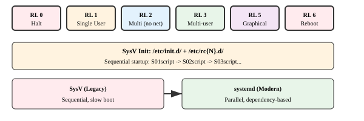
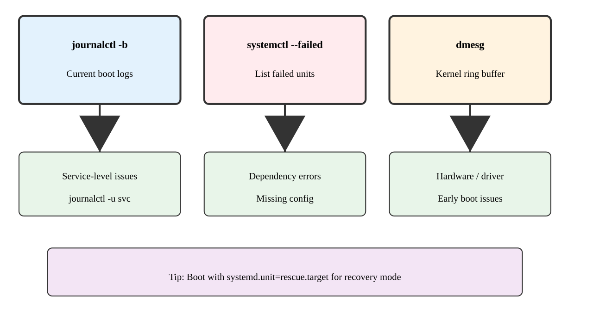

# Linux Boot System
## Understanding systemd and Boot Process
---
## Linux Boot Sequence


1. BIOS/UEFI initialization
1. Bootloader (GRUB) loads kernel
1. Kernel initialization
1. systemd starts system
1. Services start in parallel
---
## Old SysV Init System



Traditional runlevels:
- 0: Halt
- 1: Single user
- 2: Multi-user (no networking)
- 3: Multi-user
- 4: User-defined
- 5: Graphical
- 6: Reboot

---
## systemd Introduction


Key features:
- Service management
- Dependency resolution
- Parallel execution
- On-demand services
- Resource control
- Logging (journald)

---
## systemd Units



Common unit types:

```bash
# Service units
.service    # System services
.socket     # IPC/network sockets
.target     # Group of units
.mount      # Filesystem mounts
.timer      # Scheduled tasks
.device     # Hardware devices
```

---
## Basic systemctl Commands

```bash
# List units
systemctl list-units
systemctl list-units --type=service

# Check status
systemctl status nginx.service

# Start/stop service
systemctl start nginx.service
systemctl stop nginx.service

# Enable/disable on boot
systemctl enable nginx.service
systemctl disable nginx.service
```

---
## Service Management


Common operations:

```bash
# Manage service
systemctl start service
systemctl stop service
systemctl restart service
systemctl reload service
systemctl status service

# View service logs
journalctl -u service
```

---
## Writing systemd Service Files

Location: `/etc/systemd/system/myservice.service`

```ini
[Unit]
Description=My Custom Service
After=network.target

[Service]
Type=simple
ExecStart=/usr/local/bin/myapp
User=myuser
Group=mygroup
Restart=always

[Install]
WantedBy=multi-user.target
```

---
## Service File Sections



Common options:

```ini
# Unit section
Description=
After=
Requires=
Wants=

# Service section
Type=
ExecStart=
User=
Restart=

# Install section
WantedBy=
```

---
## Dependency Management

```bash
# View dependencies
systemctl list-dependencies nginx.service

# Check reverse dependencies
systemctl list-dependencies --reverse nginx.service

# Show unit dependencies
systemctl show -p "Requires" nginx.service
systemctl show -p "Wants" nginx.service
```

---
## rc.local Compatibility

For legacy support:

```bash
# Create rc-local service
/etc/systemd/system/rc-local.service

[Unit]
Description=RC Local
After=network.target

[Service]
Type=forking
ExecStart=/etc/rc.local
TimeoutSec=0
StandardOutput=tty
RemainAfterExit=yes

[Install]
WantedBy=multi-user.target
```

---
## Writing Custom init.d Scripts

```bash
#!/bin/bash
### BEGIN INIT INFO
# Provides:          myservice
# Required-Start:    $remote_fs $syslog
# Required-Stop:     $remote_fs $syslog
# Default-Start:     2 3 4 5
# Default-Stop:      0 1 6
# Short-Description: My service
### END INIT INFO

case "$1" in
    start)
        echo "Starting service"
        ;;
    stop)
        echo "Stopping service"
        ;;
    restart)
        echo "Restarting service"
        ;;
    status)
        echo "Service status"
        ;;
    *)
        echo "Usage: $0 {start|stop|restart|status}"
        exit 1
        ;;
esac

exit 0
```

---
## Systemd Targets


Target management:

```bash
# Get default target
systemctl get-default

# Set default target
systemctl set-default multi-user.target

# Switch target
systemctl isolate graphical.target
```

---
## Troubleshooting Boot Issues



Debug commands:

```bash
# View boot logs
journalctl -b

# Check failed units
systemctl --failed

# Boot messages
dmesg

# System status
systemctl status
```

---
## Best Practices

1. Service Management:

```bash
# Verify syntax
systemd-analyze verify myservice.service

# Test service
systemctl start myservice.service
systemctl status myservice.service
journalctl -u myservice.service
```

1. Security:

```ini
[Service]
# Restrict service
PrivateTmp=true
NoNewPrivileges=true
ProtectSystem=full
ProtectHome=true
```
