# DNS Server Administration (Optional)
## Concepts, BIND, Zone Files, and DNSSEC

---
## DNS Concepts



- DNS translates domain names to IP addresses
- Hierarchical, distributed database
- Query flow: client -> resolver -> root -> TLD -> authoritative

---
## DNS Resolution Process

1. Client checks local cache and `/etc/hosts`
1. Client queries recursive resolver (usually ISP or `8.8.8.8`)
1. Resolver checks its cache
1. If not cached, resolver queries root servers (`.`)
1. Root refers to TLD server (`.com`, `.org`, etc.)
1. TLD refers to authoritative nameserver
1. Authoritative returns the answer
1. Resolver caches the response (respects TTL)

```bash
# Trace full resolution path
dig +trace example.com

# Show query time and server used
dig example.com +stats
```

---
## DNS Record Types

| Type | Purpose | Example |
|------|---------|---------|
| A | IPv4 address | `www  A  93.184.216.34` |
| AAAA | IPv6 address | `www  AAAA  2001:db8::1` |
| CNAME | Alias | `blog  CNAME  www` |
| MX | Mail server | `@  MX 10  mail` |
| NS | Name server | `@  NS  ns1.example.com` |
| TXT | Text data | `@  TXT  "v=spf1 ..."` |
| SOA | Zone authority | Start of zone info |
| PTR | Reverse lookup | IP to name |
| SRV | Service location | `_sip._tcp SRV ...` |

---
## DNS Query Tools

```bash
# dig - primary DNS tool
dig example.com             # A record
dig example.com MX          # MX records
dig example.com ANY         # all records
dig @8.8.8.8 example.com   # query specific server
dig +short example.com      # concise output
dig +norecurse example.com  # non-recursive query

# nslookup (simpler)
nslookup example.com
nslookup -type=mx example.com

# host (simplest)
host example.com
host -t mx example.com
host 93.184.216.34          # reverse lookup
```

---
## Setting Up BIND

```bash
# Install
apt install bind9 bind9-utils

# Main config files
# /etc/bind/named.conf
# /etc/bind/named.conf.options
# /etc/bind/named.conf.local
```

```config
# /etc/bind/named.conf.options
options {
    directory "/var/cache/bind";
    recursion yes;
    allow-recursion { 192.168.1.0/24; };
    forwarders {
        8.8.8.8;
        8.8.4.4;
    };
    listen-on { any; };
};
```

---
## BIND Security Options

```config
# /etc/bind/named.conf.options (security)
options {
    # Hide BIND version
    version "not disclosed";

    # Disable zone transfers by default
    allow-transfer { none; };

    # Rate limit responses (DDoS protection)
    rate-limit {
        responses-per-second 10;
        window 5;
    };

    # Disable recursion for external queries
    allow-recursion { 10.0.0.0/8; 192.168.0.0/16; };

    # Query logging
    querylog yes;
};
```

---
## Setting Up dnsmasq

```bash
# Install
apt install dnsmasq
```

```config
# /etc/dnsmasq.conf
# DNS settings
server=8.8.8.8
server=8.8.4.4
domain=example.com
local=/example.com/

# DHCP settings (optional)
dhcp-range=192.168.1.100,192.168.1.200,12h

# Static entries
address=/app.example.com/192.168.1.50
```

Lightweight alternative to `BIND` for small networks.

---
## Zone Files

```config
; /etc/bind/db.example.com
$TTL    604800
@   IN  SOA ns1.example.com. admin.example.com. (
            2024011501  ; Serial (YYYYMMDDNN)
            3600        ; Refresh
            1800        ; Retry
            604800      ; Expire
            86400 )     ; Negative TTL

@       IN  NS      ns1.example.com.
@       IN  NS      ns2.example.com.
@       IN  A       93.184.216.34
@       IN  MX  10  mail.example.com.
ns1     IN  A       93.184.216.10
ns2     IN  A       93.184.216.11
www     IN  A       93.184.216.34
mail    IN  A       93.184.216.20
```

---
## Zone File Details

```config
; SOA Record Fields:
; ns1.example.com. - primary nameserver
; admin.example.com. - admin email (@ replaced with .)

; Serial: MUST increment on every change
; Refresh: how often secondary checks for updates
; Retry: how often secondary retries failed refresh
; Expire: secondary stops serving after this
; Negative TTL: how long to cache NXDOMAIN

; Common records
@       IN  TXT     "v=spf1 mx ~all"
_dmarc  IN  TXT     "v=DMARC1; p=reject"

; Wildcard record
*       IN  A       93.184.216.34

; Delegation
sub     IN  NS      ns1.sub.example.com.
```

---
## Zone Configuration and Transfers

```config
# /etc/bind/named.conf.local (primary)
zone "example.com" {
    type master;
    file "/etc/bind/db.example.com";
    allow-transfer { 192.168.1.12; };
    notify yes;
};
```

```config
# On secondary server
zone "example.com" {
    type slave;
    file "/var/cache/bind/db.example.com";
    masters { 192.168.1.11; };
};
```

```bash
# Check zone file syntax
named-checkzone example.com /etc/bind/db.example.com
named-checkconf
```

---
## Reverse Lookup Zones

```config
; /etc/bind/db.1.168.192
$TTL    604800
@   IN  SOA ns1.example.com. admin.example.com. (
            2024011501 3600 1800 604800 86400 )

@       IN  NS      ns1.example.com.
34      IN  PTR     www.example.com.
20      IN  PTR     mail.example.com.
```

```config
# named.conf.local
zone "1.168.192.in-addr.arpa" {
    type master;
    file "/etc/bind/db.1.168.192";
};
```

```bash
# Test forward and reverse lookups
dig @localhost example.com
dig @localhost -x 192.168.1.34
```

---
## DNS Troubleshooting

```bash
# Check BIND status and logs
systemctl status named
journalctl -u named -f

# Verify zone serial propagation
dig @ns1.example.com example.com SOA +short
dig @ns2.example.com example.com SOA +short

# Check for delegation issues
dig +trace example.com

# DNS cache flush
rndc flush               # BIND
systemctl restart systemd-resolved  # systemd

# Check for DNS amplification vulnerability
dig @your-server . ANY +edns=0 +bufsize=4096
```

---
## DNS Security (DNSSEC Basics)

```bash
# Generate zone signing key (ZSK)
dnssec-keygen -a ECDSAP256SHA256 example.com

# Generate key signing key (KSK)
dnssec-keygen -a ECDSAP256SHA256 -f KSK example.com

# Sign the zone
dnssec-signzone -o example.com db.example.com

# Verify DNSSEC
dig +dnssec example.com
delv example.com
```

`DNSSEC` provides:
- Authentication of DNS data origin
- Data integrity verification
- Authenticated denial of existence

---
## DNSSEC Validation

```bash
# Enable DNSSEC validation in BIND
# /etc/bind/named.conf.options
# dnssec-validation auto;

# Test DNSSEC validation
dig +dnssec +cd example.com   # check disabled
dig +dnssec example.com       # with validation

# Check DNSSEC chain
delv @127.0.0.1 example.com

# Common DNSSEC issues:
# - Expired signatures (re-sign zone)
# - Missing DS records at registrar
# - Clock skew (DNSSEC uses timestamps)
# - Key rollover failures
```

---
## DNS Caching with `unbound`

```bash
# Install unbound (caching resolver)
apt install unbound

# /etc/unbound/unbound.conf
```

```yaml
server:
    interface: 0.0.0.0
    access-control: 192.168.1.0/24 allow
    cache-min-ttl: 60
    cache-max-ttl: 86400
    prefetch: yes
    num-threads: 2
    msg-cache-size: 64m
    rrset-cache-size: 128m

    # Privacy: use DNS-over-TLS upstream
    tls-cert-bundle: /etc/ssl/certs/ca-certificates.crt

forward-zone:
    name: "."
    forward-tls-upstream: yes
    forward-addr: 1.1.1.1@853
    forward-addr: 8.8.8.8@853
```

```bash
# Check cache statistics
unbound-control stats_noreset | grep cache
unbound-control dump_cache > cache-backup.txt
```

---
## Split-Horizon DNS

```config
# /etc/bind/named.conf - serve different answers
# based on client network

acl "internal" { 192.168.0.0/16; 10.0.0.0/8; };
acl "external" { any; };

view "internal" {
    match-clients { internal; };
    zone "example.com" {
        type master;
        file "/etc/bind/db.example.com.internal";
    };
};

view "external" {
    match-clients { external; };
    zone "example.com" {
        type master;
        file "/etc/bind/db.example.com.external";
    };
};
```

Use cases:
- Internal services resolve to private IPs
- External clients get public IPs
- Different `MX` records per network

---
## DNS-Based Load Balancing

```config
; Round-robin: multiple A records for same name
www     IN  A   10.0.1.1
www     IN  A   10.0.1.2
www     IN  A   10.0.1.3

; Weighted with BIND RPZ or response-policy
; Or use low TTL for faster failover
$TTL 30
www     IN  A   10.0.1.1
```

```bash
# Verify round-robin is working
for i in $(seq 1 6); do
  dig +short @localhost www.example.com
done
```

Limitations of DNS load balancing:
- No health checking (stale records serve dead hosts)
- Client caching ignores TTL
- Uneven distribution (DNS caches)
- No session persistence

For production, combine with `HAProxy` or cloud load balancers.

---
## DNS Monitoring and Alerting

```bash
# Monitor query rates with rndc
rndc stats
cat /var/cache/bind/named.stats

# Enable query logging (use sparingly)
rndc querylog on
tail -f /var/log/named/query.log
rndc querylog off

# Monitor with dnstop (live traffic)
apt install dnstop
dnstop eth0

# Check zone serial consistency
dig @ns1.example.com example.com SOA +short
dig @ns2.example.com example.com SOA +short
```

```bash
# Simple health check script
#!/bin/bash
RESULT=$(dig +short +time=2 @localhost example.com)
if [ -z "$RESULT" ]; then
  echo "DNS resolution failed" | \
    mail -s "DNS Alert" admin@example.com
fi
```

---
## Advanced `dig` Usage

```bash
# Trace full delegation chain
dig +trace example.com

# Query with specific options
dig +nocmd +noall +answer example.com
dig +nocmd +noall +authority example.com NS

# Check AXFR (zone transfer)
dig @ns1.example.com example.com AXFR

# Reverse DNS lookup
dig -x 93.184.216.34

# Batch queries from file
dig -f queries.txt +short

# Check specific record with timing
dig example.com A +stats +noall +answer

# Test EDNS client subnet
dig @8.8.8.8 example.com +subnet=1.2.3.0/24

# Compare responses from two servers
diff <(dig @ns1 example.com ANY +short) \
     <(dig @ns2 example.com ANY +short)

# Query over TCP (useful for large responses)
dig +tcp example.com AXFR
```

---
## DNS over HTTPS and DNS over TLS

Encrypt DNS queries to prevent eavesdropping and tampering:

```bash
# DNS over TLS (DoT) with unbound
# /etc/unbound/unbound.conf
```

```yaml
server:
    tls-cert-bundle: /etc/ssl/certs/ca-certificates.crt

forward-zone:
    name: "."
    forward-tls-upstream: yes
    forward-addr: 1.1.1.1@853#cloudflare-dns.com
    forward-addr: 8.8.8.8@853#dns.google
```

```bash
# DNS over HTTPS (DoH) with dnscrypt-proxy
apt install dnscrypt-proxy

# /etc/dnscrypt-proxy/dnscrypt-proxy.toml
# server_names = ['cloudflare', 'google']
# listen_addresses = ['127.0.0.1:5353']

# Point systemd-resolved to local DoH proxy
# /etc/systemd/resolved.conf
# DNS=127.0.0.1:5353

# Verify encrypted DNS is working
tcpdump -i eth0 port 53   # should show no traffic
tcpdump -i eth0 port 853  # DoT traffic visible here
```

---
## BIND Logging Configuration

Fine-grained logging helps with debugging and security monitoring:

```config
# /etc/bind/named.conf.local
logging {
    channel query_log {
        file "/var/log/named/query.log"
          versions 5 size 50m;
        severity info;
        print-time yes;
        print-category yes;
    };

    channel security_log {
        file "/var/log/named/security.log"
          versions 3 size 20m;
        severity dynamic;
        print-time yes;
        print-severity yes;
    };

    category queries { query_log; };
    category security { security_log; };
    category xfer-in { security_log; };
    category xfer-out { security_log; };
    category default { default_syslog; };
};
```

```bash
# Create log directory
mkdir -p /var/log/named
chown bind:bind /var/log/named

# Toggle query logging at runtime
rndc querylog on
rndc querylog off
```

---
## DNS Migration Strategies

Migrating DNS providers or servers with minimal downtime:

1. **Lower TTL** well in advance (48 hours before migration):

```config
; Change TTL from 3600 to 300 (5 minutes)
$TTL 300
www     IN  A   10.0.1.1
```

1. **Set up new server** and replicate all zone data:

```bash
# Export zone from old server
dig @old-ns axfr example.com > zone-export.txt

# Verify record counts match
dig @old-ns example.com ANY +short | wc -l
dig @new-ns example.com ANY +short | wc -l
```

1. **Run both servers** in parallel, verify responses match
1. **Update NS records** at the registrar to point to new servers
1. **Monitor** for 48-72 hours, then decommission old server
1. **Restore TTL** to original value after migration is stable

Key pitfalls:
- Forgetting to lower TTL before migration
- Not testing reverse DNS (`PTR`) records
- Missing `DNSSEC` DS record updates at registrar

---
## Exercise: Build a Caching DNS Resolver

Set up a local caching DNS resolver with logging and forwarding:

1. Install `unbound` and configure it to:
    - Listen on `127.0.0.1` port `53`
    - Allow queries from the local subnet
    - Forward to upstream DNS over TLS (port `853`)
    - Enable prefetching for popular domains

```bash
apt install unbound
# Edit /etc/unbound/unbound.conf
unbound-checkconf
systemctl restart unbound
```

1. Configure the system to use the local resolver:

```bash
# /etc/resolv.conf
# nameserver 127.0.0.1
```

1. Test caching behavior:

```bash
# First query (uncached)
dig @127.0.0.1 example.com +stats
# Note the query time

# Second query (cached)
dig @127.0.0.1 example.com +stats
# Query time should be 0 msec
```

1. Verify DNS over TLS is working by capturing traffic on port `853`
1. Add a local zone override for an internal hostname
