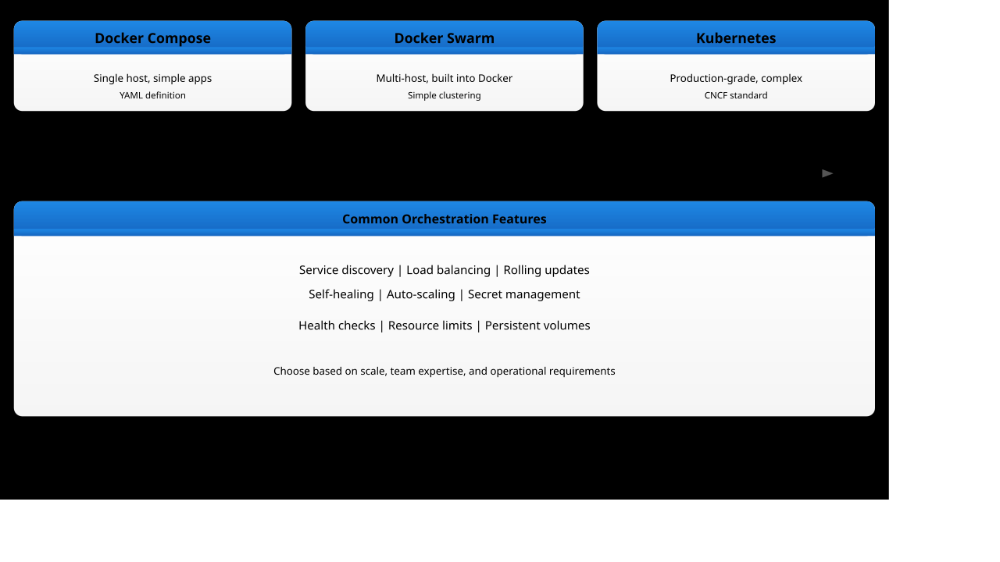

# Containerization (Optional)
## Docker, Podman, and Container Management

---
## Container Concepts



- Containers share the host kernel (unlike VMs)
- Isolated via `namespaces` and `cgroups`
- Lightweight, fast startup, portable
- Image-based: immutable layers

---
## Containers vs Virtual Machines

| Feature | Containers | Virtual Machines |
|---------|-----------|-----------------|
| Isolation | Process-level | Hardware-level |
| Startup | Seconds | Minutes |
| Size | MBs | GBs |
| Overhead | Minimal | Significant |
| Kernel | Shared | Separate |
| Security | Namespace isolation | Full isolation |
| Portability | Image-based | Image-based |

Use containers for: microservices, CI/CD, development.
Use VMs for: strong isolation, different OS kernels.

---
## Linux Kernel Features Behind Containers

**Namespaces** - isolation:
- `PID` - process IDs
- `NET` - network interfaces
- `MNT` - mount points
- `UTS` - hostname
- `IPC` - inter-process communication
- `USER` - user/group IDs

**cgroups** - resource limits:
- CPU, memory, I/O, network bandwidth

```bash
# View namespaces of a process
ls -la /proc/<PID>/ns/

# View cgroup of a process
cat /proc/<PID>/cgroup
```

---
## Docker Basics

```bash
# Install Docker
apt install docker.io

# Run a container
docker run -d --name web -p 80:80 nginx

# List containers
docker ps            # running
docker ps -a         # all

# Stop and remove
docker stop web
docker rm web

# View logs
docker logs web
docker logs -f web   # follow

# Execute command in container
docker exec -it web bash
```

---
## Docker Run Options

```bash
# Run interactively
docker run -it ubuntu:24.04 bash

# Run with environment variables
docker run -d -e MYSQL_ROOT_PASSWORD=secret mysql

# Run with auto-restart
docker run -d --restart=unless-stopped nginx

# Run with custom hostname
docker run -d --hostname myhost nginx

# Run with resource limits
docker run -d --memory=512m --cpus=1.5 nginx

# Run with read-only filesystem
docker run -d --read-only \
  --tmpfs /tmp --tmpfs /run nginx

# Run with custom DNS
docker run -d --dns 8.8.8.8 nginx
```

---
## Docker Images

```bash
# Pull an image
docker pull ubuntu:24.04

# List images
docker images

# Remove an image
docker rmi ubuntu:24.04

# Search for images
docker search nginx

# Image history (layers)
docker history nginx

# Save/load images (for offline transfer)
docker save nginx > nginx.tar
docker load < nginx.tar
```

---
## Docker Image Layers

```bash
# Inspect image layers
docker inspect nginx | jq '.[0].RootFS'

# View layer sizes
docker history nginx --no-trunc

# Multi-stage builds reduce image size
```

```dockerfile
# Multi-stage build example
FROM golang:1.22 AS builder
WORKDIR /app
COPY . .
RUN go build -o myapp .

FROM alpine:3.19
COPY --from=builder /app/myapp /usr/local/bin/
CMD ["myapp"]
```

Layer best practices:
- Combine `RUN` commands to reduce layers
- Put frequently changing steps last
- Use `.dockerignore` to exclude files

---
## Docker Volumes and Networks

```bash
# Create a named volume
docker volume create mydata

# Run with volume mount
docker run -d -v mydata:/data nginx

# Bind mount (host directory)
docker run -d -v /host/path:/container/path nginx

# List volumes
docker volume ls
```

```bash
# Create a network
docker network create mynet

# Run containers on network
docker run -d --network mynet --name db postgres
docker run -d --network mynet --name web nginx

# Containers on same network can reach each
# other by name
```

---
## Docker Network Types

```bash
# Bridge (default) - isolated network
docker network create --driver bridge mybridge

# Host - share host network stack
docker run --network host nginx

# None - no networking
docker run --network none nginx

# Custom bridge with subnet
docker network create --subnet=172.20.0.0/16 \
  --gateway=172.20.0.1 custom-net

# Connect container to multiple networks
docker network connect mynet2 web

# Inspect network
docker network inspect mynet
```

---
## Writing Dockerfiles

```dockerfile
FROM ubuntu:24.04

RUN apt-get update && apt-get install -y \
    python3 \
    python3-pip \
    && rm -rf /var/lib/apt/lists/*

WORKDIR /app
COPY requirements.txt .
RUN pip3 install -r requirements.txt

COPY . .

EXPOSE 8000
USER appuser

CMD ["python3", "app.py"]
```

```bash
# Build image
docker build -t myapp:1.0 .
```

---
## Dockerfile Best Practices

```dockerfile
# Use specific base image tags (not :latest)
FROM python:3.12-slim

# Create non-root user
RUN groupadd -r appuser && useradd -r -g appuser appuser

# Set working directory
WORKDIR /app

# Install dependencies first (layer caching)
COPY requirements.txt .
RUN pip install --no-cache-dir -r requirements.txt

# Copy application code
COPY --chown=appuser:appuser . .

# Use HEALTHCHECK
HEALTHCHECK --interval=30s --timeout=3s \
  CMD curl -f http://localhost:8000/health || exit 1

# Switch to non-root
USER appuser

# Use exec form for CMD
CMD ["python3", "app.py"]
```

---
## Podman: Rootless Containers

```bash
# Install
apt install podman

# Podman is CLI-compatible with Docker
podman run -d --name web -p 80:80 nginx
podman ps
podman stop web
podman rm web
```

Key differences from `Docker`:
- Daemonless - no background service
- Rootless by default - better security
- `Systemd` integration for container services
- No `docker.sock` attack surface

```bash
# Generate systemd unit for container
podman generate systemd --name web --new > \
  ~/.config/systemd/user/web.service
systemctl --user enable --now web
```

---
## Podman Pods

```bash
# Create a pod (group of containers sharing network)
podman pod create --name mypod -p 8080:80

# Add containers to the pod
podman run -d --pod mypod --name web nginx
podman run -d --pod mypod --name app myapp:1.0

# Containers in the pod share localhost
# web can reach app on localhost:<port>

# List pods
podman pod list

# Stop/start pod
podman pod stop mypod
podman pod start mypod

# Generate Kubernetes YAML from pod
podman generate kube mypod > mypod.yaml
```

---
## Container Management and Lifecycle

```bash
# Inspect container details
docker inspect web

# Resource usage
docker stats

# Limit resources
docker run -d --memory=512m --cpus=1.0 nginx

# System cleanup
docker system prune          # remove unused data
docker system prune -a       # include unused images
docker volume prune          # remove unused volumes

# Export/import container filesystem
docker export web > web.tar
docker import web.tar myimage:latest
```

---
## Container Security Best Practices

1. Use official/verified base images
1. Run as non-root user (`USER` directive)
1. Use read-only filesystem (`--read-only`)
1. Drop unnecessary capabilities

```bash
docker run -d \
  --read-only \
  --tmpfs /tmp \
  --cap-drop ALL \
  --cap-add NET_BIND_SERVICE \
  --security-opt no-new-privileges \
  --user 1000:1000 \
  myapp:1.0
```

1. Scan images for vulnerabilities

```bash
# Trivy scanner
trivy image myapp:1.0
```

---
## Docker Compose

Define multi-container applications in a single file:

```yaml
# docker-compose.yml
services:
  web:
    image: nginx:1.25
    ports:
      - "80:80"
    depends_on:
      - app
    networks:
      - frontend
  app:
    build: ./app
    environment:
      - DB_HOST=db
    networks:
      - frontend
      - backend
  db:
    image: postgres:16
    volumes:
      - dbdata:/var/lib/postgresql/data
    networks:
      - backend
volumes:
  dbdata:
networks:
  frontend:
  backend:
```

```bash
docker compose up -d
docker compose ps
docker compose down
```

---
## Docker Compose Operations

```bash
# Scale a service
docker compose up -d --scale app=3

# View logs for all services
docker compose logs -f

# Rebuild images
docker compose build --no-cache

# Execute command in a service
docker compose exec app bash

# View resource usage per service
docker compose top

# Pull latest images
docker compose pull

# Restart a single service
docker compose restart app

# Override with multiple files
docker compose -f docker-compose.yml \
  -f docker-compose.prod.yml up -d
```

---
## Container Logging

```bash
# View logs with timestamps
docker logs --timestamps web

# Tail last 50 lines
docker logs --tail 50 web

# Configure logging driver
docker run -d \
  --log-driver=json-file \
  --log-opt max-size=10m \
  --log-opt max-file=3 \
  nginx
```

Configure default logging in `/etc/docker/daemon.json`:

```json
{
  "log-driver": "json-file",
  "log-opts": {
    "max-size": "10m",
    "max-file": "5"
  }
}
```

---
## Container Health Checks

```bash
# Health check in docker run
docker run -d \
  --health-cmd="curl -f http://localhost/ || exit 1" \
  --health-interval=30s \
  --health-timeout=5s \
  --health-retries=3 \
  --health-start-period=10s \
  nginx

# Check health status
docker inspect --format='{{.State.Health.Status}}' web

# View health check log
docker inspect --format='{{json .State.Health}}' web \
  | jq '.Log[-1]'
```

Health states: `starting`, `healthy`, `unhealthy`.
Use health checks for:
- Load balancer integration
- Automatic restart with `--restart=on-failure`
- `Docker Compose` `depends_on` with `condition: service_healthy`

---
## Container Debugging

```bash
# Inspect running processes
docker top web

# View real-time resource usage
docker stats web --no-stream

# Copy files to/from container
docker cp web:/etc/nginx/nginx.conf ./nginx.conf
docker cp ./fix.conf web:/etc/nginx/nginx.conf

# Attach to container stdout/stderr
docker attach web

# Start a debug shell in a running container
docker exec -it web bash

# Inspect filesystem changes
docker diff web
# A = added, C = changed, D = deleted

# Create image from running container (for debugging)
docker commit web debug-snapshot:latest
```

---
## Image Scanning and Security

```bash
# Trivy: scan for vulnerabilities
trivy image --severity HIGH,CRITICAL myapp:1.0

# Scan a Dockerfile for misconfigurations
trivy config ./Dockerfile

# Docker Scout (built-in)
docker scout cves myapp:1.0
docker scout recommendations myapp:1.0

# Grype scanner
grype myapp:1.0

# Scan and fail CI pipeline if critical found
trivy image --exit-code 1 \
  --severity CRITICAL myapp:1.0
```

Best practices:
- Scan in CI/CD pipeline before pushing
- Use minimal base images (`alpine`, `distroless`)
- Regularly rebuild images to pick up patches
- Pin base image digests for reproducibility

---
## Multi-Architecture Builds

```bash
# Enable buildx (multi-arch builder)
docker buildx create --name multiarch --use

# Build for multiple architectures
docker buildx build \
  --platform linux/amd64,linux/arm64 \
  -t myapp:1.0 --push .

# Inspect manifest for multi-arch image
docker manifest inspect nginx:latest

# Build for a specific architecture
docker buildx build \
  --platform linux/arm64 \
  -t myapp:1.0-arm64 --load .

# List available builders
docker buildx ls
```

Use cases:
- Deploy same image on `x86_64` servers and `ARM` edge devices
- Support `Apple Silicon` development alongside production `AMD64`

---
## Container Orchestration Overview



Choose based on complexity: `Compose` for dev, `Swarm` for simple production, `Kubernetes` for large-scale.

---
## systemd-nspawn Containers

`systemd-nspawn` is a lightweight container tool built into `systemd`:

```bash
# Bootstrap a minimal Debian filesystem
debootstrap noble /var/lib/machines/mycontainer

# Boot the container
systemd-nspawn -D /var/lib/machines/mycontainer -b

# Run a single command
systemd-nspawn -D /var/lib/machines/mycontainer \
  /bin/bash

# Manage with machinectl
machinectl list
machinectl start mycontainer
machinectl shell mycontainer
machinectl stop mycontainer
```

Advantages over `Docker`:
- No daemon required
- Uses `systemd` natively
- Good for testing full OS environments
- Built into every `systemd` distribution

---
## Container Resource Monitoring

```bash
# Live stats for all containers
docker stats

# JSON output for scripting
docker stats --no-stream --format \
  '{{.Name}}: CPU={{.CPUPerc}} MEM={{.MemUsage}}'

# cAdvisor for detailed monitoring
docker run -d --name cadvisor \
  -v /:/rootfs:ro \
  -v /var/run:/var/run:ro \
  -v /sys:/sys:ro \
  -v /var/lib/docker:/var/lib/docker:ro \
  -p 8080:8080 \
  gcr.io/cadvisor/cadvisor

# Check cgroup limits directly
cat /sys/fs/cgroup/docker/<id>/memory.max
cat /sys/fs/cgroup/docker/<id>/cpu.max
```

Monitor for:
- Memory approaching limits (OOM kills)
- CPU throttling
- Network I/O bottlenecks
- Disk usage growth in volumes

---
## Container Networking Deep Dive

```bash
# Inspect the default bridge network
docker network inspect bridge | jq '.[0].IPAM'

# View iptables rules created by Docker
iptables -t nat -L -n | grep DOCKER
iptables -L DOCKER -n

# Trace container DNS resolution
docker run --rm alpine nslookup db
# Docker embedded DNS server: 127.0.0.11

# Expose specific IP binding
docker run -d -p 192.168.1.10:8080:80 nginx

# Create a macvlan network (containers on LAN)
docker network create -d macvlan \
  --subnet=192.168.1.0/24 \
  --gateway=192.168.1.1 \
  -o parent=eth0 lannet
```

```bash
# Debug container networking
docker run --rm --net container:web \
  nicolaka/netshoot ss -tlnp
docker run --rm --net container:web \
  nicolaka/netshoot tcpdump -i eth0
```

---
## Overlay Storage Drivers

Storage drivers manage how image layers and container filesystems are stored:

```bash
# Check current storage driver
docker info | grep "Storage Driver"

# Common drivers:
# overlay2   - default, best performance (recommended)
# btrfs      - native snapshots, requires btrfs filesystem
# zfs        - advanced features, requires zfs
# devicemapper - legacy, avoid for new installs
```

```json
// /etc/docker/daemon.json
{
  "storage-driver": "overlay2",
  "storage-opts": [
    "overlay2.override_kernel_check=true"
  ]
}
```

```bash
# View layer storage on disk
ls /var/lib/docker/overlay2/

# Check disk usage per image and container
docker system df
docker system df -v

# Understand overlay mount
mount | grep overlay
# overlay on /var/lib/docker/overlay2/.../merged
# type overlay (lowerdir=...,upperdir=...,workdir=...)
```

---
## Private Docker Registry

Run a self-hosted registry for internal image distribution:

```bash
# Run a basic registry
docker run -d -p 5000:5000 --restart=always \
  --name registry registry:2

# Push an image to the local registry
docker tag myapp:1.0 localhost:5000/myapp:1.0
docker push localhost:5000/myapp:1.0

# Pull from the local registry
docker pull localhost:5000/myapp:1.0
```

```yaml
# docker-compose.yml for registry with TLS and auth
services:
  registry:
    image: registry:2
    ports:
      - "5000:5000"
    environment:
      REGISTRY_HTTP_TLS_CERTIFICATE: /certs/domain.crt
      REGISTRY_HTTP_TLS_KEY: /certs/domain.key
      REGISTRY_AUTH: htpasswd
      REGISTRY_AUTH_HTPASSWD_PATH: /auth/htpasswd
      REGISTRY_AUTH_HTPASSWD_REALM: Registry
    volumes:
      - ./certs:/certs:ro
      - ./auth:/auth:ro
      - registry-data:/var/lib/registry
volumes:
  registry-data:
```

```bash
# List images in registry via API
curl -s https://registry.local:5000/v2/_catalog
```

---
## Container Backup Strategies

```bash
# Backup named volumes
docker run --rm \
  -v mydata:/source:ro \
  -v /backup:/target \
  alpine tar czf /target/mydata-backup.tar.gz \
  -C /source .

# Restore volume from backup
docker volume create mydata-restored
docker run --rm \
  -v mydata-restored:/target \
  -v /backup:/source:ro \
  alpine tar xzf /source/mydata-backup.tar.gz \
  -C /target

# Backup entire compose project
docker compose stop
tar czf project-backup.tar.gz \
  docker-compose.yml .env volumes/
docker compose start
```

```bash
# Automated backup script for all volumes
#!/bin/bash
BACKUP_DIR="/backup/docker/$(date +%F)"
mkdir -p "$BACKUP_DIR"
for VOL in $(docker volume ls -q); do
    docker run --rm \
      -v "$VOL":/source:ro \
      -v "$BACKUP_DIR":/target \
      alpine tar czf "/target/${VOL}.tar.gz" \
      -C /source .
done
```

---
## Exercise: Multi-Service Container Deployment

Deploy a complete application stack with networking and persistence:

1. Create a custom bridge network:

```bash
docker network create --subnet=172.25.0.0/16 appnet
```

1. Write a `docker-compose.yml` with:
    - `nginx` reverse proxy on port `80` (frontend network)
    - A `Python` or `Node.js` application (frontend + backend networks)
    - `PostgreSQL` database (backend network only)
    - Named volume for database persistence

1. Add a `HEALTHCHECK` to each service
1. Configure `nginx` to proxy requests to the application
1. Verify network isolation:

```bash
# The database should NOT be reachable from nginx
docker exec nginx ping -c1 db
# Should fail

# The app should reach both nginx and db
docker exec app ping -c1 db
docker exec app ping -c1 nginx
```

1. Test the backup and restore procedure for the database volume
1. Scale the application to 3 replicas and verify load balancing
