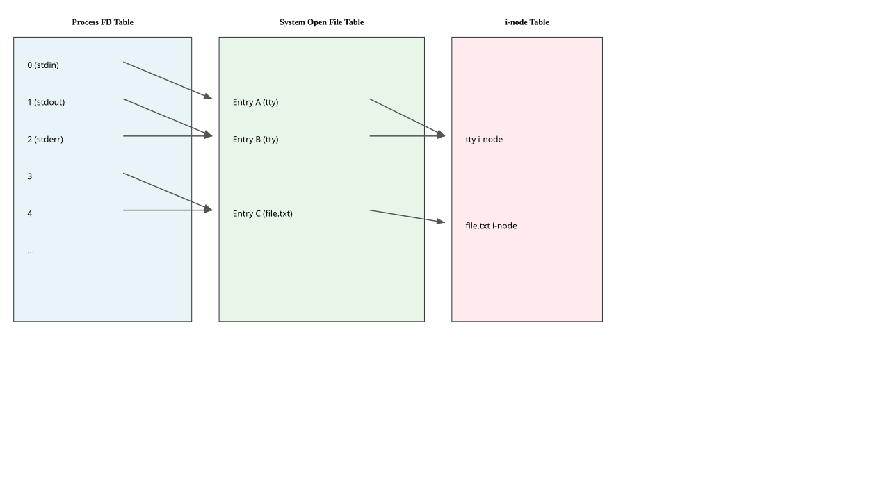

# File API

---

## "Everything is a File" in UNIX

1. This is a core philosophy of `UNIX`-like operating systems.
1. It means that various resources are abstracted as files.
1. This provides a unified interface for accessing:
    - Regular files and directories.
    - Devices (like `/dev/sda`, `/dev/ttyS0`).
    - Pipes, sockets, and other IPC mechanisms.
1. These "files" are accessed through file descriptors.

---

## File Descriptors

1. A file descriptor is a small, non-negative integer.
1. It's an abstract handle that the kernel uses to identify an open file for a specific process.
1. When a process opens a file, the kernel creates an entry in a system-wide open file table and returns a file descriptor that points to it.
1. Each process has its own per-process file descriptor table.

---

## The Per-Process File Descriptor Table

1. This is an array of pointers, indexed by the file descriptor number.
1. Each pointer references an entry in the system-wide open file table.
1. By default, every new process starts with three open file descriptors:
    - `0`: Standard Input (`stdin`)
    - `1`: Standard Output (`stdout`)
    - `2`: Standard Error (`stderr`)

---

## File Descriptor Tables Visualization



---

## Basic File I/O System Calls

1. The core API for file manipulation consists of a few simple system calls.
    - `open(2)`: Open or create a file.
    - `read(2)`: Read data from a file.
    - `write(2)`: Write data to a file.
    - `close(2)`: Close a file descriptor.
    - `lseek(2)`: Reposition the file offset.

---

## `open(2)`

```c
#include <sys/types.h>
#include <sys/stat.h>
#include <fcntl.h>

int open(const char *pathname, int flags, mode_t mode);
```

1. `pathname`: The path to the file.
1. `flags`: A bitmask specifying the access mode (`O_RDONLY`, `O_WRONLY`, `O_RDWR`) and other options (`O_CREAT`, `O_APPEND`, `O_TRUNC`).
1. `mode`: Specifies the file permissions if the file is being created.
1. Returns a new file descriptor on success, or -1 on error.

---

## `read(2)`

```c
#include <unistd.h>

ssize_t read(int fd, void *buf, size_t count);
```

1. `fd`: The file descriptor to read from.
1. `buf`: A pointer to the buffer where data will be stored.
1. `count`: The maximum number of bytes to read.
1. **Return Value Semantics:**
    - `> 0`: The number of bytes read (can be less than `count`).
    - `0`: End of file (EOF).
    - `-1`: An error occurred (`errno` is set).

---

## `write(2)`

```c
#include <unistd.h>

ssize_t write(int fd, const void *buf, size_t count);
```

1. `fd`: The file descriptor to write to.
1. `buf`: A pointer to the buffer containing data to write.
1. `count`: The number of bytes to write.
1. **Return Value Semantics:**
    - `> 0`: The number of bytes written (can be less than `count`).
    - `-1`: An error occurred (`errno` is set).

---

## The Problem of Short Reads/Writes

1. `read(2)` and `write(2)` are not guaranteed to transfer all the bytes you requested in a single call.
1. This can happen for many reasons:
    - Reading from a pipe that doesn't have enough data yet.
    - Writing to a network socket whose buffer is full.
    - Being interrupted by a signal.
1. You **must** always handle this by putting the call in a loop.

---

## Example: A Correct `read` Loop

```c
ssize_t total_read = 0;
ssize_t bytes_read;
char buf[BUF_SIZE];

while (total_read < BUF_SIZE) {
    bytes_read = read(fd, buf + total_read, BUF_SIZE - total_read);
    if (bytes_read == 0) { // EOF
        break;
    }
    if (bytes_read == -1) {
        if (errno == EINTR) continue; // Interrupted, try again
        perror("read");
        break;
    }
    total_read += bytes_read;
}
```

---

## `close(2)`

```c
#include <unistd.h>

int close(int fd);
```

1. Releases a file descriptor, making it available for reuse.
1. Decrements the reference count in the open file table entry.
1. If the count reaches zero, the entry is removed.
1. It is a common mistake to forget to close file descriptors, leading to resource leaks.

---

## Overcoming `read`/`write` Issues

1. The low-level `read/write` API is simple but can be inefficient or cumbersome.
1. Several other mechanisms exist to improve or simplify I/O.
    - `mmap(2)`: Map a file directly into memory.
    - Standard I/O Library (`FILE*`): Buffered I/O.
    - `ioctl(2)`: Device-specific operations.
    - C++ Streams: Object-oriented I/O abstraction.

---

## Using `mmap(2)` for File I/O

1. `mmap(2)` maps a file's contents directly into the process's virtual address space.
1. You can then access the file's content as if it were an array in memory.
1. The kernel handles loading pages from the file on-demand (paging).
1. This avoids the extra copy from kernel space to user space that `read(2)` requires.

---

## Standard I/O Library (`stdio.h`)

1. Provides the `FILE*` abstraction (`fopen`, `fread`, `fwrite`, `fclose`).
1. This library performs buffered I/O in user space.
1. `fread` reads large chunks from the kernel and serves smaller requests from its buffer.
1. `fwrite` buffers small writes and sends them to the kernel in larger chunks.
1. This is much more efficient for many small reads or writes.

---

## No Mandatory Locking in `UNIX`

1. By default, `UNIX` file systems use **advisory locking**.
1. This means the kernel keeps track of locks, but it does not enforce them on `read(2)` or `write(2)` calls.
1. A process can ignore a lock and write to a file that another process has locked.
1. All cooperating processes must explicitly check for locks to make the system work.
1. This is a design choice favoring performance and flexibility over strictness.

---

## Manipulating Files and Directories

1. The API provides functions for managing the file system itself.
    - `mkdir(2)`: Create a directory.
    - `rmdir(2)`: Remove an empty directory.
    - `unlink(2)`: Remove a file name (deletes the file if it's the last link).
    - `rename(2)`: Move or rename a file.
    - `stat(2)` / `fstat(2)`: Get file metadata (size, permissions, timestamps).

---

## Directory Operations

1. A directory is a special file that contains a list of file names and their corresponding i-node numbers.
1. You can't `read(2)` a directory directly in a portable way.
1. Use the directory stream API:
    - `opendir(3)`: Open a directory stream.
    - `readdir(3)`: Read the next entry in the directory.
    - `closedir(3)`: Close the directory stream.

---

## Example: Listing Directory Contents

```c
#include <dirent.h>
#include <stdio.h>

void list_dir(const char *path) {
    DIR *d = opendir(path);
    if (!d) {
        perror("opendir");
        return;
    }
    struct dirent *entry;
    while ((entry = readdir(d)) != NULL) {
        printf("%s\n", entry->d_name);
    }
    closedir(d);
}
```

---

## Symbolic Links (Symlinks)

1. A symbolic link is a special file that contains a path to another file or directory.
1. Most system calls operate on the target file, not the link itself. This is called "following" the link.
1. Special versions of system calls exist to operate on the link itself.
    - `lstat(2)`: Like `stat(2)`, but gets info about the link.
    - `readlink(2)`: Reads the path stored in the link.
    - `symlink(2)`: Creates a new symbolic link.

---

## Other File Types

`UNIX` file systems support several types of files, visible in the output of `ls -l`.

| Type | Character | Description |
| :--- | :--- | :--- |
| Regular File | `-` | A file containing data. |
| Directory | `d` | A file that holds other files. |
| Symbolic Link | `l` | A pointer to another file. |
| Block Device | `b` | A buffered device (e.g., hard disk). |
| Character Device | `c` | An unbuffered device (e.g., terminal). |
| Named Pipe (FIFO)| `p` | A file for inter-process communication. |
| Socket | `s` | A file for network communication. |

---

## Passing File Descriptors

1. Sometimes, a process needs to pass an open file descriptor to another, unrelated process.
1. This is not possible with `fork(2)` as that only works for parent-child relationships.
1. The mechanism for this is sending "ancillary data" or "control messages" over a `UNIX` domain socket.
1. This uses the `sendmsg(2)` and `recvmsg(2)` system calls with a special `SCM_RIGHTS` message type.

---

## `inotify(7)`

1. `inotify` is a `Linux`-specific kernel subsystem that provides a mechanism to monitor file system events.
1. You can watch files or directories for events like:
    - `IN_ACCESS`: File was accessed.
    - `IN_MODIFY`: File was modified.
    - `IN_CREATE`: File was created in a watched directory.
    - `IN_DELETE`: File was deleted from a watched directory.
    - `IN_MOVED_TO` / `IN_MOVED_FROM`: File was moved.

---

## How `inotify` Works

1. `inotify_init(2)`: Creates an `inotify` instance and returns a file descriptor for it.
1. `inotify_add_watch(2)`: Adds a watch for a specific path to the `inotify` instance.
1. You then `read(2)` from the `inotify` file descriptor.
    - The `read` call will block until an event occurs.
    - It returns a structure describing the event.

---

## `inotify` Pitfalls

1. **Race Conditions:** The state of the file system can change between when you receive an event and when you act on it. For example, a file could be deleted and recreated with the same name.
1. **Event Queue Overflow:** If events are generated faster than you can read them, the kernel's event queue can overflow, and you will miss events.
1. **Recursive Watching:** `inotify` does not support recursive directory watching out of the box. You must manually add a watch for each new subdirectory that is created.

---

## Chapter Summary

1. We reviewed the "everything is a file" philosophy and the role of file descriptors.
1. We covered the basic I/O system calls: `open`, `read`, `write`, `close`.
1. We emphasized the importance of handling short reads/writes.
1. We explored alternatives like `mmap` and `stdio` for different I/O patterns.
1. We discussed file system management, directory operations, and various file types.
1. We introduced advanced topics like passing file descriptors and monitoring events with `inotify`.
