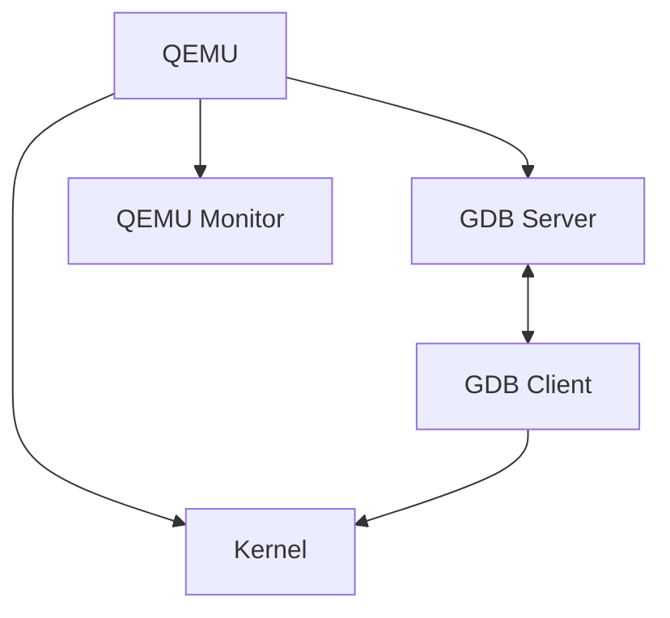

# Debugging Kernels with QEMU

---

Chapter Overview
- GDB integration with QEMU
- Kernel debugging techniques using QEMU
- Analyzing kernel crashes and hangs

---

Importance of Kernel Debugging
- Identifying and fixing kernel bugs
- Understanding kernel behavior
- Improving kernel performance and stability

---

QEMU Debugging Architecture

---

Setting Up QEMU for Kernel Debugging
- Compiling the kernel with debug symbols
- QEMU command-line options for debugging
- Configuring GDB for kernel debugging

---

GDB Integration with QEMU
- Starting QEMU in debug mode
- Connecting GDB to QEMU
- Basic GDB commands for kernel debugging

---

Kernel Symbols and Source Code
- Loading kernel symbols in GDB
- Navigating kernel source in GDB
- Using the 'lx-symbols' helper script

---

Breakpoints and Watchpoints
- Setting breakpoints in kernel code
- Hardware and software breakpoints
- Using watchpoints for data access debugging

---

Stepping Through Kernel Code
- Single-stepping instructions
- Stepping over functions
- Continuing execution until next breakpoint

---

Examining Kernel Data Structures
- Inspecting kernel variables and structures
- Using GDB pretty-printers for kernel structures
- Navigating linked lists and complex data structures

---

Debugging Kernel Modules
- Loading and unloading modules in QEMU
- Setting breakpoints in module code
- Debugging module initialization and cleanup

---

Kernel Oops and Panic Debugging
- Capturing kernel oops messages
- Analyzing kernel panic stack traces
- Using QEMU to reproduce and debug crashes

---

QEMU Monitor for Debugging
- Accessing the QEMU monitor
- Useful monitor commands for debugging
- Switching between GDB and QEMU monitor

---

Debugging Early Boot Issues
- Using QEMU's -S option for early debugging
- Analyzing bootloader to kernel handoff
- Debugging kernel initialization code

---

Debugging Process and Thread Issues
- Examining process states
- Debugging scheduler-related problems
- Analyzing thread synchronization issues

---

Memory Debugging Techniques
- Detecting memory leaks in the kernel
- Debugging use-after-free and buffer overflow issues
- Using QEMU's memory tracing features

---

Debugging Kernel Races and Deadlocks
- Identifying race conditions
- Debugging deadlocks and livelocks
- Using QEMU's deterministic execution features

---

Debugging Interrupt Handlers and Bottom Halves
- Setting breakpoints in interrupt context
- Analyzing interrupt timing issues
- Debugging softirq and tasklet execution

---

Kernel Tracing with QEMU
- Using ftrace with QEMU
- Kernel tracepoints and kprobes
- Analyzing trace data for debugging

---

Performance Debugging
- Profiling kernel code with QEMU
- Identifying performance bottlenecks
- Using perf tools with QEMU

---

Network Stack Debugging
- Debugging network drivers
- Analyzing network protocol issues
- Using QEMU's network tracing features

---

File System and Block Layer Debugging
- Debugging file system drivers
- Analyzing I/O issues
- Using QEMU's block tracing features

---

Debugging Virtualization Features
- Analyzing KVM-related issues
- Debugging hardware virtualization extensions
- Using QEMU's virtualization-specific debug features

---

Remote Debugging with QEMU
- Setting up remote debugging sessions
- Debugging kernels over serial and network connections
- Best practices for remote kernel debugging

---

Automated Debugging Techniques
- Using GDB scripts for automated debugging
- Implementing conditional breakpoints
- Creating custom GDB commands for kernel debugging

---

Debugging Real-time and Time-sensitive Issues
- Using QEMU's timing control features
- Debugging scheduler latency issues
- Analyzing timer and clocksource problems

---

Advanced QEMU Features for Kernel Debugging
- Using QEMU's record and replay feature
- Leveraging QEMU's gdbstub extensions
- Exploiting QEMU's device state save/restore for debugging

---

Kernel Debugging Best Practices
- Organizing debugging sessions
- Documenting debugging findings
- Collaborating on kernel debugging efforts

---

Common Kernel Debugging Pitfalls
- Misinterpreting debugging output
- Introducing debug-only bugs
- Overlooking architecture-specific issues

---

Debugging Tools Ecosystem
- Integrating QEMU debugging with other tools (LTTng, SystemTap)
- Using kernel-specific debugging extensions
- Exploring emerging kernel debugging technologies

---

Future of Kernel Debugging with QEMU
- Upcoming features in QEMU for kernel debugging
- Trends in automated and AI-assisted debugging
- Preparing for debugging challenges in future kernel architectures
