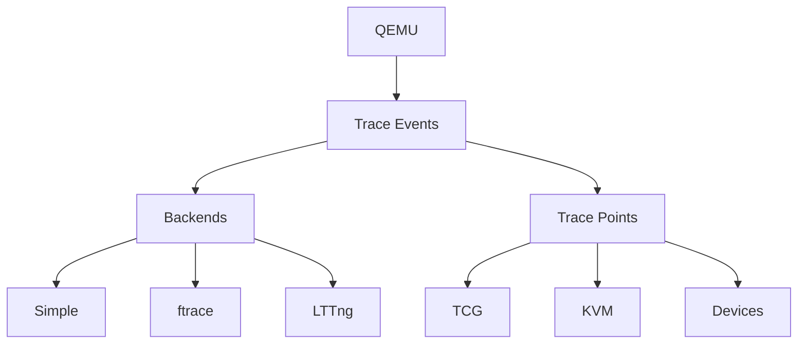

# Advanced QEMU Features for Kernel Development

---

Chapter Overview
- QEMU tracing and instrumentation
- Using QEMU for kernel fuzzing
- Continuous Integration (CI) with QEMU

---

QEMU Tracing Framework
- Overview of QEMU's tracing capabilities
- Enabling and configuring traces
- Analyzing trace output for kernel debugging

---

QEMU Tracing Architecture

---

Instrumenting QEMU for Kernel Analysis
- Adding custom trace points
- Correlating QEMU and kernel events
- Performance impact of tracing

---

QEMU's GDB Stub
- Advanced usage of QEMU's GDB stub
- Remote debugging techniques
- Kernel-specific GDB extensions

---

QEMU Record and Replay
- Principles of deterministic replay debugging
- Implementing record and replay for kernel testing
- Analyzing non-deterministic bugs

---

QEMU Checkpointing
- Creating and managing VM checkpoints
- Using checkpoints for kernel debugging
- Integrating checkpoints in test workflows

---

QEMU for Kernel Fuzzing
- Overview of kernel fuzzing techniques
- Implementing fuzzers with QEMU
- AFL (American Fuzzy Lop) integration with QEMU

---

Sanitizers and QEMU
- Using address sanitizer (ASAN) with QEMU
- Memory sanitizer (MSAN) for kernel testing
- Undefined behavior sanitizer (UBSAN) in virtualized environments

---

QEMU and Kernel Coverage Analysis
- Generating kernel code coverage with QEMU
- Integrating coverage data in CI pipelines
- Strategies for improving kernel test coverage

---

QEMU Plugins
- Introduction to QEMU plugin architecture
- Writing custom plugins for kernel analysis
- Use cases: memory profiling, instruction counting

---

TCG (Tiny Code Generator) Instrumentation
- Understanding QEMU's TCG
- Instrumenting TCG for kernel analysis
- Performance implications of TCG instrumentation

---

QEMU and Hardware-Assisted Virtualization
- Advanced KVM usage in QEMU
- Nested virtualization for kernel testing
- Analyzing virtualization overhead

---

QEMU for Multi-Architecture Kernel Testing
- Cross-architecture kernel compilation
- Running kernels on emulated architectures
- Challenges in multi-architecture testing

---

QEMU in Continuous Integration Pipelines
- Setting up QEMU-based CI for kernel testing
- Automated test suite execution
- Reporting and analyzing test results

---

QEMU Networking Advanced Features
- Software-defined networking (SDN) with QEMU
- Network namespaces and QEMU
- Testing complex network topologies

---

QEMU Storage Advanced Features
- QEMU image format internals
- Implementing custom block drivers
- Testing advanced storage features (e.g., thin provisioning, snapshots)

---

QEMU for Real-Time Kernel Testing
- Simulating real-time environments
- Testing scheduler latency and deadlines
- Analyzing interrupt handling in real-time scenarios

---

QEMU and Kernel Memory Management
- Advanced memory management features in QEMU
- Testing huge pages and NUMA configurations
- Analyzing memory fragmentation

---

QEMU for Power Management Testing
- Simulating power states (S3, S4)
- Testing ACPI implementations
- Analyzing kernel power management code

---

QEMU and Trusted Execution Environments
- Emulating secure enclaves (e.g., Intel SGX)
- Testing Trusted Execution Environment (TEE) drivers
- Challenges in security-focused virtualization

---

QEMU for Kernel Profiling
- Integration with perf and oprofile
- Kernel hot spot analysis in virtualized environments
- Optimizing kernel performance with QEMU insights

---

QEMU and Kernel Debugging Automation
- Scripting GDB for automated debugging
- Creating repeatable debug scenarios
- Integrating debugging in CI workflows

---

QEMU for Kernel Regression Testing
- Implementing kernel bisection with QEMU
- Automated regression test suites
- Strategies for quick issue isolation

---

QEMU and Kernel Module Testing
- Advanced techniques for kernel module testing
- Simulating module load/unload scenarios
- Analyzing module dependencies

---

QEMU for Kernel Security Testing
- Simulating security vulnerabilities
- Testing kernel exploit mitigations
- Analyzing kernel security features in isolated environments

---

QEMU and Kernel Documentation
- Generating kernel documentation with QEMU setups
- Creating reproducible examples for kernel features
- Automating kernel API testing and documentation

---

QEMU for Kernel Performance Benchmarking
- Setting up consistent benchmark environments
- Comparative analysis of kernel versions
- Isolating performance regressions

---

Future Trends in QEMU for Kernel Development
- Emerging QEMU features for kernel developers
- Potential impacts of hardware trends on QEMU and kernel testing
- Preparing for future challenges in kernel development with QEMU
