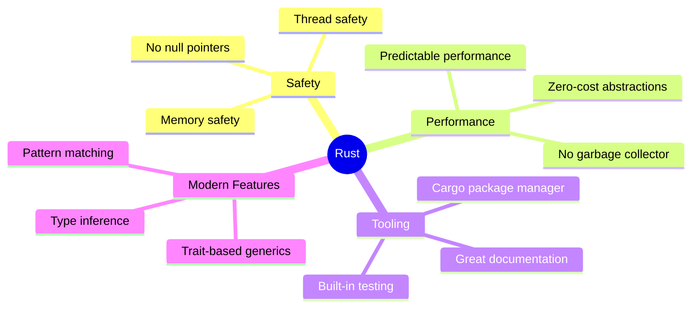
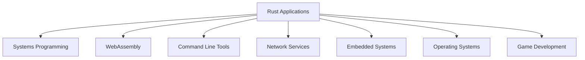
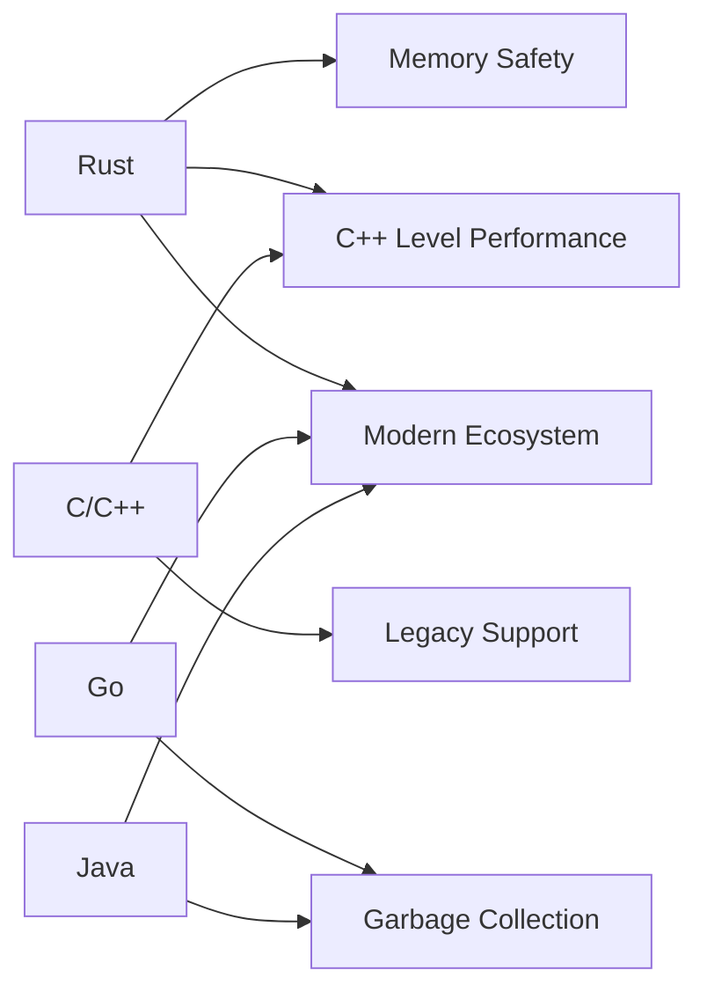
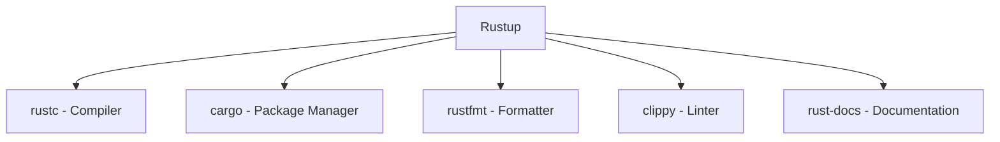
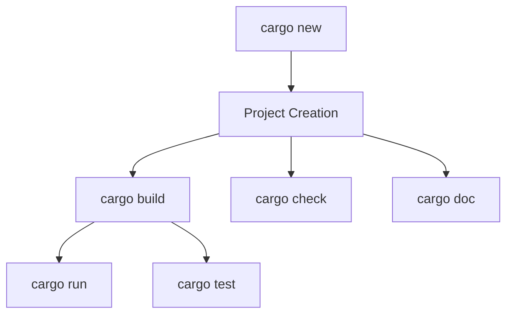
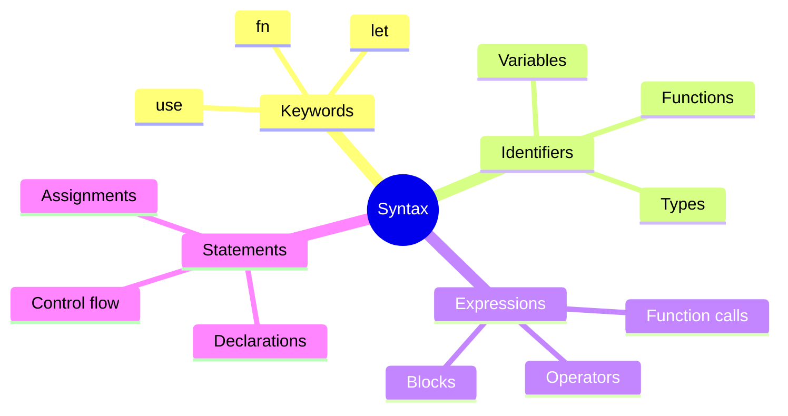
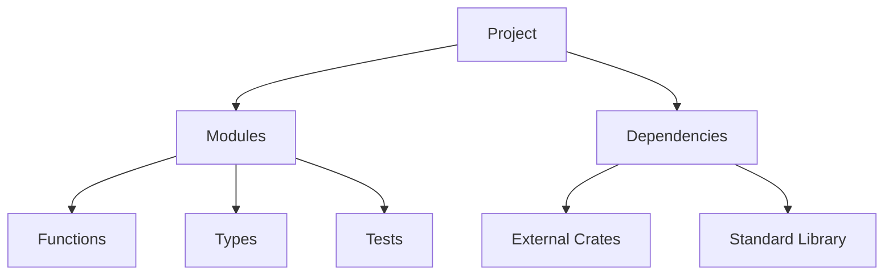
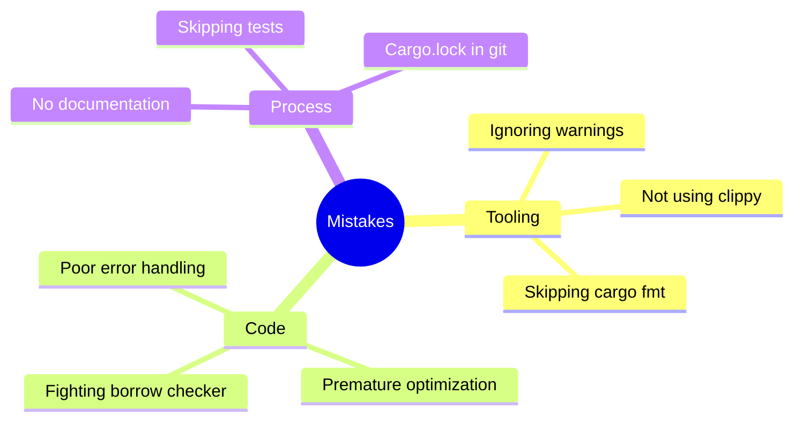
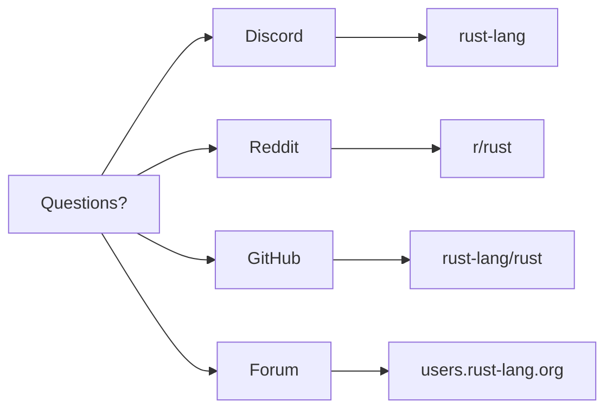

# Getting Started with Rust
## Chapter 1: Introduction to Rust Programming

---

# What is Rust?


- Systems programming language
- Focuses on safety, concurrency, and performance
- Created by Mozilla Research
- First released in 2015
- Now used by: Mozilla, Microsoft, Amazon, Google

---

# Key Features of Rust



---

# Why Choose Rust?

<div class="columns">
<div>

## Benefits
- Memory safety
- Zero-cost abstractions
- Modern tooling
- Growing ecosystem

</div>
<div>

## Features
- No garbage collector
- Concurrency support
- Cross-platform
- Great documentation

</div>
</div>

---

# Use Cases for Rust



---

# Rust vs Other Languages



---

# Installing Rust

<div class="columns">
<div>

## Unix/Linux/macOS
```bash
curl --proto '=https' --tlsv1.2 \
     -sSf https://sh.rustup.rs | sh
```

</div>
<div>

## Windows
- Download rustup-init.exe
- Run installer
- Follow prompts

</div>
</div>

---

# Rustup Components



---

# Verifying Installation

```bash
# Check Rust compiler version
rustc --version

# Check Cargo version
cargo --version

# View installed components
rustup component list
```

---

# Development Environment


## Recommended Setup
- VS Code
- rust-analyzer extension
- CodeLLDB extension
- Even Better TOML extension

---

# Cargo: Rust's Package Manager



---

# Common Cargo Commands

<div class="columns">
<div>

## Project Management
```bash
cargo new project_name
cargo build
cargo run
```

</div>
<div>

## Development
```bash
cargo check
cargo test
cargo doc
```

</div>
</div>

---

# Project Structure

```
my_project/
├── Cargo.toml          # Project manifest
├── Cargo.lock          # Lock file
└── src/
    └── main.rs         # Source code
```

---

# Cargo.toml Explained

```toml
[package]
name = "my_project"
version = "0.1.0"
edition = "2021"

[dependencies]
serde = "1.0"
tokio = { version = "1.0", features = ["full"] }
```

---

# Hello, World!

```rust
fn main() {
    println!("Hello, World!");
}
```

---

# Basic Program Structure

```rust
// Import standard library
use std::io;

// Main function
fn main() {
    // Your code here
    println!("Basic Rust Program");
}
```

---

# Comments in Rust

```rust
// Line comment

/* Block comment
   Multiple lines */

/// Documentation comment
/// Generates docs for the following item

//! Inner documentation comment
//! Typically used at the start of a file
```

---

# Basic Syntax Elements



---

# Function Syntax

```rust
// Basic function
fn function_name(param1: Type1, param2: Type2) -> ReturnType {
    // Function body
    return_value
}

// Example
fn add(a: i32, b: i32) -> i32 {
    a + b  // Implicit return
}
```

---

# Macro Usage

```rust
// Common macros
println!("Hello");          // Print line
format!("Value: {}", x);    // Format string
vec![1, 2, 3];             // Create vector
assert!(condition);         // Assertion

// Example usage
let name = "Rust";
println!("Hello, {}!", name);
```

---

# Basic Input/Output

```rust
use std::io;

fn main() {
    println!("What's your name?");
    
    let mut input = String::new();
    
    io::stdin()
        .read_line(&mut input)
        .expect("Failed to read line");
        
    println!("Hello, {}!", input.trim());
}
```

---

# Code Organization



---

# Best Practices

<div class="columns">
<div>

## Development
- Use rust-analyzer
- Follow style guide
- Write documentation
- Run `cargo fmt`

</div>
<div>

## Code Quality
- Use `cargo clippy`
- Write tests
- Handle errors
- Document APIs

</div>
</div>

---

# Common Mistakes to Avoid



---

# Resources for Learning

<div class="columns">
<div>

## Official
- The Rust Book
- Rust by Example
- Standard Library Docs
- Rustlings

</div>
<div>

## Community
- Discord
- Reddit (r/rust)
- Stack Overflow
- GitHub

</div>
</div>

---

# Practice Exercise

Create a simple calculator that:
1. Accepts two numbers
2. Asks for operation (+, -, *, /)
3. Prints the result
4. Handles basic errors

---

# Questions?


