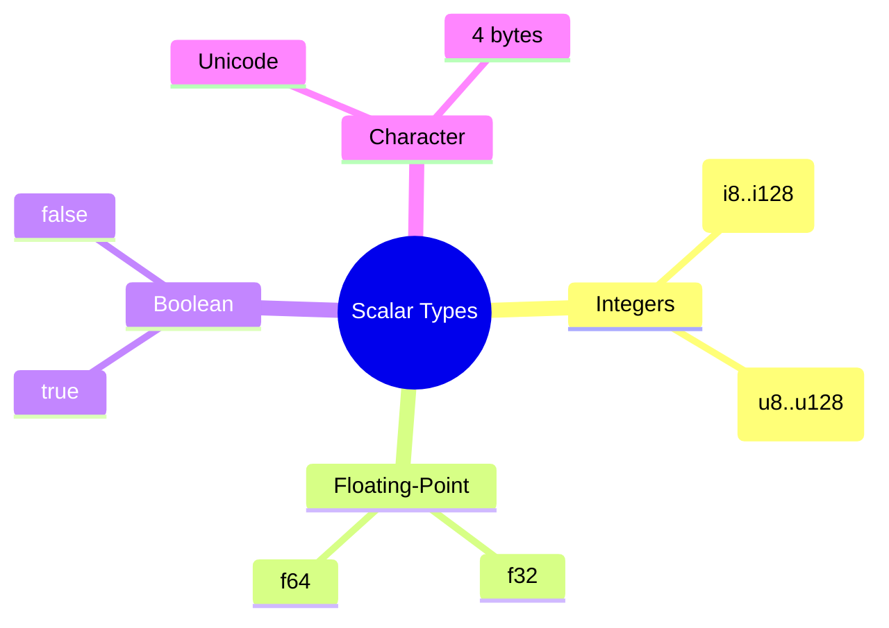
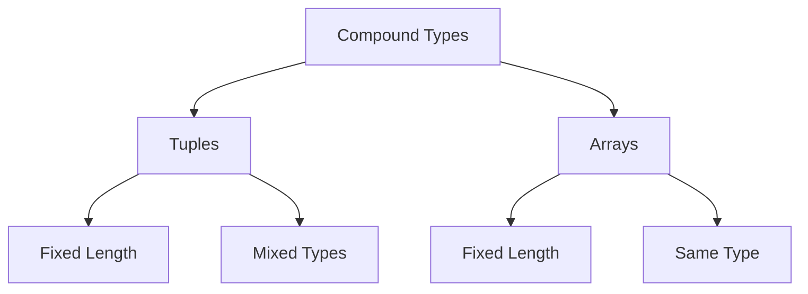

# Rust Fundamentals
## Chapter 2: Core Concepts and Basic Syntax

---
## Variables and Mutability

```rust
// Immutable by default
let x = 5;

// Mutable variables
let mut y = 5;
y = 6; // OK

// Shadowing
let x = 5;
let x = x + 1; // New variable, shadows previous x
```

---
## Constants

```rust
const MAX_POINTS: u32 = 100_000;
const PI: f64 = 3.141592653589793;

fn main() {
    println!("Max points: {}", MAX_POINTS);
    // Constants are valid for entire program runtime
    // Must have type annotation
    // Can only be set to constant expressions
}
```

---

## Scalar Types



---

## Integer Types

<div class="columns">
<div>

### Signed
- i8: -128 to 127
- i16: -32,768 to 32,767
- i32: -2^32 to 2^31-1
- i64: -2^63 to 2^63-1
- i128: -2^127 to 2i^127-1

</div>
<div>

### Unsigned
- u8: 0 to 255
- u16: 0 to 65,535
- u32: 0 to 2^32-1
- u64: 0 to 2^64-1
- u128: 0 to 2^128-1

</div>
</div>

---

## Number Literals

```rust
fn main() {
    let decimal = 98_222;      // Decimal
    let hex = 0xff;            // Hex
    let octal = 0o77;          // Octal
    let binary = 0b1111_0000;  // Binary
    let byte = b'A';           // Byte (u8 only)

    // Numeric separators for readability
    let million = 1_000_000;
}
```

---

## Floating-Point Types

```rust
fn main() {
    let x = 2.0;      // f64 (default)
    let y: f32 = 3.0; // f32 (explicit)
    // Basic operations
    let sum = 5.0 + 10.0;             // addition
    let difference = 95.5 - 4.3;       // subtraction
    let product = 4.0 * 30.0;         // multiplication
    let quotient = 56.7 / 32.2;       // division
    let remainder = 43.5 % 5.0;       // remainder
}
```

---

## Boolean Type

```rust
fn main() {
    let t = true;
    let f: bool = false; // with explicit type annotation
    // Booleans in conditionals
    if t {
        println!("This is true!");
    }
    // Boolean operations
    let a = true && false; // false
    let b = true || false; // true
    let c = !true;        // false
}
```

---

## Character Type

```rust
fn main() {
    let c = 'z';
    let z: char = 'z'; // explicit type annotation
    let heart_eyed_cat = 'cat';

    // Characters are 4 bytes
    println!("Size of char: {} bytes", std::mem::size_of::<char>());

    // Unicode support
    let kanji = 'fu';
}
```

---

## Compound Types



---

## Tuples

```rust
fn main() {
    // Basic tuple
    let tup: (i32, f64, u8) = (500, 6.4, 1);

    // Destructuring
    let (x, y, z) = tup;
    println!("y is: {}", y);

    // Accessing elements
    let five_hundred = tup.0;
    let six_point_four = tup.1;
}
```

---

## Arrays

```rust
fn main() {
    // Fixed-length array
    let months = ["Jan", "Feb", "Mar", "Apr", "May"];

    // Array with explicit type and size
    let numbers: [i32; 5] = [1, 2, 3, 4, 5];

    // Initialize array with same value
    let zeros = [0; 5]; // [0, 0, 0, 0, 0]

    // Accessing elements
    let first = months[0];
}
```

---

## Control Flow: if Expressions

```rust
fn main() {
    let number = 6;

    if number % 4 == 0 {
        println!("number is divisible by 4");
    } else if number % 3 == 0 {
        println!("number is divisible by 3");
    } else if number % 2 == 0 {
        println!("number is divisible by 2");
    } else {
        println!("number is not divisible by 4, 3, or 2");
    }
}
```

---

## If in Let Statements

```rust
fn main() {
    let condition = true;
    let number = if condition { 5 } else { 6 };

    println!("The value of number is: {}", number);

    // Both arms must return same type
    // This would NOT work:
    // let number = if condition { 5 } else { "six" };
}
```

---

## Loops: loop Expression

```rust
fn main() {
    let mut counter = 0;

    let result = loop {
        counter += 1;

        if counter == 10 {
            break counter * 2;
        }
    };

    println!("The result is {}", result);
}
```

---

## Loop Labels

```rust
fn main() {
    'outer: loop {
        println!("Entered outer loop");

        'inner: loop {
            println!("Entered inner loop");
            // Break outer loop
            break 'outer;
        }
    }
    println!("Exited outer loop");
}
```

---

## While Loops

```rust
fn main() {
    let mut number = 3;

    while number != 0 {
        println!("{}!", number);
        number -= 1;
    }

    println!("LIFTOFF!!!");
}
```

---

## For Loops

```rust
fn main() {
    // Iterate over array
    let numbers = [10, 20, 30, 40, 50];
    for element in numbers.iter() {
        println!("The value is: {}", element);
    }
    // Range-based loop
    for number in (1..4).rev() {
        println!("{}!", number);
    }
}
```

---

## Match Expression

```rust
fn main() {
    let number = 13;

    match number {
        // Match a single value
        1 => println!("One!"),
        // Match several values
        2 | 3 | 5 | 7 | 11 | 13 => println!("This is a prime"),
        // Match a range
        13..=19 => println!("A teen"),
        // Handle the rest of cases
        _ => println!("Ain't special"),
    }
}
```

---

## Match with Binding

```rust
fn main() {
    let x = Some(5);
    let y = 10;

    match x {
        Some(50) => println!("Got 50"),
        Some(n) if n == y => println!("Matched, n = {}", n),
        Some(n) => println!("Didn't match, n = {}", n),
        None => println!("None value"),
    }
}
```

---

## Functions

```rust
fn main() {
    print_labeled_measurement(5, 'h');
}

fn print_labeled_measurement(value: i32, unit_label: char) {
    println!("The measurement is: {}{}", value, unit_label);
}
```

---

## Function Return Values

```rust
fn five() -> i32 {
    5  // Implicit return
}

fn plus_one(x: i32) -> i32 {
    x + 1  // Implicit return
}

fn main() {
    let x = five();
    let y = plus_one(5);
    println!("x is: {}, y is: {}", x, y);
}
```

---

## Expressions vs Statements

```rust
fn main() {
    // Statement (doesn't return a value)
    let y = 6;
    // Expression (returns a value)
    let x = {
        let y = 3;
        y + 1  // Note: no semicolon
    };
    println!("x is: {}", x);  // 4
}
```

---

## Basic Error Handling

```rust
use std::fs::File;

fn main() {
    // Using expect
    let f = File::open("hello.txt").expect("Failed to open file");
    // Using match
    let f = match File::open("hello.txt") {
        Ok(file) => file,
        Err(error) => panic!("Problem opening file: {:?}", error),
    };
}
```

---

## Option Type

```rust
fn main() {
    let some_number = Some(5);
    let some_string = Some("a string");
    let absent_number: Option<i32> = None;

    // Using match with Option
    match some_number {
        Some(i) => println!("Got a number: {}", i),
        None => println!("No number!"),
    }
}
```

---

## Result Type

```rust
use std::fs::File;
use std::io::ErrorKind;

fn main() {
    let f = File::open("hello.txt");

    let f = match f {
        Ok(file) => file,
        Err(error) => match error.kind() {
            ErrorKind::NotFound => match File::create("hello.txt") {
                Ok(fc) => fc,
                Err(e) => panic!("Problem creating file: {:?}", e),
            },
            other_error => panic!("Problem opening file: {:?}", other_error),
        },
    };
}
```
