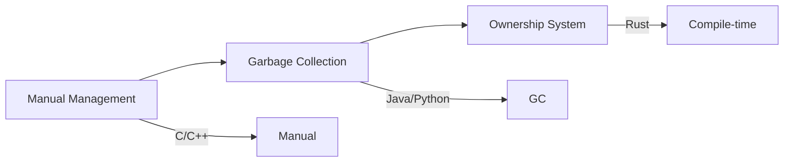
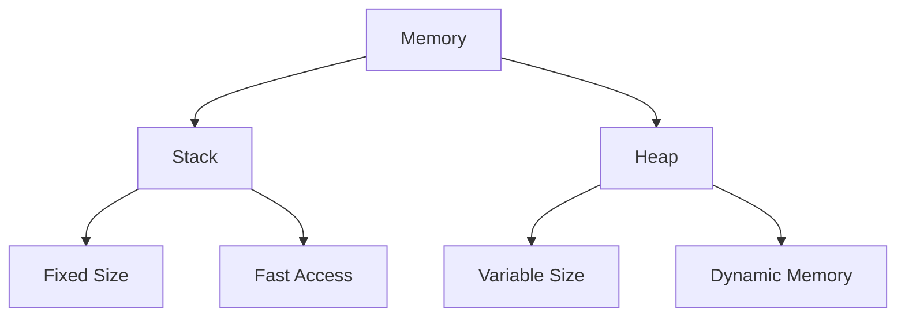
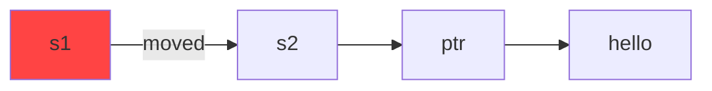
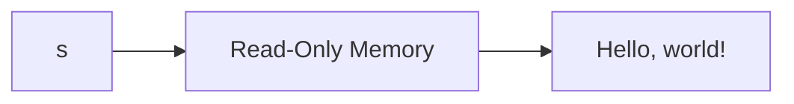
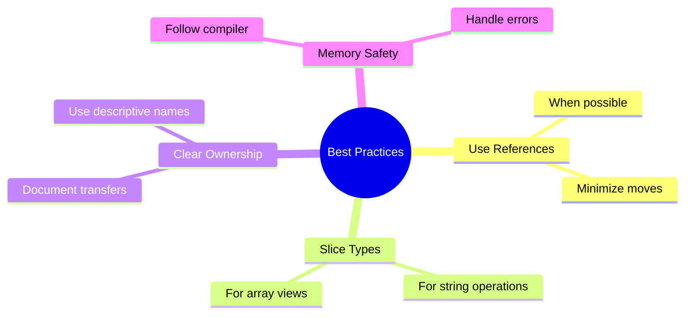

# Understanding Ownership
## Chapter 3: Rust's Unique Memory Management

---

# Memory Management Evolution



---

# What is Ownership?

- Memory management system
- Compile-time checks
- No garbage collector
- No manual memory management
- Rules enforced by compiler

---

# Ownership Rules

1. Each value has exactly one owner
1. Only one owner at a time
1. When owner goes out of scope, value is dropped

---

# Variable Scope Basics

```rust
{
    let s = String::from("hello"); // s is valid
    println!("{}", s);             // s is still valid
}                                  // s is dropped here
```

---

# The Stack and The Heap



---

# Stack vs Heap

<div class="columns">
<div>

## Stack
- Fixed size
- LIFO (Last In, First Out)
- Fast access
- Function calls
- Simple types

</div>
<div>

## Heap
- Dynamic size
- Random access
- Slower than stack
- Complex types
- Runtime allocation

</div>
</div>

---

# Stack-Only Data

```rust
fn main() {
    let x = 5;        // i32 goes on stack
    let y = x;        // Copy of x
    println!("x = {}, y = {}", x, y); // Both valid
}
```

---

# Move Semantics

```rust
fn main() {
    let s1 = String::from("hello");
    let s2 = s1; // s1 is moved to s2
    // println!("{}", s1); // Error! s1 was moved
    println!("{}", s2);    // Works fine
}
```

---

# Memory Layout: Move



---

# Clone for Deep Copy

```rust
fn main() {
    let s1 = String::from("hello");
    let s2 = s1.clone(); // Deep copy
    println!("s1 = {}, s2 = {}", s1, s2); // Both valid
}
```

---

# Copy Types

- Integers
- Booleans
- Floating point numbers
- Characters
- Tuples (if elements are Copy)
- Arrays (if elements are Copy)

---

# Ownership and Functions

```rust
fn main() {
    let s = String::from("hello");
    takes_ownership(s); // s is moved into function
    // s is no longer valid here
}

fn takes_ownership(s: String) {
    println!("{}", s);
} // s goes out of scope and is dropped
```

---

# Return Values and Scope

```rust
fn main() {
    let s1 = gives_ownership();
    let s2 = String::from("hello");
    let s3 = takes_and_gives_back(s2);
}

fn gives_ownership() -> String {
    String::from("yours")
}

fn takes_and_gives_back(s: String) -> String {
    s
}
```

---

# References and Borrowing

```rust
fn main() {
    let s1 = String::from("hello");
    let len = calculate_length(&s1); // Borrow s1
    println!("Length of '{}' is {}", s1, len);
}

fn calculate_length(s: &String) -> usize {
    s.len()
}
```

---

# References Rules

1. One mutable reference OR many immutable references
2. References must always be valid
3. Reference scope ends at last usage

---

# Mutable References

```rust
fn main() {
    let mut s = String::from("hello");
    change(&mut s);
    println!("{}", s);
}

fn change(s: &mut String) {
    s.push_str(", world");
}
```

---

# Reference Restrictions

```rust
fn main() {
    let mut s = String::from("hello");
    let r1 = &mut s;
    // let r2 = &mut s; // Error!
    println!("{}", r1);
}
```

---

# Multiple Immutable References

```rust
fn main() {
    let s = String::from("hello");
    let r1 = &s;
    let r2 = &s;
    println!("{} and {}", r1, r2);
}
```

---

# Reference Scope

```rust
fn main() {
    let mut s = String::from("hello");
    let r1 = &s; // ok
    let r2 = &s; // ok
    println!("{} and {}", r1, r2);
    // r1 and r2 scope ends here
    let r3 = &mut s; // ok
    println!("{}", r3);
}
```

---

# Dangling References

```rust
fn main() {
    let reference_to_nothing = dangle();
}

fn dangle() -> &String { // Error!
    let s = String::from("hello");
    &s
} // s is dropped here, reference would be invalid
```

---

# The Slice Type

```rust
fn main() {
    let s = String::from("hello world");
    let hello = &s[0..5];
    let world = &s[6..11];
    println!("{} {}", hello, world);
}
```

---

# String Slices

```rust
let s = String::from("hello world");

let entire = &s[..];     // whole string
let hello = &s[..5];     // from start to 5
let world = &s[6..];     // from 6 to end
let hw = &s[..];         // whole string
```

---

# String Literals as Slices

```rust
let s: &str = "Hello, world!";
```



---

# Other Slice Types

```rust
fn main() {
    let a = [1, 2, 3, 4, 5];
    let slice = &a[1..3];
    println!("{:?}", slice); // [2, 3]
}
```

---

# String Types

<div class="columns">
<div>

## String
- Owned
- Growable
- Heap allocated
- `String::from()`

</div>
<div>

## &str
- Borrowed
- Fixed size
- Read-only
- String literals

</div>
</div>

---

# Best Practices



---

# Common Pitfalls

1. Fighting the borrow checker
2. Unnecessary cloning
3. Complex ownership patterns
4. Inefficient data sharing
5. Improper scope management

---

# String Operations Example

```rust
fn main() {
    let mut s = String::from("hello");
    // Push string
    s.push_str(" world");
    // Push character
    s.push('!');
    // Get length
    let len = s.len();
    println!("{} ({})", s, len);
}
```

---

# Practice Exercise

Create a function that:
1. Takes a string slice
1. Returns first word
1. Uses string slices
1. Handles empty strings

---

# Summary
- Ownership rules
- References and borrowing
- Slices
- Memory management
- Best practices
