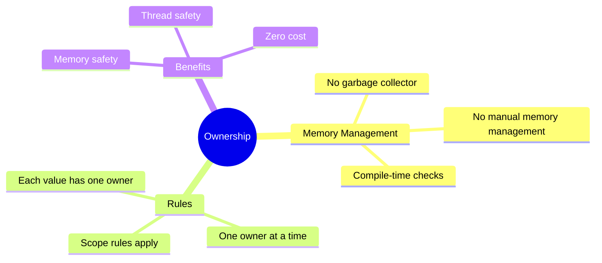

---

# Understanding Ownership
## Chapter 3: Rust's Unique Memory Management

---

# What is Ownership?



---

# Ownership Rules

1. Each value has exactly one owner
2. Only one owner at a time
3. When owner goes out of scope, value is dropped

```rust
{
    let s = String::from("hello"); // s is valid from this point
    // do stuff with s
}                                  // scope is over, s is dropped
```

---

# Variable Scope

```rust
fn main() {
    // s is not valid here
    {
        let s = "hello"; // s is valid from this point
        println!("{}", s);
    } // scope is over, s is no longer valid
    // s is not valid here
}
```
