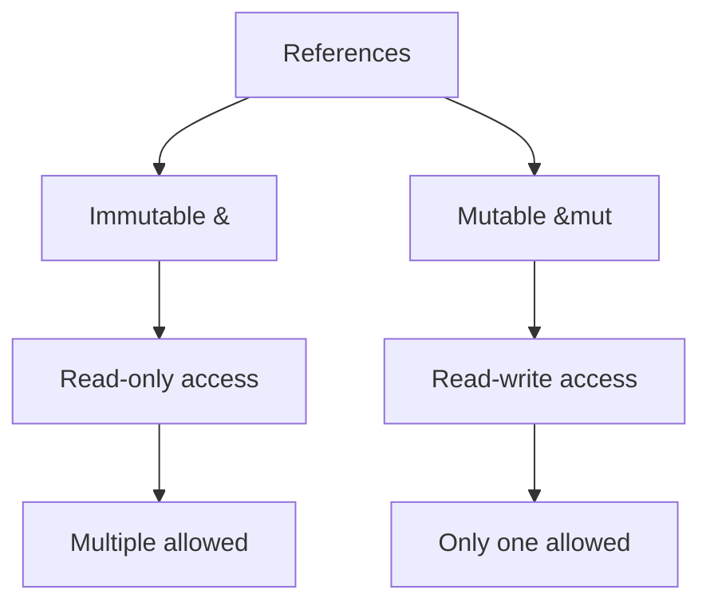
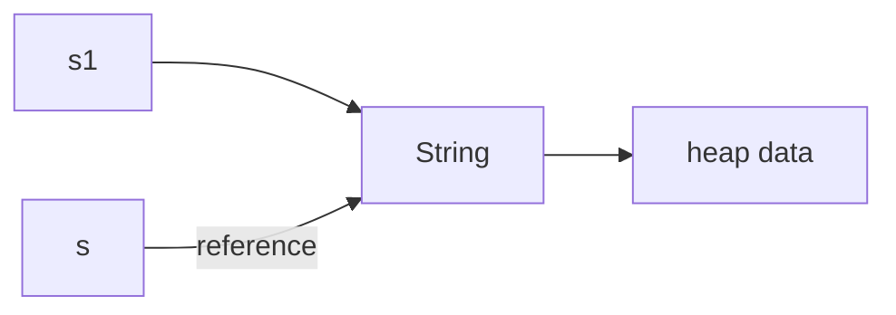
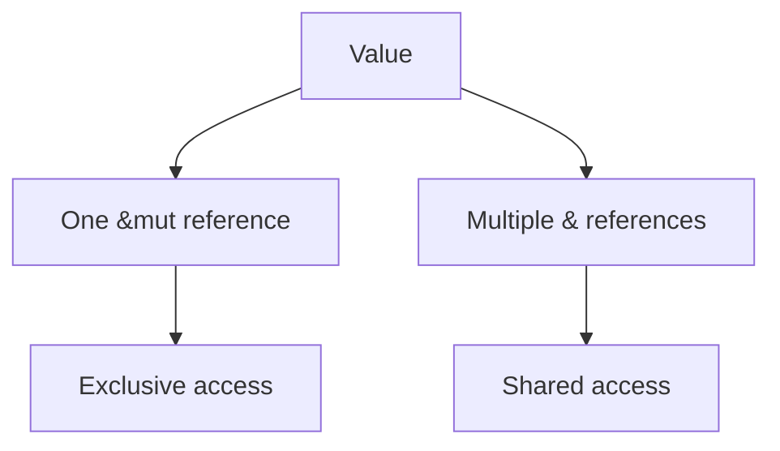
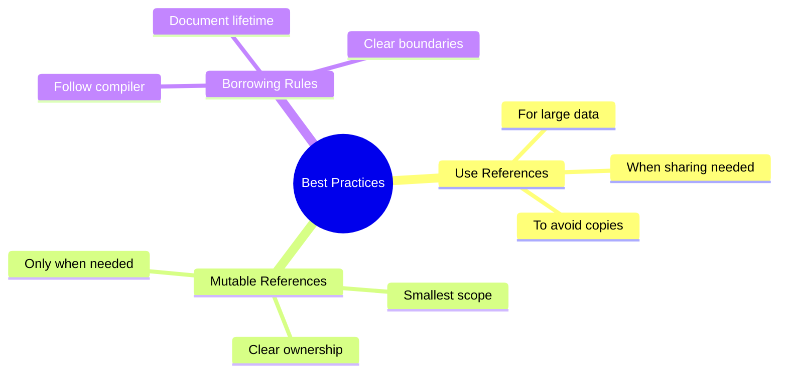

# References and Borrowing
## Chapter 4: Memory Management in Practice

---

# What are References?



---

# Basic References

```rust
fn main() {
    let s1 = String::from("hello");
    let len = calculate_length(&s1);
    println!("Length of '{}' is {}", s1, len);
}

fn calculate_length(s: &String) -> usize {
    s.len()
}
```

---

# Memory Layout: References



---

# Reference Rules

1. At any given time, you can have either:
   - One mutable reference
   - Any number of immutable references
2. References must always be valid
3. References can't outlive their referent

---

# Mutable References

```rust
fn main() {
    let mut s = String::from("hello");
    change(&mut s);
    println!("{}", s);  // prints "hello world"
}

fn change(s: &mut String) {
    s.push_str(" world");
}
```

---

# Reference Scope

```rust
let mut s = String::from("hello");

{
    let r1 = &s; // ok
    let r2 = &s; // ok
    println!("{} and {}", r1, r2);
} // r1 and r2 go out of scope here

let r3 = &mut s; // ok
println!("{}", r3);
```

---

# Reference Restrictions

```rust
let mut s = String::from("hello");

let r1 = &mut s;
let r2 = &mut s; // ERROR!

println!("{}", r1);
```

---

# Data Race Prevention

```rust
let mut s = String::from("hello");

let r1 = &s;     // ok
let r2 = &s;     // ok
let r3 = &mut s; // ERROR!

println!("{}, {}, and {}", r1, r2, r3);
```

---

# Dangling References

```rust
fn dangle() -> &String {            // WRONG
    let s = String::from("hello");
    &s
}   // s is dropped here

fn no_dangle() -> String {         // CORRECT
    String::from("hello")
}
```

---

# Reference Lifetime

```rust
fn main() {
    let x = 5;
    let r = &x;
    println!("r: {}", r);
}  // x and r go out of scope
```

---

# Mutable and Immutable Together

```rust
let mut s = String::from("hello");

let r1 = &s; // ok
let r2 = &s; // ok
println!("{} and {}", r1, r2);
// r1 and r2 are no longer used after this point

let r3 = &mut s; // ok
println!("{}", r3);
```

---

# Borrowing Rules Visualization



---

# Reference in Structs

```rust
struct Person {
    name: String,
    reference: &String,  // WRONG: needs lifetime
}

struct ValidPerson<'a> {
    name: String,
    reference: &'a String,  // Correct with lifetime
}
```

---

# Multiple References

```rust
fn main() {
    let mut s = String::from("hello");
    
    let r1 = &s;
    let r2 = &s;
    let r3 = &s;
    
    println!("{} {} {}", r1, r2, r3);
}
```

---

# Mutable Reference Mutation

```rust
fn main() {
    let mut s = String::from("hello");
    let r1 = &mut s;
    
    r1.push_str(" world");    // ok
    println!("{}", r1);       // hello world
}
```

---

# Borrowing in Functions

```rust
fn print_string(s: &String) {
    println!("{}", s);
}

fn modify_string(s: &mut String) {
    s.push_str(" world");
}

fn main() {
    let mut s = String::from("hello");
    print_string(&s);
    modify_string(&mut s);
}
```

---

# Borrowing and Ownership

```rust
fn main() {
    let s1 = String::from("hello");
    let s2 = &s1;        // borrowing
    let s3 = s1;         // ownership move
    println!("{}", s2);  // ERROR: s1 was moved
}
```

---

# References vs. Smart Pointers

```rust
use std::rc::Rc;

let s = Rc::new(String::from("hello"));
let s1 = &s;        // Reference
let s2 = Rc::clone(&s); // Smart Pointer clone
```

---

# Auto-Dereferencing

```rust
fn main() {
    let s = String::from("hello");
    let s_ref = &s;
    
    println!("Length: {}", s_ref.len());
    // Rust automatically dereferences s_ref
}
```

---

# References in Collections

```rust
fn main() {
    let mut vec = Vec::new();
    let s = String::from("hello");
    
    vec.push(&s);  // Store reference
    println!("{}", vec[0]);
}
```

---

# Common Reference Patterns

```rust
// Passing large structs
fn process_data(data: &LargeStruct) { }

// Modifying in place
fn update_data(data: &mut LargeStruct) { }

// Multiple readers
fn read_data(data1: &Data, data2: &Data) { }
```

---

# Error Patterns to Avoid

```rust
// Don't return references to local variables
fn wrong() -> &String {  // ERROR
    let s = String::from("hello");
    &s
}

// Don't create mutable references if not needed
fn unnecessary(s: &mut String) {  // Use &String if not modifying
    println!("{}", s);
}
```

---

# Best Practices



---

# Practice Exercise

Create functions that:
1. Use immutable references
2. Use mutable references
3. Handle multiple references
4. Demonstrate scope rules
5. Show reference patterns

---

# Common Pitfalls
1. Fighting the borrow checker
2. Unnecessary mutable references
3. Reference lifetime issues
4. Complex borrowing patterns
5. Returning dangling references

---

# Summary
- Reference basics
- Borrowing rules
- Mutable references
- Scope and lifetime
- Best practices
