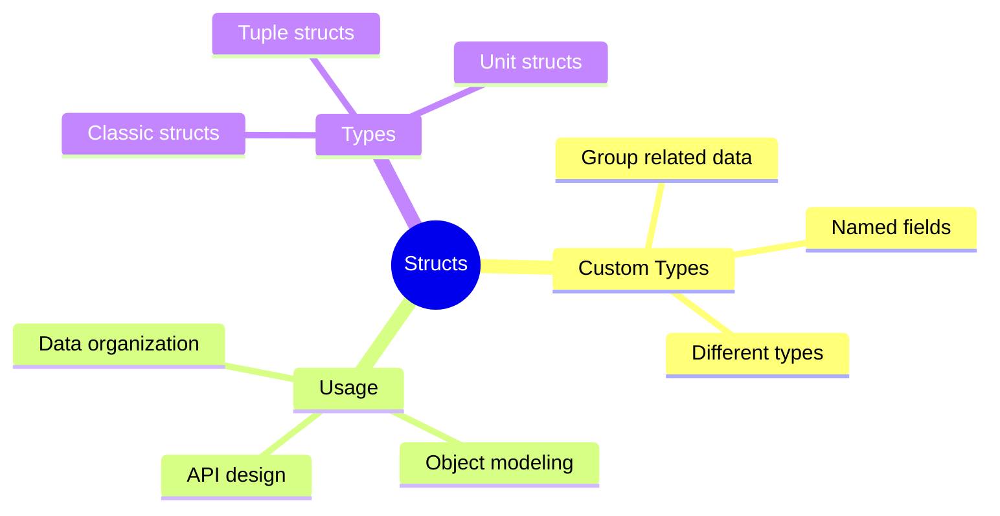
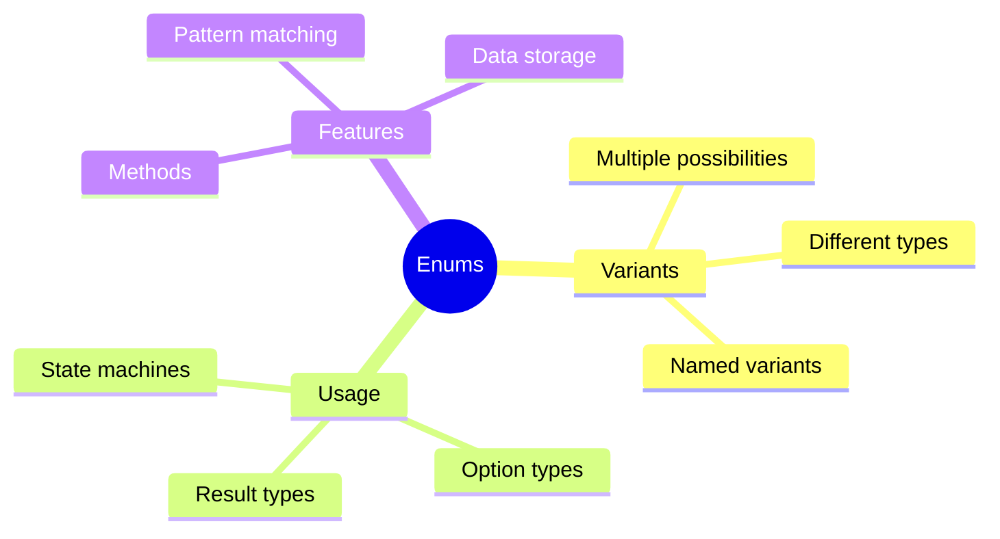
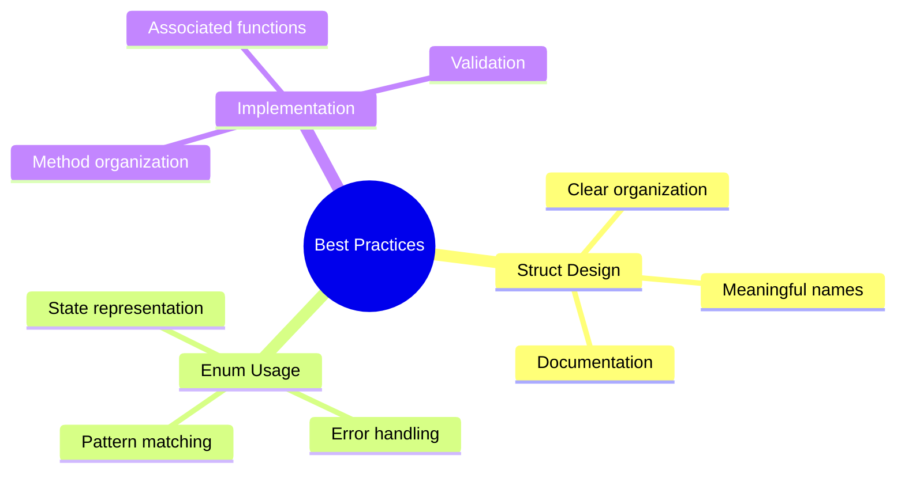

# Structs and Enums
## Chapter 4: Custom Data Types in Rust

---

# What are Structs?



---

# Defining a Struct

```rust
struct User {
    username: String,
    email: String,
    sign_in_count: u64,
    active: bool,
}
```

---

# Creating Struct Instances

```rust
let user1 = User {
    email: String::from("user@example.com"),
    username: String::from("user123"),
    active: true,
    sign_in_count: 1,
};
```

---

# Accessing Struct Fields

```rust
fn main() {
    let mut user1 = User {
        email: String::from("user@example.com"),
        username: String::from("user123"),
        active: true,
        sign_in_count: 1,
    };

    // Access fields using dot notation
    println!("Username: {}", user1.username);
    // Modify field (requires mut)
    user1.email = String::from("newemail@example.com");
}
```

---

# Field Init Shorthand

```rust
fn build_user(email: String, username: String) -> User {
    User {
        email,      // same as email: email
        username,   // same as username: username
        active: true,
        sign_in_count: 1,
    }
}
```

---

# Struct Update Syntax

```rust
let user2 = User {
    email: String::from("another@example.com"),
    ..user1  // remaining fields from user1
};
```

---

# Tuple Structs

```rust
struct Color(i32, i32, i32);
struct Point(i32, i32, i32);

let black = Color(0, 0, 0);
let origin = Point(0, 0, 0);
```

---

# Unit Structs

```rust
struct AlwaysEqual;

let subject = AlwaysEqual;
// Useful for implementing traits
impl SomeTrait for AlwaysEqual {
    // ...
}
```

---

# Struct Methods

```rust
struct Rectangle {
    width: u32,
    height: u32,
}

impl Rectangle {
    fn area(&self) -> u32 {
        self.width * self.height
    }
}
```

---

# Associated Functions

```rust
impl Rectangle {
    // Associated function (no self parameter)
    fn square(size: u32) -> Rectangle {
        Rectangle {
            width: size,
            height: size,
        }
    }
}

// Usage: Rectangle::square(3)
```

---

# Multiple impl Blocks

```rust
impl Rectangle {
    fn area(&self) -> u32 {
        self.width * self.height
    }
}

impl Rectangle {
    fn can_hold(&self, other: &Rectangle) -> bool {
        self.width > other.width && self.height > other.height
    }
}
```

---

# What are Enums?



---

# Basic Enum Definition

```rust
enum IpAddrKind {
    V4,
    V6,
}

let four = IpAddrKind::V4;
let six = IpAddrKind::V6;
```

---

# Enums with Data

```rust
enum IpAddr {
    V4(u8, u8, u8, u8),
    V6(String),
}

let home = IpAddr::V4(127, 0, 0, 1);
let loopback = IpAddr::V6(String::from("::1"));
```

---

# Complex Enum Data

```rust
enum Message {
    Quit,                       // no data
    Move { x: i32, y: i32 },   // named fields
    Write(String),             // single value
    ChangeColor(i32, i32, i32),// tuple
}
```

---

# Methods on Enums

```rust
impl Message {
    fn call(&self) {
        // method body
        match self {
            Message::Quit => println!("Quit"),
            Message::Move {x, y} => println!("Move to {}, {}", x, y),
            Message::Write(s) => println!("Write {}", s),
            Message::ChangeColor(r,g,b) => println!("Color: {},{},{}", r,g,b),
        }
    }
}
```

---

# The Option Enum

```rust
enum Option<T> {
    None,
    Some(T),
}

let some_number = Some(5);
let some_string = Some("a string");
let absent_number: Option<i32> = None;
```

---

# Working with Option

```rust
fn main() {
    let x: i8 = 5;
    let y: Option<i8> = Some(5);

    // This won't compile
    // let sum = x + y;
    // Need to handle the Option
    let sum = x + y.unwrap_or(0);
}
```

---

# Match Expression

```rust
enum Coin {
    Penny,
    Nickel,
    Dime,
    Quarter,
}

fn value_in_cents(coin: Coin) -> u8 {
    match coin {
        Coin::Penny => 1,
        Coin::Nickel => 5,
        Coin::Dime => 10,
        Coin::Quarter => 25,
    }
}
```

---

# Match with Patterns

```rust
fn plus_one(x: Option<i32>) -> Option<i32> {
    match x {
        None => None,
        Some(i) => Some(i + 1),
    }
}

let five = Some(5);
let six = plus_one(five);
let none = plus_one(None);
```

---

# Match with Guards

```rust
match some_value {
    Some(x) if x < 0 => println!("Negative"),
    Some(x) if x > 0 => println!("Positive"),
    Some(0) => println!("Zero"),
    None => println!("None"),
}
```

---

# Catch-all Patterns

```rust
let dice_roll = 9;
match dice_roll {
    3 => add_fancy_hat(),
    7 => remove_fancy_hat(),
    _ => (),  // catch-all, do nothing
}
```

---

# if let Syntax

```rust
let some_value = Some(3);

// Instead of:
match some_value {
    Some(3) => println!("three"),
    _ => (),
}

// You can use:
if let Some(3) = some_value {
    println!("three");
}
```

---

# while let Syntax

```rust
let mut stack = Vec::new();
stack.push(1);
stack.push(2);
stack.push(3);

while let Some(top) = stack.pop() {
    println!("{}", top);
}
```

---

# Pattern Binding

```rust
enum Color {
    Rgb(i32, i32, i32),
    Hsv(i32, i32, i32),
}

match color {
    Color::Rgb(r, g, b) => println!("R:{}, G:{}, B:{}", r, g, b),
    Color::Hsv(h, s, v) => println!("H:{}, S:{}, V:{}", h, s, v),
}
```

---

# Nested Patterns

```rust
enum Message {
    Quit,
    Move { x: i32, y: i32 },
    Write(String),
    ChangeColor(Color),
}

match msg {
    Message::ChangeColor(Color::Rgb(r, g, b)) => {
        println!("Change color to RGB {} {} {}", r, g, b);
    }
    // ... other patterns
}
```

---

# Common Patterns Example

```rust
enum Status {
    Active,
    Inactive,
    Pending(String),
}

struct User {
    id: i32,
    name: String,
    status: Status,
}
```

---

# Reference Patterns

```rust
let reference = &4;
match reference {
    &val => println!("Got a value: {}", val),
}

// or with ref:
let value = 5;
match value {
    ref r => println!("Got a reference: {}", r),
}
```

---

# Practice Exercise

Create a basic state machine using enums:
1. Define states
1. Implement transitions
1. Add validation
1. Handle errors

---

# Best Practices



---

# Summary
- Structs and their types
- Methods and associated functions
- Enums and variants
- Pattern matching
- Option and Result types
