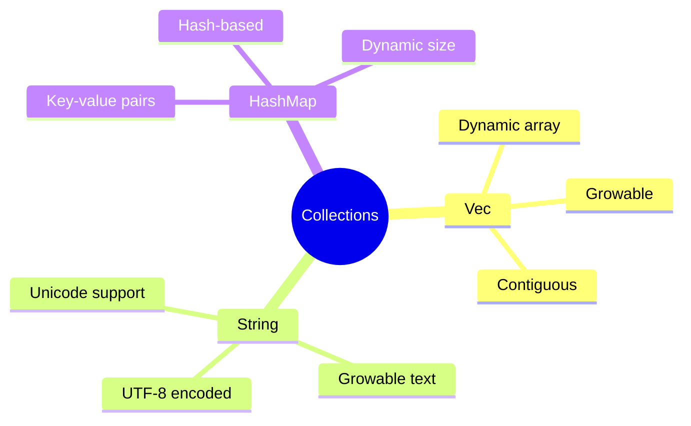
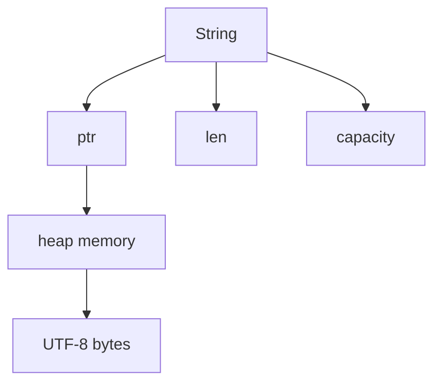
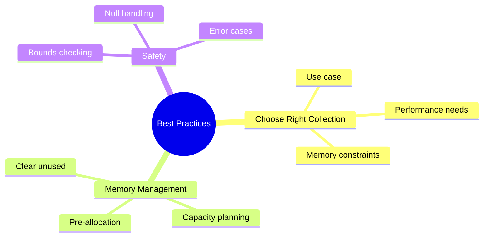

# Collections
## Chapter 5: Working with Data Structures

---

# Common Collections



---

# Vector Basics

```rust
// Creating new vectors
let v: Vec<i32> = Vec::new();
let v = vec![1, 2, 3];

// Adding elements
let mut v = Vec::new();
v.push(5);
v.push(6);
```

---

# Accessing Vector Elements

```rust
let v = vec![1, 2, 3, 4, 5];

// Using index
let third: &i32 = &v[2];

// Using get
match v.get(2) {
    Some(third) => println!("Third element is {}", third),
    None => println!("No third element"),
}
```

---

# Vector Safety

```rust
let v = vec![1, 2, 3, 4, 5];

// Will panic
// let does_not_exist = &v[100];

// Safe access
let does_not_exist = v.get(100);
match does_not_exist {
    Some(value) => println!("Value: {}", value),
    None => println!("Index out of bounds"),
}
```

---

# Iterating Over Vectors

```rust
let v = vec![100, 32, 57];

// Immutable references
for i in &v {
    println!("{}", i);
}

// Mutable references
let mut v = vec![100, 32, 57];
for i in &mut v {
    *i += 50;
}
```

---

# Vector with Different Types

```rust
enum SpreadsheetCell {
    Int(i32),
    Float(f64),
    Text(String),
}

let row = vec![
    SpreadsheetCell::Int(3),
    SpreadsheetCell::Text(String::from("blue")),
    SpreadsheetCell::Float(10.12),
];
```

---

# Vector Methods

```rust
fn main() {
    let mut v = vec![1, 2, 3];

    v.push(4);        // Add element
    v.pop();          // Remove last
    v.len();          // Get length
    v.capacity();     // Get capacity
    v.clear();        // Remove all
    v.extend([1,2,3].iter()); // Add multiple
}
```

---

# String Creation

```rust
// Empty string
let mut s = String::new();

// From literal
let s = "initial contents".to_string();

// Using from
let s = String::from("initial contents");
```

---

# String Updates

```rust
let mut s = String::from("foo");

// Push string
s.push_str("bar");

// Push single char
s.push('!');

// Concatenation
let s1 = String::from("Hello, ");
let s2 = String::from("world!");
let s3 = s1 + &s2; // s1 has been moved
```

---

# String Internals



---

# String Slicing

```rust
let hello = "hello";

let s = &hello[0..4]; // Gets "he"

// Be careful with slicing - must be valid UTF-8 boundaries
```

---

# String Iteration

```rust
let s = String::from("hello");

// Chars
for c in s.chars() {
    println!("{}", c);
}

// Bytes
for b in s.bytes() {
    println!("{}", b);
}
```

---

# HashMap Basics

```rust
use std::collections::HashMap;

let mut scores = HashMap::new();

scores.insert(String::from("Blue"), 10);
scores.insert(String::from("Yellow"), 50);
```

---

# Creating HashMap

```rust
use std::collections::HashMap;

// From tuples
let teams = vec![String::from("Blue"), String::from("Yellow")];
let initial_scores = vec![10, 50];

let scores: HashMap<_, _> = teams.iter()
    .zip(initial_scores.iter())
    .collect();
```

---

# Accessing HashMap Values

```rust
let mut scores = HashMap::new();
scores.insert(String::from("Blue"), 10);

// Using get
match scores.get("Blue") {
    Some(score) => println!("Blue team score: {}", score),
    None => println!("Blue team doesn't exist"),
}

// Iteration
for (key, value) in &scores {
    println!("{}: {}", key, value);
}
```

---

# Updating HashMap

```rust
let mut scores = HashMap::new();

// Overwriting
scores.insert(String::from("Blue"), 10);
scores.insert(String::from("Blue"), 25);

// Insert if key has no value
scores.entry(String::from("Yellow")).or_insert(50);
```

---

# Update Based on Old Value

```rust
use std::collections::HashMap;

let text = "hello world wonderful world";

let mut map = HashMap::new();

for word in text.split_whitespace() {
    let count = map.entry(word).or_insert(0);
    *count += 1;
}
```

---

# Hash Functions

```rust
use std::collections::HashMap;
use std::hash::BuildHasherDefault;
use std::collections::hash_map::DefaultHasher;

// Using default hasher
let mut map = HashMap::new();

// Using custom hasher
let mut map: HashMap<_, _, BuildHasherDefault<DefaultHasher>> =
    HashMap::default();
```

---

# Collection Traits

```mermaid
graph TD
    A[Collection Traits] --> B[IntoIterator]
    A --> C[Extend]
    A --> D[FromIterator]
    B --> E[iter()]
    B --> F[iter_mut()]
    B --> G[into_iter()]
```

---

# Vec vs Array vs Slice

<div class="columns">
<div>

## Vec<T>
- Dynamic size
- Heap allocated
- Growable

</div>
<div>

## Array/Slice
- Fixed size
- Stack possible
- Immutable size

</div>
</div>

---

# Common Methods

```rust
let mut vec = vec![1, 2, 3];
vec.push(4);              // Add to end
vec.pop();               // Remove from end
vec.remove(1);           // Remove at index
vec.insert(1, 5);        // Insert at index
vec.clear();             // Remove all
vec.extend([6,7,8]);     // Add multiple
```

---

# Performance Considerations

```mermaid
mindmap
  root((Performance))
    Vector
      Amortized O(1) push
      O(n) insertion
      O(1) pop
    HashMap
      O(1) average lookup
      Hash collisions
      Memory overhead
    String
      UTF-8 encoding
      O(n) concatenation
      Memory reallocation
```

---

# Collection Examples

```rust
// Frequency counter
fn word_frequency(text: &str) -> HashMap<String, u32> {
    let mut map = HashMap::new();

    for word in text.split_whitespace() {
        *map.entry(word.to_string()).or_insert(0) += 1;
    }

    map
}
```

---

# Error Handling

```rust
fn main() {
    let v = vec![1, 2, 3];

    // Safe index access
    match v.get(5) {
        Some(value) => println!("Value: {}", value),
        None => println!("Index out of bounds"),
    }

    // Safe key access
    let mut map = HashMap::new();
    map.insert(String::from("key"), 42);

    if let Some(value) = map.get("key") {
        println!("Value: {}", value);
    }
}
```

---

# Memory Management

```rust
fn main() {
    // Pre-allocation
    let mut v = Vec::with_capacity(10);

    // String pre-allocation
    let mut s = String::with_capacity(100);

    // HashMap with capacity
    let mut map = HashMap::with_capacity(50);
}
```

---

# Practice Exercise

Create a simple text analyzer that:
1. Counts word frequency
1. Tracks unique words
1. Finds longest/shortest words
1. Reports statistics

---

# Best Practices



---

# Common Pitfalls
1. Index out of bounds
2. Invalid string slicing
3. HashMap key type constraints
4. Unnecessary cloning
5. Inefficient capacity usage

---

# Summary
- Vectors for sequences
- Strings for text
- HashMaps for key-value data
- Memory management
- Performance considerations
