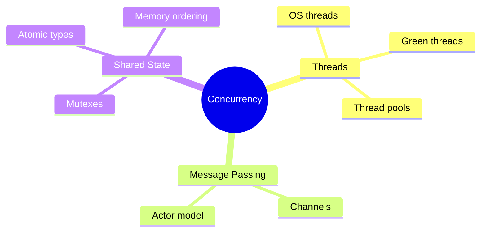
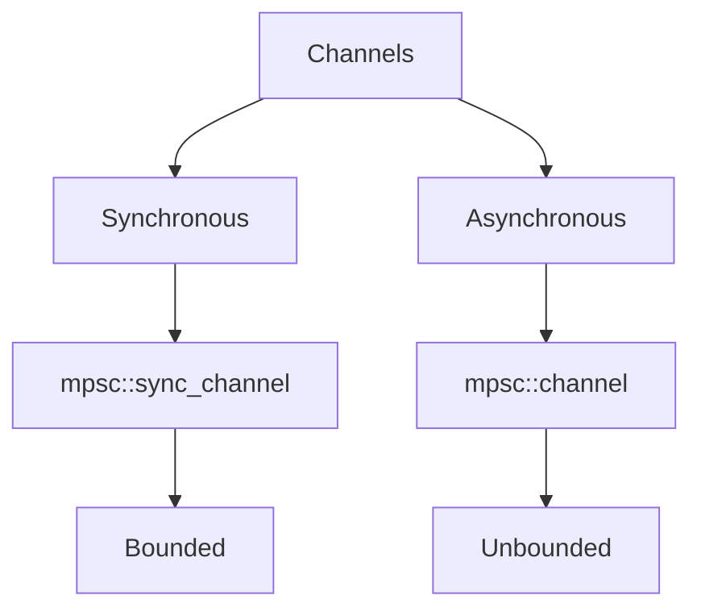
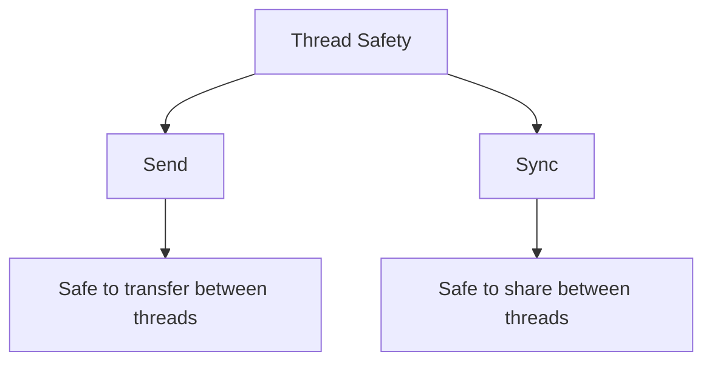
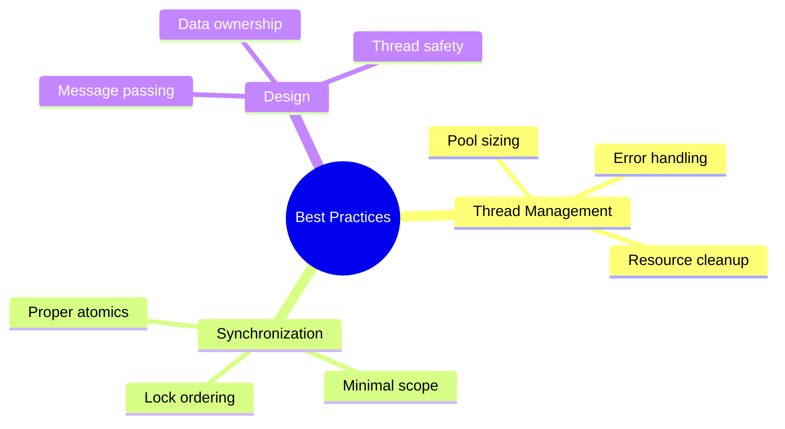

# Threads and Concurrency
## Chapter 8: Parallel Programming in Rust

---

# Concurrency Models



---

# Creating Threads

```rust
use std::thread;
use std::time::Duration;

fn main() {
    let handle = thread::spawn(|| {
        for i in 1..10 {
            println!("hi number {} from spawned thread!", i);
            thread::sleep(Duration::from_millis(1));
        }
    });

    handle.join().unwrap();
}
```

---

# Thread Handles

```rust
let handle = thread::spawn(|| {
    // Thread code
});

// Do other work

// Wait for thread to finish
match handle.join() {
    Ok(result) => println!("Thread finished: {:?}", result),
    Err(e) => println!("Thread panicked: {:?}", e),
}
```

---

# Moving Values into Threads

```rust
let v = vec![1, 2, 3];

let handle = thread::spawn(move || {
    println!("Vector: {:?}", v);
});

// v is no longer accessible here
handle.join().unwrap();
```

---

# Message Passing: Channels

```rust
use std::sync::mpsc;
use std::thread;

let (tx, rx) = mpsc::channel();

thread::spawn(move || {
    tx.send(String::from("hello")).unwrap();
});

let received = rx.recv().unwrap();
println!("Got: {}", received);
```

---

# Multiple Producers

```rust
let (tx, rx) = mpsc::channel();
let tx1 = tx.clone();

thread::spawn(move || {
    tx.send(1).unwrap();
});

thread::spawn(move || {
    tx1.send(2).unwrap();
});

for received in rx {
    println!("Got: {}", received);
}
```

---

# Channel Types



---

# Shared State: Mutex

```rust
use std::sync::Mutex;

let m = Mutex::new(5);

{
    let mut num = m.lock().unwrap();
    *num = 6;
}

println!("m = {:?}", m);
```

---

# Mutex Between Threads

```rust
use std::sync::{Arc, Mutex};
use std::thread;

let counter = Arc::new(Mutex::new(0));
let mut handles = vec![];

for _ in 0..10 {
    let counter = Arc::clone(&counter);
    let handle = thread::spawn(move || {
        let mut num = counter.lock().unwrap();
        *num += 1;
    });
    handles.push(handle);
}
```

---

# Arc (Atomic Reference Counting)

```rust
use std::sync::Arc;

let data = Arc::new(vec![1, 2, 3, 4]);
let mut handles = vec![];

for _ in 0..3 {
    let data_ref = Arc::clone(&data);
    handles.push(thread::spawn(move || {
        println!("{:?}", *data_ref);
    }));
}
```

---

# Atomic Types

```rust
use std::sync::atomic::{AtomicI32, Ordering};

let counter = AtomicI32::new(0);

counter.fetch_add(1, Ordering::SeqCst);
println!("Count: {}", counter.load(Ordering::SeqCst));
```

---

# Memory Ordering

```rust
use std::sync::atomic::Ordering;

// Available orderings
Ordering::Relaxed;    // Weakest
Ordering::Release;    // Store with release semantics
Ordering::Acquire;    // Load with acquire semantics
Ordering::AcqRel;     // Both acquire and release
Ordering::SeqCst;     // Strongest
```

---

# RwLock (Reader-Writer Lock)

```rust
use std::sync::RwLock;

let lock = RwLock::new(5);

// Multiple readers
let r1 = lock.read().unwrap();
let r2 = lock.read().unwrap();

// One writer
let w = lock.write().unwrap();
*w = 6;
```

---

# Thread Pools

```rust
use threadpool::ThreadPool;

let pool = ThreadPool::new(4);

for i in 0..8 {
    pool.execute(move || {
        println!("Task {} executed", i);
    });
}
```

---

# Barrier Synchronization

```rust
use std::sync::{Arc, Barrier};

let barrier = Arc::new(Barrier::new(3));

for _ in 0..3 {
    let b = Arc::clone(&barrier);
    thread::spawn(move || {
        println!("before wait");
        b.wait();
        println!("after wait");
    });
}
```

---

# Condition Variables

```rust
use std::sync::{Arc, Mutex, Condvar};

let pair = Arc::new((Mutex::new(false), Condvar::new()));
let pair2 = Arc::clone(&pair);

thread::spawn(move || {
    let (lock, cvar) = &*pair2;
    let mut started = lock.lock().unwrap();
    *started = true;
    cvar.notify_one();
});
```

---

# Thread Safety Traits



---

# Send and Sync

```rust
// Types that can be transferred across threads
trait Send {}

// Types that can be shared between threads
trait Sync {}

// Example
#[derive(Debug)]
struct MySendType;
unsafe impl Send for MySendType {}
```

---

# Deadlock Prevention

```rust
use std::sync::{Mutex, MutexGuard};

fn transfer(
    source: &Mutex<i32>,
    dest: &Mutex<i32>,
    amount: i32,
) {
    let mut source_guard: MutexGuard<i32>;
    let mut dest_guard: MutexGuard<i32>;

    // Acquire locks in a consistent order
    if std::ptr::eq(source, dest) {
        return;
    } else if source as *const _ < dest as *const _ {
        source_guard = source.lock().unwrap();
        dest_guard = dest.lock().unwrap();
    } else {
        dest_guard = dest.lock().unwrap();
        source_guard = source.lock().unwrap();
    }
}
```

---

# Thread Local Storage

```rust
thread_local! {
    static COUNTER: RefCell<u32> = RefCell::new(0);
}

COUNTER.with(|c| {
    *c.borrow_mut() += 1;
    println!("Counter: {}", *c.borrow());
});
```

---

# Scoped Threads

```rust
let mut v = vec![1, 2, 3];

thread::scope(|s| {
    s.spawn(|| {
        println!("can borrow v here: {:?}", &v);
    });
});

println!("v: {:?}", v);
```

---

# Error Handling in Threads

```rust
let handle = thread::spawn(|| {
    if some_condition {
        Err("Something went wrong")
    } else {
        Ok("Success!")
    }
});

match handle.join() {
    Ok(Ok(success)) => println!("Success: {}", success),
    Ok(Err(err)) => println!("Thread returned error: {}", err),
    Err(e) => println!("Thread panicked: {:?}", e),
}
```

---

# Best Practices



---

# Performance Considerations
1. Thread creation overhead
2. Context switching costs
3. Cache coherency
4. Lock contention
5. Memory ordering impact

---

# Practice Exercise

Create a concurrent application that:
1. Uses multiple threads
2. Shares data safely
3. Handles errors
4. Prevents deadlocks
5. Uses message passing

---

# Common Pitfalls
1. Race conditions
2. Deadlocks
3. Thread leak
4. Lock contention
5. Incorrect synchronization

---

# Summary
- Thread basics
- Message passing
- Shared state
- Synchronization
- Best practices
