# Supply Chain Attacks

---
## What is a Supply Chain Attack?

- A supply chain attack targets the less-secure elements in the software or hardware supply chain
- Instead of attacking the target directly, attackers compromise a supplier, dependency, or tool the target trusts
- The compromised component is then delivered to the target through normal update/distribution channels
- Extremely effective because the malicious code arrives through trusted channels

```python
┌──────────────────────────────────────────────────────────┐
│          Supply Chain Attack Concept                      │
│                                                          │
│  Traditional Attack:                                     │
│  Attacker ─────────────────────────────> Target          │
│            (blocked by security controls)                │
│                                                          │
│  Supply Chain Attack:                                    │
│  Attacker ──> Supplier/Dependency ──> Target             │
│               (trusted channel!)                         │
│                                                          │
│  The target's own security controls                      │
│  ALLOW the malicious code in because                     │
│  it comes from a "trusted" source                        │
└──────────────────────────────────────────────────────────┘
```

---
## Types of Software Supply Chain Attacks

| Attack Type                  | Vector                                    | Example               |
|------------------------------|-------------------------------------------|-----------------------|
| Dependency confusion         | Package registry name collision           | Alex Birsan (2021)    |
| Typosquatting                | Similar package names with typos          | crossenv / cross-env  |
| Compromised maintainer       | Hijack or bribe package maintainer        | event-stream (2018)   |
| Build pipeline compromise    | Inject into CI/CD system                  | SolarWinds (2020)     |
| Code signing compromise      | Steal or forge code signing keys          | ASUS ShadowHammer     |
| Vendor software compromise   | Backdoor vendor's product                 | 3CX (2023)            |
| Open source contribution     | Malicious PR merged into project          | xz-utils (2024)       |
| Container image poisoning    | Malicious Docker images on registries     | Various               |

---
## Software Supply Chain Attack Flow

```bash
┌──────────────────────────────────────────────────────────┐
│          Attack Flow: Build Pipeline Compromise           │
│                                                          │
│  1. Attacker gains access to build system                │
│     (CI/CD server, build scripts, developer machine)     │
│                                                          │
│  2. Injects malicious code into build pipeline           │
│     (not in source code repo -- harder to detect!)       │
│                                                          │
│  3. Clean source code produces tainted binary            │
│     ┌────────────┐    ┌──────────┐    ┌─────────────┐   │
│     │ Clean      │───>│Compromised│───>│ Tainted     │   │
│     │ Source Code│    │ Build     │    │ Binary      │   │
│     │ (GitHub)   │    │ System    │    │ (signed!)   │   │
│     └────────────┘    └──────────┘    └──────┬──────┘   │
│                                              │           │
│  4. Tainted binary distributed via           │           │
│     normal software update channels          │           │
│                                              v           │
│                                       ┌─────────────┐   │
│                                       │ 18,000+     │   │
│                                       │ Customers   │   │
│                                       └─────────────┘   │
└──────────────────────────────────────────────────────────┘
```

---
## Case Study: SolarWinds SUNBURST (2020)

```bash
┌──────────────────────────────────────────────────────────┐
│          SolarWinds SUNBURST Timeline                     │
│                                                          │
│  Sep 2019  Attackers gain access to SolarWinds network   │
│                                                          │
│  Oct 2019  Attackers inject test code into Orion build   │
│            (testing their access works)                   │
│                                                          │
│  Feb 2020  SUNBURST backdoor injected into Orion build   │
│            pipeline (SolarWinds.Orion.Core.dll)          │
│                                                          │
│  Mar 2020  Tainted Orion update (2020.2) released        │
│            - Digitally signed by SolarWinds              │
│            - Distributed through normal update channel   │
│            - 18,000+ organizations installed it          │
│                                                          │
│  Dec 2020  FireEye discovers the backdoor                │
│            (9 months of undetected access!)              │
│                                                          │
│  Victims included:                                       │
│  - US Treasury, Commerce, Homeland Security              │
│  - Microsoft, Intel, Cisco, Deloitte                     │
│  - FireEye (who discovered it)                           │
│                                                          │
│  Attribution: Russian SVR (APT29 / Cozy Bear)            │
└──────────────────────────────────────────────────────────┘
```

**SUNBURST technical details:**
- Backdoor waited 12-14 days before activating (evade sandbox analysis)
- Used DNS for C2 communication (encoded in subdomain names)
- Checked for security tools and disabled them before acting
- Only activated on "interesting" targets (selective targeting)

---
## Case Study: xz-utils Backdoor (2024)



---
## Dependency Confusion


---
## Dependency Confusion Defense

```bash
# npm: Use scoped packages and registry configuration
# .npmrc
@company:registry=https://private.registry.company.com/
registry=https://registry.npmjs.org/
# Scoped packages (@company/*) always come from private registry

# Python: Use --index-url and --extra-index-url carefully
# pip.conf
[global]
index-url = https://private.registry.company.com/simple/
# Do NOT use --extra-index-url (allows fallback to PyPI!)

# Better: Pin exact versions and use lockfiles
# package-lock.json, Pipfile.lock, poetry.lock
```

```python
# Python: Verify package source in CI/CD
import subprocess
import json

def verify_packages():
    """Ensure no packages come from unexpected sources."""
    result = subprocess.run(
        ['pip', 'list', '--format=json'],
        capture_output=True, text=True
    )
    packages = json.loads(result.stdout)

    for pkg in packages:
        # Check each package origin
        show = subprocess.run(
            ['pip', 'show', pkg['name']],
            capture_output=True, text=True
        )
        if 'pypi.org' in show.stdout and pkg['name'].startswith('internal-'):
            raise SecurityError(
                f"Internal package {pkg['name']} installed from PyPI!"
            )
```

---
## Typosquatting Attacks

```bash
┌──────────────────────────────────────────────────────────┐
│  Typosquatting Examples                                  │
├─────────────────────┬────────────────────────────────────┤
│  Legitimate Package │  Typosquat Variants                │
├─────────────────────┼────────────────────────────────────┤
│  cross-env          │  crossenv (malicious, 2017)        │
│  lodash             │  lodahs, lodas, lodassh            │
│  requests           │  reqeusts, request, requets        │
│  colors             │  colour, colorsjs, color           │
│  urllib3             │  urllib, urlib3, urllib4            │
│  python-nmap        │  nmap-python, python_nmap          │
│  tensorflow         │  tenserflow, tensorflw             │
└─────────────────────┴────────────────────────────────────┘
│                                                          │
│  Techniques:                                             │
│  - Character substitution (o -> 0, l -> 1)              │
│  - Missing/extra characters (lodash -> lodas)            │
│  - Hyphen/underscore confusion (my-pkg -> my_pkg)        │
│  - Namespace confusion (@scope/pkg -> scope-pkg)         │
│  - Different separator (python-nmap -> python.nmap)      │
└──────────────────────────────────────────────────────────┘
```

---
## npm and PyPI Security Incidents

| Incident                | Year | Package/Registry | Impact                         |
|-------------------------|------|------------------|--------------------------------|
| event-stream            | 2018 | npm              | Crypto wallet theft            |
| ua-parser-js            | 2021 | npm              | Cryptominer + password stealer |
| colors / faker          | 2022 | npm              | Maintainer protest (corruption)|
| PyPI typosquats         | 2022 | PyPI             | 400+ malicious packages found  |
| ctx + phpass            | 2022 | PyPI/PHP         | Exfiltrated env variables      |
| Ledger Connect Kit      | 2023 | npm              | Crypto wallet drainer injected |
| polyfill.io takeover    | 2024 | CDN              | Malicious JS served to 100K+ sites |

---
## Software Bill of Materials (SBOM)

```bash
┌──────────────────────────────────────────────────────────┐
│          Software Bill of Materials (SBOM)                │
│                                                          │
│  An SBOM is a formal inventory of all components,        │
│  libraries, and dependencies in a software product       │
│                                                          │
│  Like a "nutrition label" for software                   │
│                                                          │
│  ┌────────────────────────────────────────────┐          │
│  │  MyApp v2.1.0                              │          │
│  │  ├── express v4.18.2                       │          │
│  │  │   ├── accepts v1.3.8                    │          │
│  │  │   ├── body-parser v1.20.1              │          │
│  │  │   │   └── bytes v3.1.2                 │          │
│  │  │   ├── content-type v1.0.5              │          │
│  │  │   └── cookie v0.5.0                    │          │
│  │  ├── jsonwebtoken v9.0.0                   │          │
│  │  │   └── jws v3.2.2                       │          │
│  │  └── pg v8.11.0                            │          │
│  │      └── pg-protocol v1.6.0               │          │
│  └────────────────────────────────────────────┘          │
│                                                          │
│  Formats: SPDX (ISO standard), CycloneDX (OWASP)        │
│  US Executive Order 14028 (2021) requires SBOMs          │
│  for software sold to the federal government             │
└──────────────────────────────────────────────────────────┘
```

```bash
# Generate SBOM with Syft
syft dir:./myapp -o spdx-json > sbom.spdx.json
syft dir:./myapp -o cyclonedx-json > sbom.cdx.json

# Scan SBOM for known vulnerabilities with Grype
grype sbom:./sbom.spdx.json

# npm: Built-in audit
npm audit
npm audit --json

# Python
pip-audit
safety check
```

---
## Verification Strategies

### Package Signing and Verification

```bash
# npm: Check package provenance (npm v9+)
npm audit signatures

# Python: Verify package hashes
pip install --require-hashes -r requirements.txt
# requirements.txt with hashes:
# requests==2.31.0 \
#   --hash=sha256:58cd2187c01e70e6e26505bca751777aa9f2ee0b7f4300988b709f44e013003eb

# Go: Module checksums verified automatically
# go.sum file contains expected hashes
go mod verify

# Container images: Verify signatures
cosign verify --key cosign.pub myregistry/myimage:latest
```

---
## Sigstore: Open Source Signing

```bash
┌──────────────────────────────────────────────────────────┐
│          Sigstore Ecosystem                               │
│                                                          │
│  Problem: Traditional code signing requires managing     │
│  long-lived private keys (complex and risky)             │
│                                                          │
│  Sigstore solution: Keyless signing using OIDC identity  │
│                                                          │
│  Components:                                             │
│  ┌──────────┐  ┌──────────┐  ┌──────────┐               │
│  │  Cosign   │  │  Fulcio   │  │  Rekor   │               │
│  │ (signing  │  │ (cert     │  │ (trans-  │               │
│  │  tool)    │  │  authority)│  │  parency │               │
│  └────┬──────┘  └────┬──────┘  │  log)    │               │
│       │              │         └────┬─────┘               │
│       v              v              v                     │
│  1. Developer authenticates via OIDC (GitHub, Google)    │
│  2. Fulcio issues short-lived signing certificate        │
│  3. Cosign signs the artifact                            │
│  4. Signature recorded in Rekor transparency log         │
│  5. Certificate expires (no long-lived keys to steal!)   │
└──────────────────────────────────────────────────────────┘
```

```bash
# Sign a container image with Sigstore/Cosign
cosign sign myregistry.io/myimage:v1.0.0
# (triggers OIDC login, keyless signing)

# Verify a signed image
cosign verify myregistry.io/myimage:v1.0.0

# Sign a blob/artifact
cosign sign-blob --bundle artifact.bundle myfile.tar.gz

# npm provenance (uses Sigstore)
npm publish --provenance
# Publishes with cryptographic proof of build origin
```

---
## CI/CD Pipeline Security

```bash
┌──────────────────────────────────────────────────────────┐
│  Securing the Build Pipeline                             │
├──────────────────────────────────────────────────────────┤
│                                                          │
│  Source Code:                                            │
│  [ ] Require signed commits (git commit -S)             │
│  [ ] Branch protection rules (required reviews)          │
│  [ ] Dependency scanning in PRs (Dependabot, Snyk)       │
│  [ ] Pin dependencies to exact versions + lockfiles      │
│                                                          │
│  Build System:                                           │
│  [ ] Isolated, ephemeral build environments              │
│  [ ] Reproducible builds (same source = same binary)     │
│  [ ] Minimal build permissions (least privilege)         │
│  [ ] Audit trail for all build actions                   │
│  [ ] Secret scanning (no credentials in code)            │
│                                                          │
│  Artifacts:                                              │
│  [ ] Sign all build artifacts (Sigstore/Cosign)          │
│  [ ] Generate SBOM for every release                     │
│  [ ] Scan artifacts for vulnerabilities before deploy    │
│  [ ] Use content-addressable storage (by hash, not tag)  │
│                                                          │
│  Distribution:                                           │
│  [ ] Verify signatures before deployment                 │
│  [ ] Use private/curated package registries              │
│  [ ] Monitor for unauthorized changes post-deploy        │
└──────────────────────────────────────────────────────────┘
```

---
## SLSA Framework (Supply-chain Levels for Software Artifacts)


---
## Practical Defense Checklist

```bash
# 1. Lock all dependency versions
npm ci                    # Uses lockfile, not package.json ranges
pip install -r requirements.txt  # Pin exact versions

# 2. Audit dependencies regularly
npm audit
pip-audit
snyk test

# 3. Monitor for new vulnerabilities
# GitHub Dependabot (automatic)
# Snyk (continuous monitoring)
# OSV (open source vulnerability database)

# 4. Use lockfiles and verify integrity
npm ci --ignore-scripts   # Don't run postinstall scripts
pip install --require-hashes -r requirements.txt

# 5. Minimize dependencies
# Ask: Do I really need this library?
# Can I write this myself in < 50 lines?

# 6. Pin container base images by digest
# BAD:  FROM node:18
# GOOD: FROM node:18@sha256:abc123def456...

# 7. Scan container images
trivy image myapp:latest
grype myapp:latest
```

---
## Key Takeaways

- Supply chain attacks exploit trust relationships to bypass security controls
- SolarWinds demonstrated that even signed, officially distributed software can be backdoored
- The xz-utils incident showed that long-term social engineering can compromise open source
- Dependency confusion and typosquatting are low-effort, high-impact attack vectors
- SBOMs provide visibility into what components are in your software
- Sigstore enables keyless signing, making artifact verification more accessible
- SLSA framework provides maturity levels for build pipeline security
- Defense requires: dependency pinning, lockfiles, auditing, signing, and monitoring
- The software supply chain is only as strong as its weakest link
