# Drive Data Acquisition

## Course: Linux Forensics - Day 3 (continued)
- Forensic acquisition creates exact copies of evidence media
- Proper imaging preserves the original evidence untouched
- This module covers FTK Imager CLI, `LiME`, `fmem`, and imaging best practices

---

## Acquisition Principles

- **Never** work directly on original evidence
- Use write blockers (hardware or software)
- Create bit-for-bit copies of storage media
- Hash before and after imaging
- Document the entire process
- Maintain chain of custody



---

## Types of Forensic Images

| Format      | Extension | Description                      |
|-------------|-----------|----------------------------------|
| Raw/dd      | `.dd`     | Bit-for-bit copy, no metadata    |
| E01         | `.E01`    | EnCase format, compressed, hashed|
| AFF         | `.aff`    | Advanced Forensic Format         |
| AFF4        | `.aff4`   | Modern, supports large images    |
| SMART       | `.s01`    | ASR Data format                  |
| VMDK        | `.vmdk`   | VMware virtual disk              |

```bash
# Raw format is simplest and most universal
# Can be mounted directly with loop device
# No compression = faster but larger files
```

---

## Software Write Blocking

```bash
# Method 1: blockdev (set device read-only)
sudo blockdev --setro /dev/sdb
sudo blockdev --getro /dev/sdb  # Verify: returns 1

# Method 2: udev rules for automatic write blocking
cat > /etc/udev/rules.d/99-write-block.rules << 'EOF'
# Block writes to all USB storage devices
ACTION=="add", SUBSYSTEM=="block", \
  ATTRS{removable}=="1", \
  RUN+="/sbin/blockdev --setro %N"
EOF
sudo udevadm control --reload-rules

# Method 3: Mount read-only
sudo mount -o ro /dev/sdb1 /mnt/evidence

# Verify write blocking
# Try to write (should fail)
sudo dd if=/dev/zero of=/dev/sdb bs=1 count=1
# dd: writing to '/dev/sdb': Operation not permitted
```

---

## Imaging with `dd`

```bash
# Basic imaging with dd
sudo dd if=/dev/sdb of=/evidence/disk.dd bs=4M \
  status=progress

# Parameters explained:
# if=   Input file (source device)
# of=   Output file (destination image)
# bs=   Block size (4M is efficient)
# status=progress  Show progress

# Handle read errors gracefully
sudo dd if=/dev/sdb of=/evidence/disk.dd bs=4M \
  status=progress conv=sync,noerror
# conv=sync  Pad read errors with zeros
# conv=noerror  Continue on read errors

# Compress while imaging (saves space)
sudo dd if=/dev/sdb bs=4M status=progress | \
  gzip -c > /evidence/disk.dd.gz
```

---

## Imaging with `dcfldd`

```bash
# dcfldd: forensic-enhanced dd
sudo apt install dcfldd

# Image with simultaneous hashing
sudo dcfldd if=/dev/sdb of=/evidence/disk.dd \
  bs=4M \
  hash=md5,sha256 \
  hashwindow=1G \
  hashlog=/evidence/hash_log.txt

# Split output into multiple files
sudo dcfldd if=/dev/sdb \
  of=/evidence/disk.dd \
  bs=4M \
  split=2G \
  splitformat=aa

# Output: disk.dd.aa, disk.dd.ab, disk.dd.ac, ...

# Verify with pattern
sudo dcfldd if=/dev/sdb vf=/evidence/disk.dd
```

---

## Imaging with `dc3dd`

```bash
# dc3dd: DoD Cyber Crime Center's dd
sudo apt install dc3dd

# Basic imaging with hashing and logging
sudo dc3dd if=/dev/sdb of=/evidence/disk.dd \
  hash=sha256 \
  log=/evidence/imaging.log

# With progress bar and error handling
sudo dc3dd if=/dev/sdb of=/evidence/disk.dd \
  hash=md5 hash=sha256 \
  log=/evidence/imaging.log \
  rec=on \
  hlog=/evidence/hashes.txt

# rec=on  enables error recovery

# View log
cat /evidence/imaging.log
# Shows: bytes transferred, hashes, errors, time elapsed
```

---

## FTK Imager CLI for Linux

```bash
# FTK Imager CLI (ftkimager) - AccessData/Exterro tool
# Must be downloaded from vendor

# Create E01 (EnCase) format image
ftkimager /dev/sdb /evidence/disk \
  --e01 \
  --case-number "CASE-2025-001" \
  --evidence-number "E001" \
  --description "Suspect laptop hard drive" \
  --examiner "John Investigator" \
  --compress 6 \
  --frag 2G

# Output: disk.E01, disk.E02, disk.E03, ...

# Create raw (dd) image
ftkimager /dev/sdb /evidence/disk --dd

# Verify an existing image
ftkimager --verify /evidence/disk.E01
```

---

## FTK Imager CLI Features

```bash
# List available drives
ftkimager --list-drives

# Image specific partition
ftkimager /dev/sdb1 /evidence/partition1 --e01

# Print drive information
ftkimager --print-info /dev/sdb

# Key features:
# - E01 format with compression (smaller images)
# - Built-in MD5 and SHA-1 hashing
# - Case metadata embedding
# - Segment splitting for large images
# - Verification after imaging
# - Error logging
# - Support for physical and logical images
```

---

## Memory Acquisition with `LiME`

```bash
# LiME (Linux Memory Extractor)
# Loadable Kernel Module for RAM capture

# Download and compile LiME
git clone https://github.com/504ensicsLabs/LiME.git
cd LiME/src
make
# Creates lime-$(uname -r).ko

# Capture memory to file
sudo insmod lime-$(uname -r).ko "path=/evidence/memory.lime format=lime"

# Capture memory to network (avoid modifying disk)
sudo insmod lime-$(uname -r).ko \
  "path=tcp:4444 format=lime"
# On receiving end:
nc target_ip 4444 > /evidence/memory.lime

# Format options:
# lime   - LiME format (recommended, includes metadata)
# raw    - Raw padded format
# padded - Raw with padding for non-accessible ranges
```

---

## LiME Format and Analysis

```bash
# LiME file format:
# Header (32 bytes per segment):
#   Magic: 0x4C694D45 ("LiME")
#   Version: 1
#   Start address
#   End address
#   Reserved

# Verify LiME capture
xxd /evidence/memory.lime | head -3
# Should start with: 4c69 4d45 (LiME magic)

# Convert LiME to raw for other tools
python3 -c "
import struct
with open('/evidence/memory.lime', 'rb') as f:
    with open('/evidence/memory.raw', 'wb') as out:
        while True:
            header = f.read(32)
            if len(header) < 32: break
            magic, ver, start, end = struct.unpack('<IIqq', header[:24])
            if magic != 0x4C694D45: break
            size = end - start + 1
            out.seek(start)
            out.write(f.read(size))
"
```

---

## Memory Acquisition with `fmem`

```bash
# fmem creates /dev/fmem device for memory access
# Alternative when /dev/mem is restricted

# Download and compile
git clone https://github.com/NateBrune/fmem.git
cd fmem
make

# Load the module
sudo ./run.sh
# Creates /dev/fmem

# Determine memory size
grep MemTotal /proc/meminfo
# MemTotal: 16384000 kB (= 16 GB)

# Capture memory via /dev/fmem
sudo dd if=/dev/fmem of=/evidence/memory.raw \
  bs=1M count=16384 conv=noerror

# Clean up
sudo rmmod fmem
```

---

## Memory Acquisition with `/proc/kcore`

```bash
# /proc/kcore provides kernel memory in ELF format
# Available without loading additional modules

# Check availability
ls -la /proc/kcore

# Copy kcore (may be very large)
sudo cp /proc/kcore /evidence/kcore_dump

# Note: /proc/kcore maps virtual memory
# Size appears as very large (128 TB on 64-bit)
# Actual data is much smaller

# Alternative: /dev/mem (often restricted)
# Modern kernels restrict /dev/mem to first 1MB
# CONFIG_STRICT_DEVMEM=y limits access
# LiME is preferred for full memory capture
```

---

## Network-Based Acquisition

```bash
# Acquire image over network (minimize footprint on evidence)

# On forensic workstation (receiver):
nc -l -p 4444 | dd of=/evidence/remote_disk.dd bs=4M

# On evidence system (sender):
sudo dd if=/dev/sdb bs=4M | nc forensic_workstation 4444

# With compression for faster transfer:
# Receiver:
nc -l -p 4444 | gunzip | dd of=/evidence/remote_disk.dd bs=4M
# Sender:
sudo dd if=/dev/sdb bs=4M | gzip -1 | nc forensic_workstation 4444

# Using SSH for encrypted transfer:
sudo dd if=/dev/sdb bs=4M | ssh investigator@workstation \
  "dd of=/evidence/remote_disk.dd bs=4M"

# Hash verification after transfer is essential
```

---

## Imaging Removable Media

```bash
# USB flash drives
sudo dd if=/dev/sdc of=/evidence/usb_drive.dd bs=4M \
  status=progress

# SD cards
sudo dd if=/dev/mmcblk0 of=/evidence/sdcard.dd bs=4M \
  status=progress

# CD/DVD
sudo dd if=/dev/sr0 of=/evidence/optical.iso bs=2048

# Floppy disks (legacy)
sudo dd if=/dev/fd0 of=/evidence/floppy.dd bs=512

# NVME drives
sudo dd if=/dev/nvme0n1 of=/evidence/nvme.dd bs=4M \
  status=progress

# Always identify device correctly before imaging!
lsblk -o NAME,SIZE,TYPE,FSTYPE,MODEL,SERIAL
```

---

## Imaging Best Practices Checklist

```misc
[ ] Write blocker in place (hardware or software)
[ ] Source device serial number documented
[ ] Source device make/model documented
[ ] Forensic workstation date/time verified
[ ] Pre-image hash of source device computed
[ ] Imaging tool and version documented
[ ] Imaging command documented
[ ] Image hash computed after imaging
[ ] Pre-image and post-image hashes compared
[ ] Image verified (re-read and hash)
[ ] Chain of custody form updated
[ ] Imaging log saved with evidence
[ ] Second copy of image created (backup)
[ ] All actions timestamped in notes
```

---

## Dealing with Imaging Errors

```bash
# Bad sectors on failing drive
# Use ddrescue for error recovery
sudo apt install gddrescue

# First pass: fast copy, skip errors
sudo ddrescue -n /dev/sdb /evidence/disk.dd /evidence/rescue.log

# Second pass: retry error areas
sudo ddrescue -d -r3 /dev/sdb /evidence/disk.dd /evidence/rescue.log
# -d  Direct disk access
# -r3 Retry errors 3 times

# View rescue log
cat /evidence/rescue.log
# Shows mapped regions: copied, error, untried

# ddrescue advantages:
# - Incremental (can resume interrupted imaging)
# - Prioritizes good data first
# - Detailed logging of bad areas
# - Does not overwrite previously rescued data
```

---

## Imaging Encrypted Drives

```bash
# LUKS encrypted drive
# Option 1: Image the encrypted partition (preserves encryption)
sudo dd if=/dev/sdb1 of=/evidence/encrypted_partition.dd bs=4M

# Option 2: If password/key is known, image decrypted content
sudo cryptsetup luksOpen /dev/sdb1 evidence_crypt
sudo dd if=/dev/mapper/evidence_crypt \
  of=/evidence/decrypted_partition.dd bs=4M
sudo cryptsetup luksClose evidence_crypt

# eCryptfs (home directory encryption)
# Image the raw encrypted directory
sudo tar cf /evidence/ecryptfs_home.tar /home/.ecryptfs/user/

# BitLocker (if accessible via dislocker)
sudo dislocker -V /dev/sdb1 -p PASSWORD -- /mnt/bitlocker
sudo dd if=/mnt/bitlocker/dislocker-file \
  of=/evidence/bitlocker_decrypted.dd bs=4M
```

---

## Splitting and Combining Images

```bash
# Split large image into smaller chunks
split -b 2G /evidence/disk.dd /evidence/disk.dd.part_
# Creates: disk.dd.part_aa, disk.dd.part_ab, etc.

# Combine split images back
cat /evidence/disk.dd.part_* > /evidence/disk_full.dd

# Verify combined image
sha256sum /evidence/disk_full.dd

# Using dcfldd for splitting during acquisition
sudo dcfldd if=/dev/sdb of=/evidence/disk.dd \
  bs=4M split=4G splitformat=000

# Mount split E01 images (ewfmount)
sudo apt install ewf-tools
sudo ewfmount /evidence/disk.E01 /mnt/ewf/
# Access as: /mnt/ewf/ewf1
```

---

## Working with E01 Images

```bash
# Install EWF tools
sudo apt install ewf-tools

# Get information about E01 image
ewfinfo /evidence/disk.E01
# Media type:     Fixed disk
# Media size:     500 GB
# MD5 hash:       abc123...
# SHA1 hash:      def456...

# Verify E01 image integrity
ewfverify /evidence/disk.E01

# Mount E01 as raw device
mkdir /mnt/ewf
ewfmount /evidence/disk.E01 /mnt/ewf/
# Now /mnt/ewf/ewf1 is accessible as raw image

# Mount partition from E01
fdisk -l /mnt/ewf/ewf1
sudo mount -o ro,loop,offset=$((2048*512)) \
  /mnt/ewf/ewf1 /mnt/evidence/

# Convert E01 to raw
ewfexport -t raw -T /evidence/disk /evidence/disk.E01
```

---

## Acquisition Documentation Template

```template
FORENSIC IMAGING DOCUMENTATION
================================
Case Number:     CASE-2025-001
Evidence Number: E001
Date/Time:       2025-01-15 10:30:00 UTC
Examiner:        [Name]

SOURCE DEVICE:
  Type:          Internal HDD
  Make/Model:    Samsung SSD 860 EVO 500GB
  Serial:        S3YZNB0K123456
  Interface:     SATA

WRITE BLOCKER:
  Type:          Hardware
  Make/Model:    Tableau T356789

IMAGING:
  Tool:          dc3dd version 7.2.646
  Command:       dc3dd if=/dev/sdb of=disk.dd hash=sha256
  Start Time:    10:30:00
  End Time:      11:45:00

VERIFICATION:
  Source SHA-256: abc123...
  Image SHA-256:  abc123...
  Match:          YES
```

---

## Exercise: Drive Acquisition Lab

### Tasks:
1. Set up software write blocking on a test device
1. Create a raw `dd` image with hash verification
1. Create an E01 image using available tools
1. Verify image integrity
1. Mount the image and access partition data

```bash
# Practice workflow
# 1. Write block
sudo blockdev --setro /dev/sdb

# 2. Hash source
sha256sum /dev/sdb > source_hash.txt

# 3. Image
sudo dc3dd if=/dev/sdb of=test_image.dd hash=sha256

# 4. Hash image
sha256sum test_image.dd >> source_hash.txt

# 5. Compare
cat source_hash.txt
```

---

## Summary: Drive Data Acquisition

- Write blocking is mandatory before any acquisition
- `dd` is the simplest imaging tool but lacks forensic features
- `dcfldd` and `dc3dd` add hashing, logging, and error handling
- FTK Imager CLI creates E01 format images with metadata
- `LiME` captures volatile memory via kernel module
- `fmem` provides alternative memory access via `/dev/fmem`
- Network acquisition minimizes footprint on evidence system
- `ddrescue` handles failing drives with bad sectors
- E01 format provides compression and built-in verification
- Always hash before and after imaging, then compare
- Document every step of the acquisition process
- Maintain chain of custody throughout

---

## Imaging with `ewfacquire`

```bash
# ewfacquire creates E01 format images
sudo apt install ewf-tools

# Interactive imaging
sudo ewfacquire /dev/sdb
# Prompts for case info, compression, segment size

# Non-interactive imaging
sudo ewfacquire /dev/sdb \
  -t /evidence/disk \
  -C "CASE-2025-001" \
  -D "Suspect hard drive" \
  -e "Examiner Name" \
  -E "E001" \
  -f encase6 \
  -m fixed \
  -c deflate:fast \
  -S 2GiB \
  -u

# Verify E01 image
ewfverify /evidence/disk.E01
# MD5 hash calculated over data: abc123...
# SHA1 hash calculated over data: def456...
# ewfverify: SUCCESS
```

---

## Remote Imaging with `ssh` and `dd`

```bash
# Image a remote system over encrypted SSH tunnel

# Method 1: Direct pipe
ssh root@target "dd if=/dev/sda bs=4M" | \
  dd of=/evidence/remote.dd bs=4M status=progress

# Method 2: With compression (faster over slow networks)
ssh root@target "dd if=/dev/sda bs=4M | gzip -1" | \
  gunzip | dd of=/evidence/remote.dd bs=4M status=progress

# Method 3: With pv for progress monitoring
ssh root@target "dd if=/dev/sda bs=4M" | \
  pv -s 500G | dd of=/evidence/remote.dd bs=4M

# Method 4: Using netcat for raw speed (no encryption)
# On forensic workstation:
nc -l -p 9999 | dd of=/evidence/remote.dd bs=4M
# On target:
dd if=/dev/sda bs=4M | nc forensic_workstation 9999

# Always verify hash after network transfer
ssh root@target "sha256sum /dev/sda"
sha256sum /evidence/remote.dd
```

---

## Triage Imaging (Selective Acquisition)

```bash
# When full imaging isn't practical (time constraints)
# Collect only forensically relevant data

# Selective file acquisition
tar czf /evidence/triage.tar.gz \
  /etc/passwd /etc/shadow /etc/group \
  /etc/hostname /etc/hosts \
  /etc/crontab /etc/cron.d/ \
  /etc/systemd/system/ \
  /var/log/ \
  /var/spool/cron/ \
  /home/*/.bash_history \
  /home/*/.ssh/ \
  /root/.bash_history \
  /root/.ssh/ \
  /tmp/ \
  2>/dev/null

# Hash the triage package
sha256sum /evidence/triage.tar.gz > /evidence/triage.sha256

# Document what was NOT collected
echo "TRIAGE: Only selected artifacts collected." > \
  /evidence/triage_notes.txt
echo "Full disk imaging was not performed due to time constraints." >> \
  /evidence/triage_notes.txt
```

---

## Imaging Verification Methods

```bash
# Method 1: Hash comparison
echo "Source hash:"
sudo sha256sum /dev/sdb
echo "Image hash:"
sha256sum /evidence/disk.dd
# Must be identical

# Method 2: Byte-by-byte comparison (slow but thorough)
sudo cmp /dev/sdb /evidence/disk.dd
# cmp: EOF on /evidence/disk.dd  (OK if image matches disk)

# Method 3: Verify during imaging (dcfldd)
sudo dcfldd if=/dev/sdb vf=/evidence/disk.dd
# Reads source and image simultaneously, comparing

# Method 4: Statistical verification
sudo stat -f /dev/sdb  # Source device info
stat /evidence/disk.dd  # Image file info
# File sizes must match exactly

# Method 5: Spot-check specific sectors
for sector in 0 1000 50000 100000; do
  sudo dd if=/dev/sdb bs=512 skip=$sector count=1 2>/dev/null | \
    md5sum
  dd if=/evidence/disk.dd bs=512 skip=$sector count=1 2>/dev/null | \
    md5sum
done
```

---

## Live System Acquisition Considerations

```bash
# Sometimes you must image a live (running) system
# This introduces forensic challenges

# Challenges:
# 1. Data changes during imaging (files being written)
# 2. Open files may be inconsistent
# 3. Filesystem cache may not be flushed
# 4. Active processes modifying state

# Mitigation:
# 1. Capture RAM first (most volatile)
sudo insmod lime.ko "path=/evidence/ram.lime format=lime"

# 2. Sync filesystems before imaging
sync

# 3. Image with error handling
sudo dd if=/dev/sda of=/evidence/live_disk.dd bs=4M \
  conv=noerror,sync status=progress

# 4. Document that system was live during acquisition
echo "LIVE ACQUISITION: System was running during imaging" > \
  /evidence/acquisition_notes.txt
echo "Timestamp: $(date -u)" >> /evidence/acquisition_notes.txt
echo "Running processes: $(ps aux | wc -l)" >> \
  /evidence/acquisition_notes.txt
```
