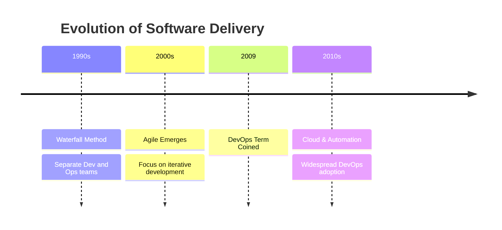
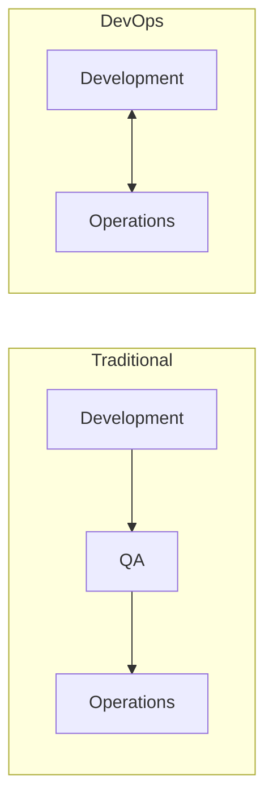
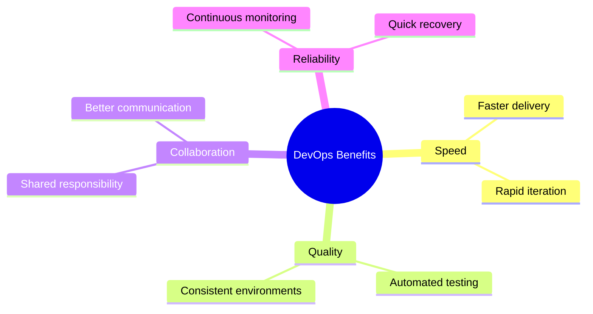
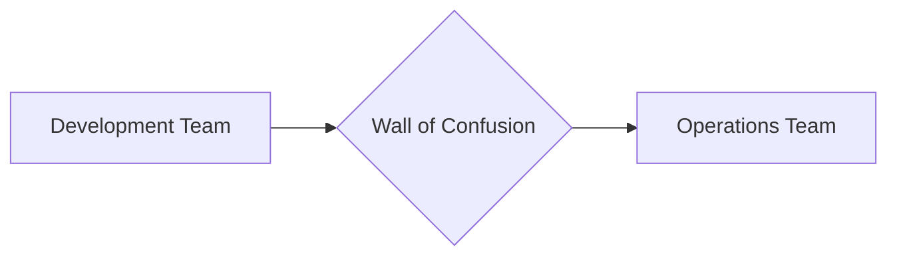
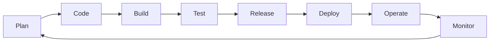
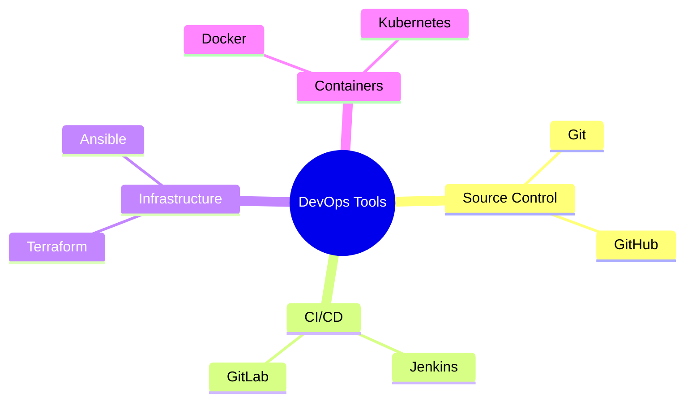
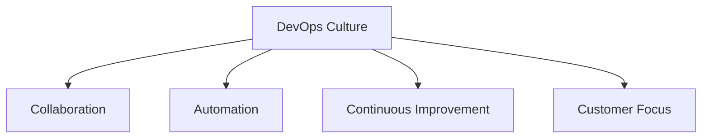

# What is DevOps?
Understanding the fundamentals of DevOps practices and culture

---

## Definition of DevOps

- Combination of Development (Dev) and Operations (Ops)
- Cultural philosophy, practice, and toolset
- Enables faster, better software delivery
- Breaks down traditional silos between teams

---

## Historical Context

---

## Traditional IT vs DevOps

---

## Why DevOps?

- Market demands for faster delivery
- Need for higher quality software
- Reduced time to market
- Better customer satisfaction
- Improved team collaboration

---

## Challenges of Traditional Approach

- Siloed teams and knowledge
- Slow deployment cycles
- Communication barriers
- Manual processes
- Inconsistent environments

---

## Key Benefits of DevOps

---

## Market Demands

- Continuous service availability
- Rapid feature delivery
- Quick bug fixes
- Competitive advantage
- User experience focus

---

## Breaking Down Silos

Before:

After:

---

## Core DevOps Practices

- Version Control
- Continuous Integration
- Continuous Delivery
- Infrastructure as Code
- Monitoring and Logging
- Automation

---

## The DevOps Infinity Loop

---

## Impact on Business

- Faster time to market
- Reduced failure rate
- Improved recovery time
- Better resource utilization
- Higher employee satisfaction

---

## DevOps Tools Ecosystem

---

## Adoption Challenges

- Cultural resistance
- Legacy systems
- Skill gaps
- Tool complexity
- Process changes

---

## Success Metrics

- Deployment frequency
- Lead time for changes
- Mean time to recovery
- Change failure rate

---

## Getting Started

1. Start small
1. Focus on culture
1. Automate gradually
1. Measure progress
1. Celebrate wins

---

## DevOps Culture Pillars

---

## Future of DevOps

- AI/ML integration
- GitOps practices
- DevSecOps growth
- Platform engineering
- Cloud-native focus

---

## Key Takeaways

- DevOps is about culture and practices
- Focuses on automation and collaboration
- Enables faster, better software delivery
- Requires organizational change
- Continuous evolution
