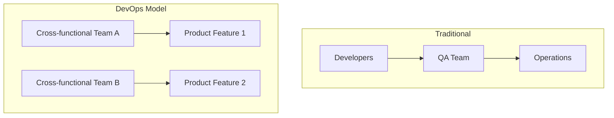
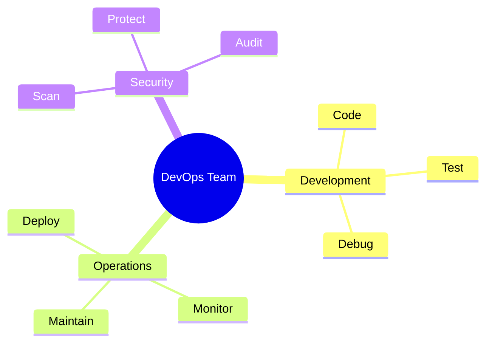
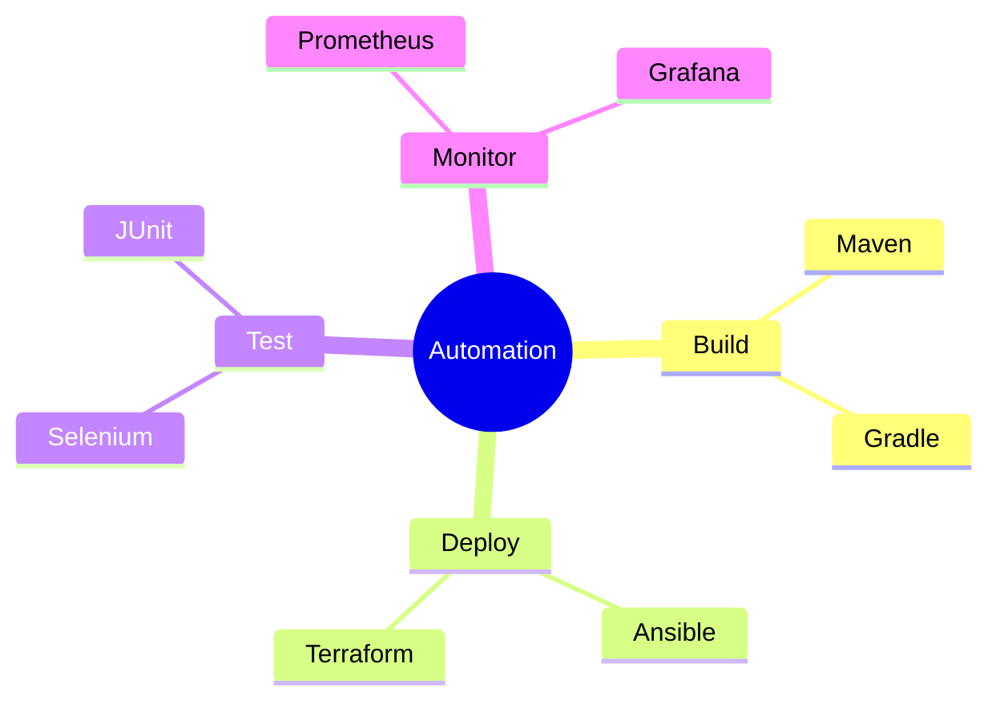
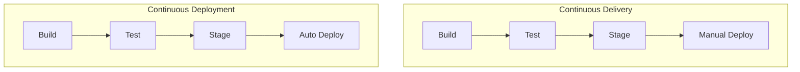
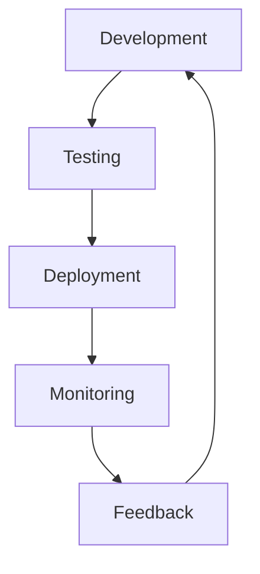
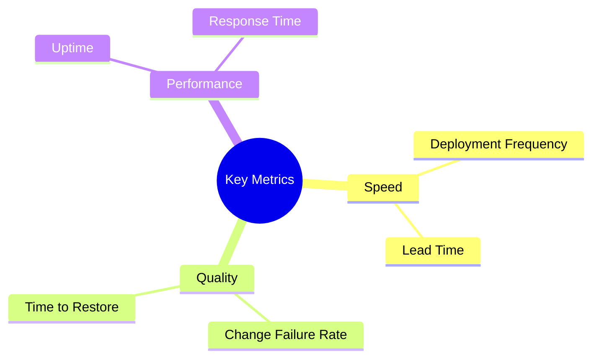
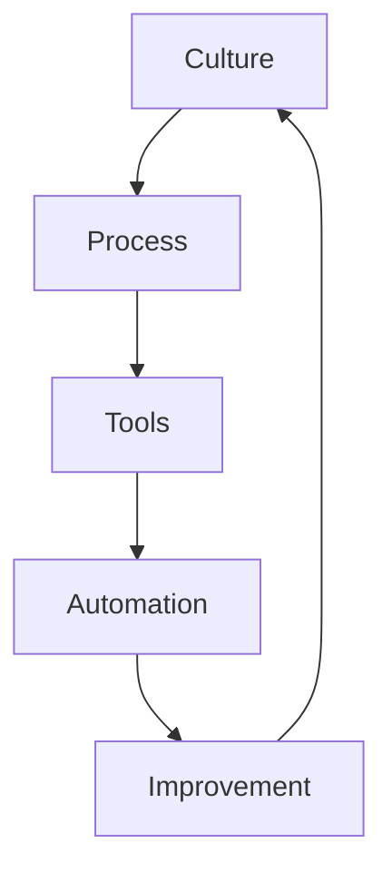

# Core Principles of DevOps
Understanding the fundamental principles that drive DevOps practices

---

## Collaboration and Communication

- Cross-functional teams
- Shared responsibilities
- Breaking down silos
- Transparent workflows

---

## Team Structure Evolution

---

## Shared Responsibilities

---

## Automation Fundamentals

- Reducing manual intervention
- Ensuring consistency
- Minimizing human error
- Increasing deployment speed
- Enabling scalability

---

## Automation Targets

---

## Common Automation Tools

---

## Continuous Integration

- Regular code merges
- Automated testing
- Build verification
- Early defect detection
- Code quality checks

---

## CI Pipeline Structure

---

## Continuous Delivery vs Deployment

---

## CI/CD Benefits

- Faster releases
- Reduced deployment risks
- Consistent process
- Better code quality
- Quick feedback loops

---

## Pipeline Automation

---

## Feedback Loops

---

## Implementation Steps

1. Start with version control
1. Implement automated builds
1. Add automated testing
1. Set up deployment pipelines
1. Enable monitoring

---

## Best Practices

- Keep pipelines fast
- Maintain test coverage
- Automate everything possible
- Use infrastructure as code
- Monitor and measure

---

## DevOps Metrics

---

## Culture and Tools Integration

---

## Continuous Improvement

- Regular retrospectives
- Measure and optimize
- Adapt processes
- Update tooling
- Enhance collaboration

---

## Implementation Roadmap

---

## Success Factors

- Leadership support
- Team buy-in
- Clear goals
- Right tools
- Iterative approach
