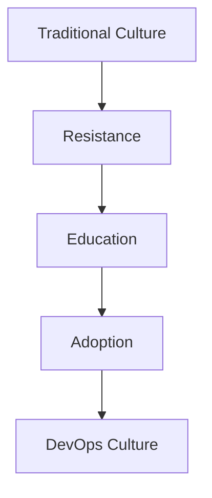
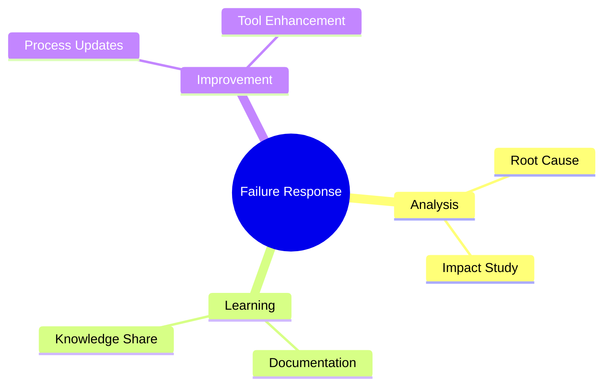
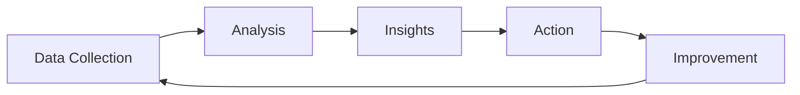
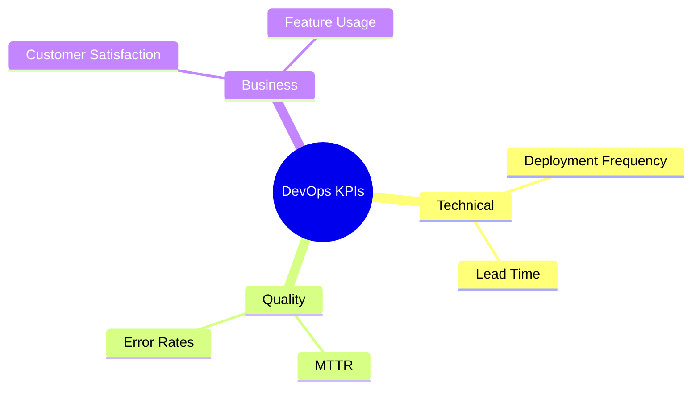
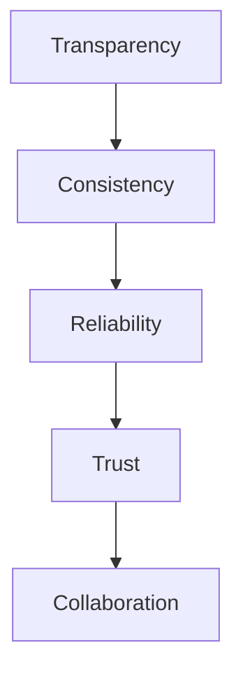
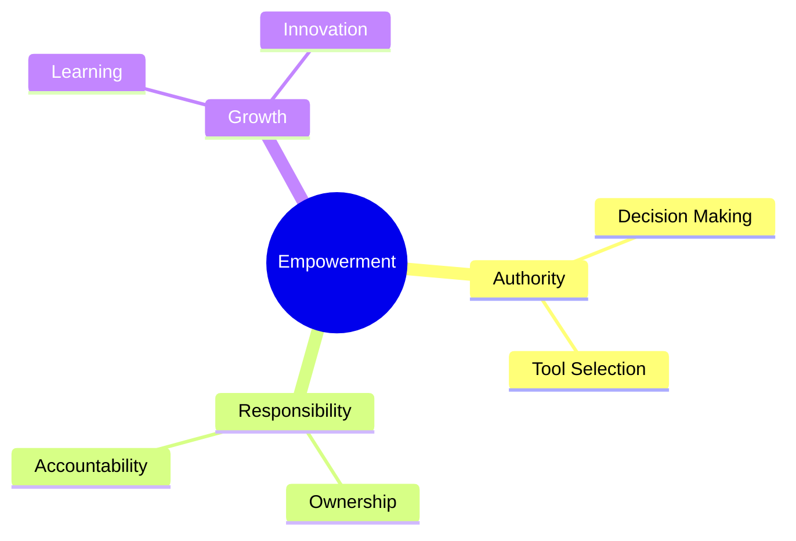
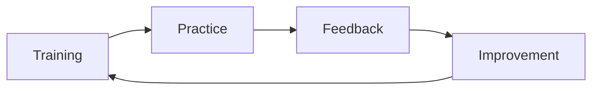
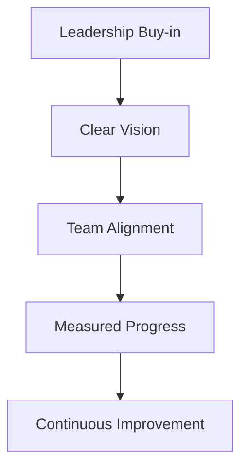
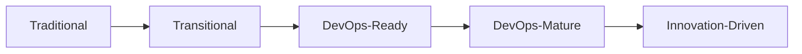

# DevOps Culture
Understanding the cultural transformation required for DevOps success

---

## Mindset and Values

- Shared responsibility
- Continuous learning
- Embracing change
- Experimentation mindset
- Customer-centric approach

---

## Cultural Transformation

---

## Learning from Failures

---

## Customer-Centric Approach

- Focus on end-user value
- Quick feedback incorporation
- Continuous delivery
- Feature experimentation
- Usage analytics

---

## Metrics and KPIs

---

## Key Performance Indicators

---

## Feedback Loops

- Monitoring systems
- User feedback
- Team retrospectives
- Automated alerts
- Performance metrics

---

## Building Trust

---

## Change Management

- Gradual implementation
- Clear communication
- Training programs
- Success celebration
- Continuous support

---

## Team Empowerment

---

## Communication Channels

- Regular standups
- Cross-team meetings
- Documentation
- Chat platforms
- Knowledge bases

---

## Continuous Learning

---

## Cultural Barriers

- Resistance to change
- Blame culture
- Silos mentality
- Fear of automation
- Lack of trust

---

## Success Patterns

---

## Measuring Culture

- Team satisfaction
- Collaboration metrics
- Innovation rate
- Knowledge sharing
- Incident response

---

## Sustainable Practices

- Work-life balance
- Manageable on-call
- Knowledge rotation
- Cross-training
- Career growth

---

## Cultural Evolution

