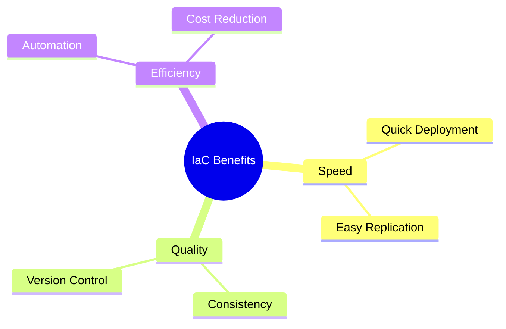
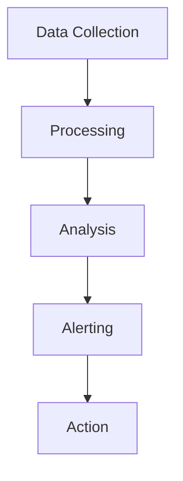
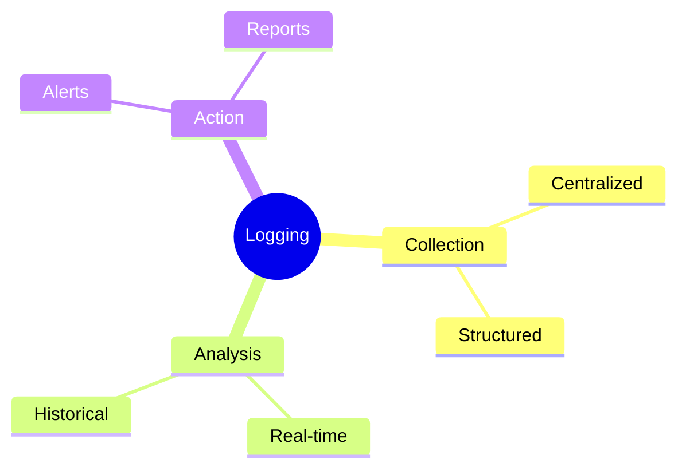
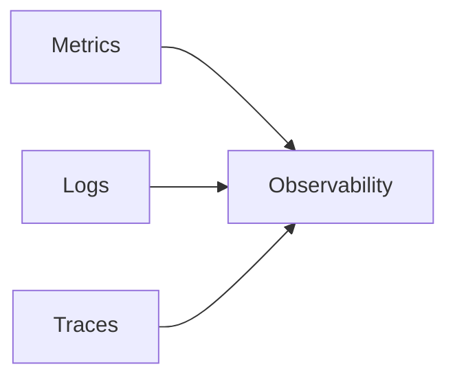
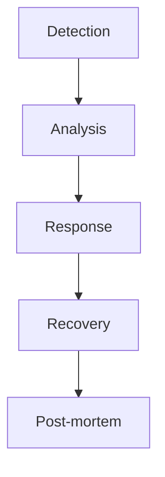
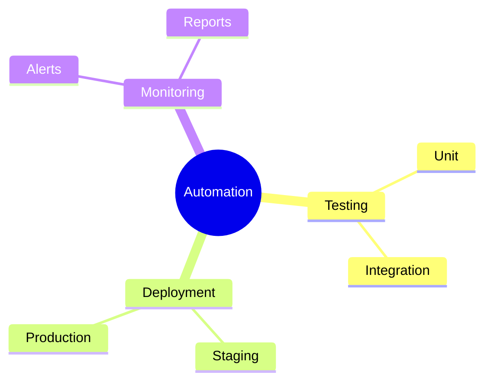
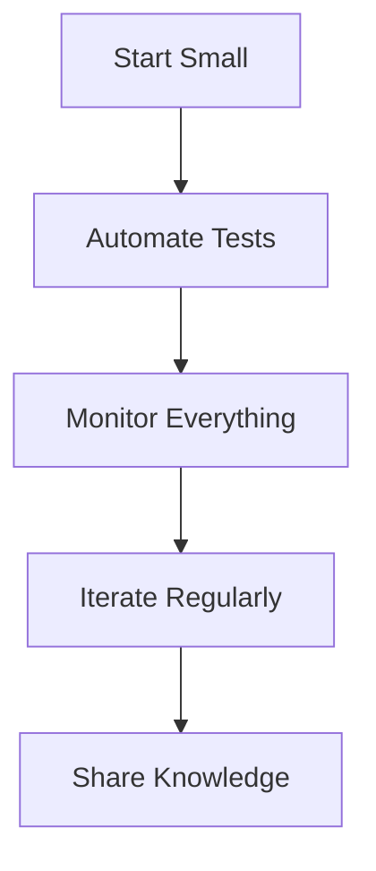

# Key DevOps Practices
Essential practices for successful DevOps implementation

---

## Infrastructure as Code (IaC)

1. Version-controlled infrastructure
1. Declarative configurations
1. Automated provisioning
1. Environment consistency
1. Reduced manual errors

---

## IaC Benefits

---

## Configuration Management

---

## Configuration Tools

1. Ansible - Agentless automation
1. Puppet - Configuration management
1. Chef - Infrastructure automation
1. SaltStack - Event-driven orchestration
1. Terraform - Infrastructure provisioning

---

## Monitoring Fundamentals

---

## Essential Metrics

1. System performance
1. Application health
1. User experience
1. Business metrics
1. Security indicators

---

## Logging Best Practices

---

## Monitoring Tools

1. Prometheus - Metrics collection
1. Grafana - Visualization
1. ELK Stack - Log management
1. Datadog - Application monitoring
1. Nagios - Infrastructure monitoring

---

## Observability Components

---

## Alert Management

1. Define thresholds
1. Set priority levels
1. Establish response plans
1. Document procedures
1. Review and improve

---

## Incident Response

---

## Security Integration

1. Code scanning
1. Dependency checks
1. Compliance monitoring
1. Access controls
1. Audit logging

---

## Automation Strategy

---

## Implementation Steps

1. Assess current state
1. Define objectives
1. Select tools
1. Start small
1. Scale gradually

---

## Common Challenges

1. Tool complexity
1. Skill gaps
1. Resource constraints
1. Legacy systems
1. Resistance to change

---

## Best Practices

---

## Success Metrics

1. Deployment frequency
1. Lead time for changes
1. Mean time to recovery
1. Change failure rate
1. Team velocity
