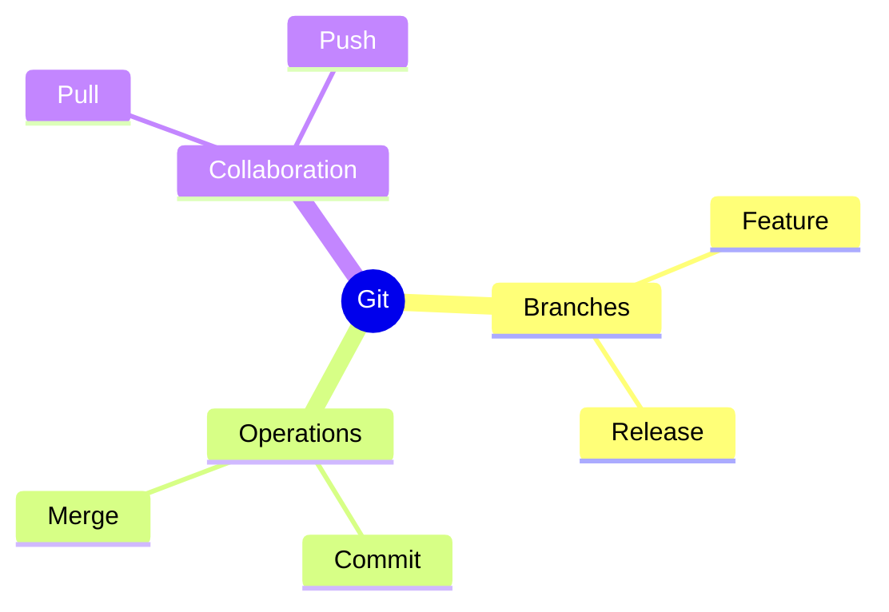
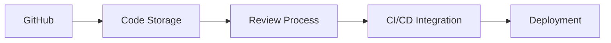
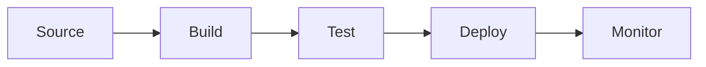
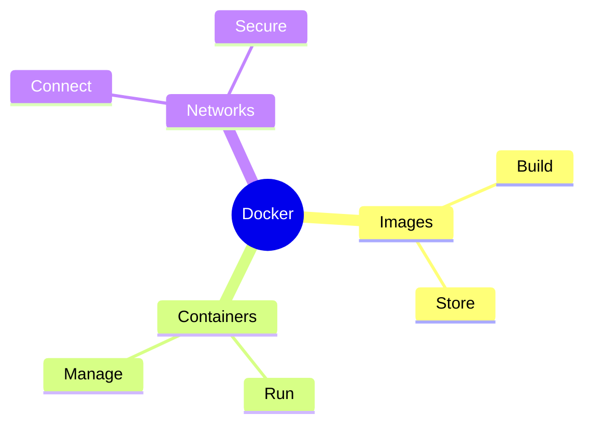
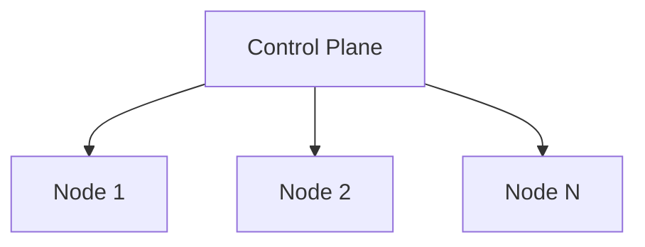
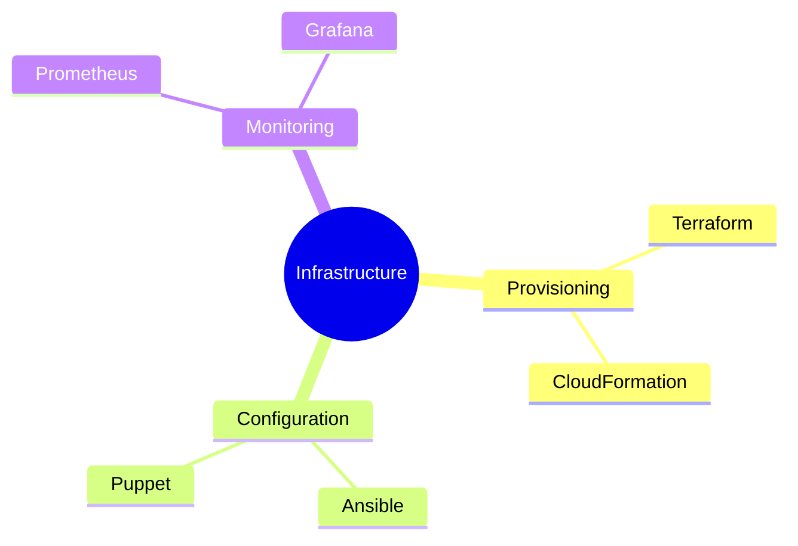
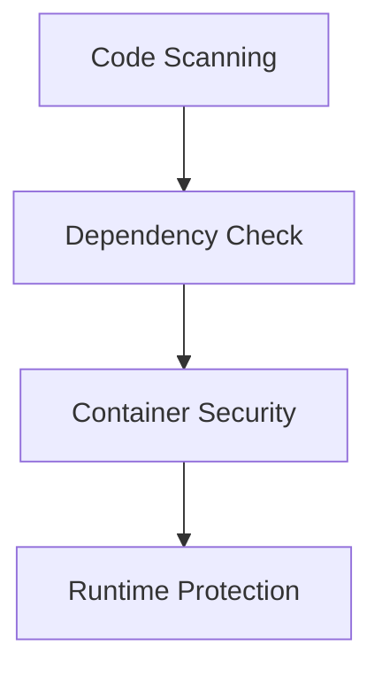
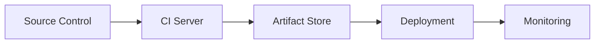
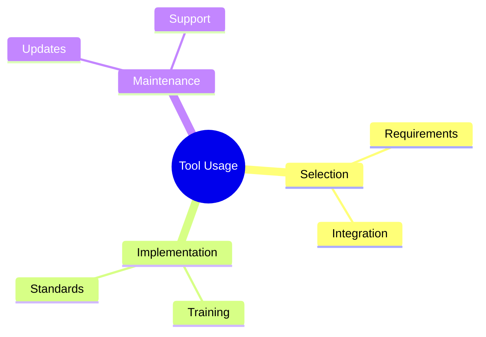

# Essential DevOps Tools
Understanding the core toolset for DevOps implementation

---

## Version Control Systems

---

## Git Workflows

1. Create branch
1. Make changes
1. Commit code
1. Push changes
1. Create pull request

---

## Collaboration Platforms

---

## CI/CD Tools Overview

1. Jenkins - Automation server
1. GitLab CI - Integrated pipeline
1. CircleCI - Cloud-native CI
1. Travis CI - GitHub integration
1. Azure DevOps - Microsoft suite

---

## Jenkins Pipeline

---

## Containerization Basics

1. Image creation
1. Container management
1. Network configuration
1. Volume management
1. Resource allocation

---

## Docker Components

---

## Kubernetes Architecture

---

## Container Orchestration

1. Pod management
1. Service discovery
1. Load balancing
1. Auto-scaling
1. Self-healing

---

## Infrastructure Tools

---

## Monitoring Stack

1. Data collection
1. Storage
1. Analysis
1. Visualization
1. Alerting

---

## Security Tools

---

## Testing Framework

1. Unit testing tools
1. Integration testing
1. Performance testing
1. Security testing
1. Acceptance testing

---

## Tool Integration

---

## Automation Tools

1. Build automation
1. Test automation
1. Deployment automation
1. Infrastructure automation
1. Monitoring automation

---

## Best Practices

