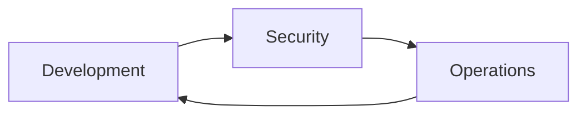
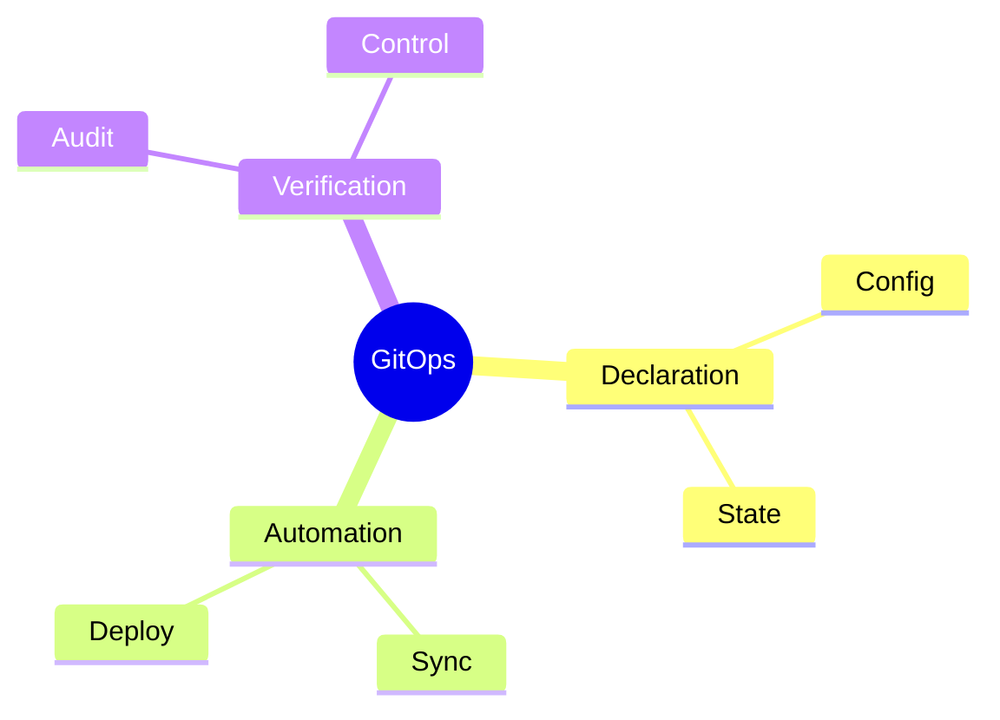
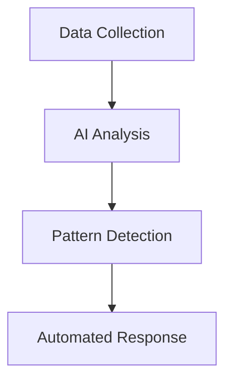
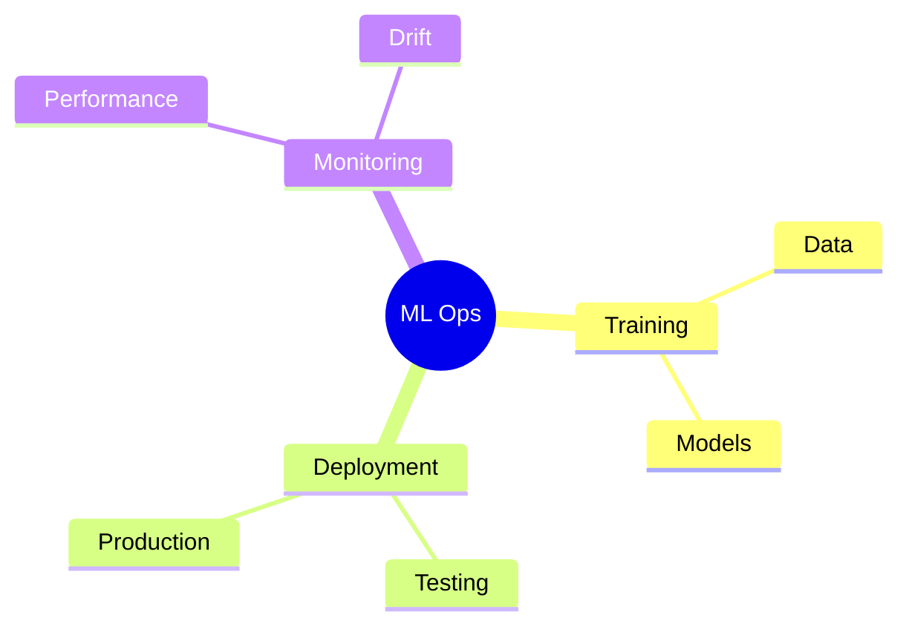
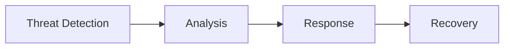
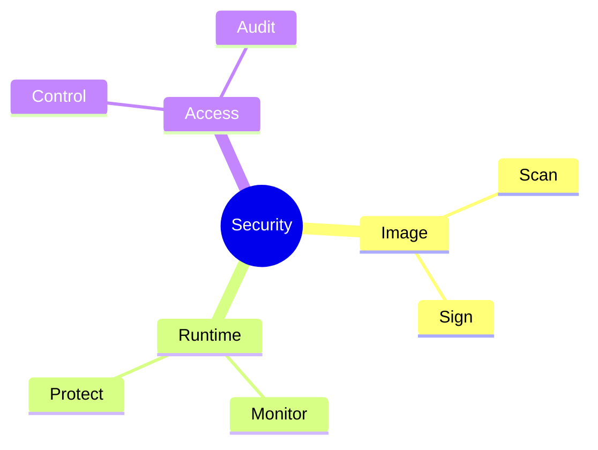
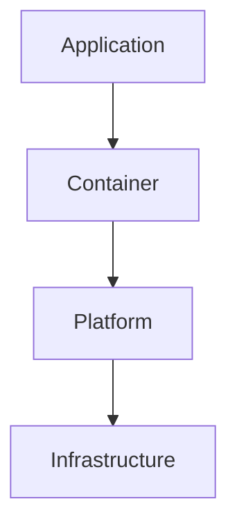
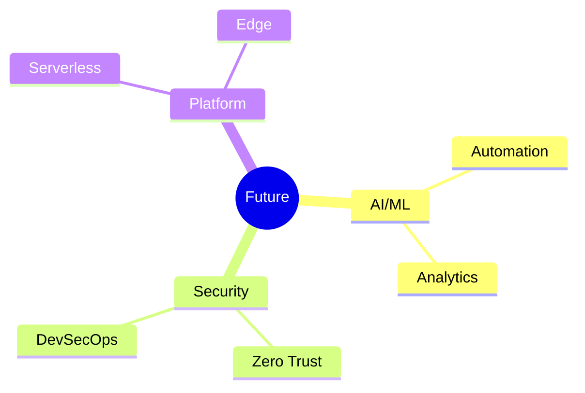

# Current Trends in DevOps
Modern approaches and emerging patterns

---

## DevSecOps Integration

---

## Security Shift Left

1. Early security testing
1. Automated scans
1. Compliance checks
1. Vulnerability assessment
1. Security monitoring

---

## GitOps Principles

---

## GitOps Workflow

1. Git as single source
1. Declarative systems
1. Automated synchronization
1. Drift detection
1. Version control

---

## AIOps Evolution

---

## AI in Operations

1. Anomaly detection
1. Predictive analytics
1. Automated remediation
1. Capacity planning
1. Performance optimization

---

## Machine Learning Integration

---

## Predictive Analytics

1. Resource utilization
1. System performance
1. Failure prediction
1. Cost optimization
1. User behavior

---

## Security Automation

---

## Automated Compliance

1. Policy enforcement
1. Audit trails
1. Compliance checking
1. Risk assessment
1. Report generation

---

## Container Security

---

## Zero Trust Security

1. Identity verification
1. Access control
1. Network segmentation
1. Monitoring
1. Threat detection

---

## Cloud Native Security

---

## Emerging Practices

1. Chaos engineering
1. Site reliability
1. Platform engineering
1. Green DevOps
1. Edge computing

---

## Future Directions

