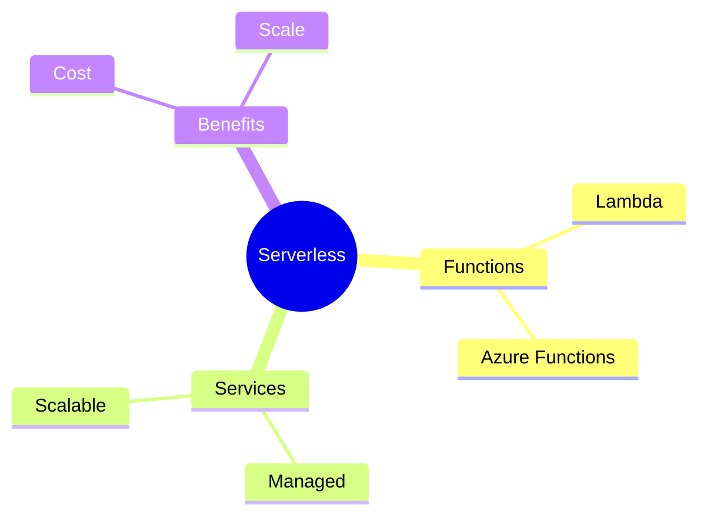
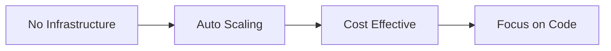
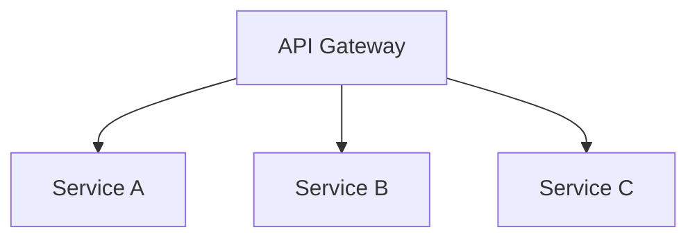
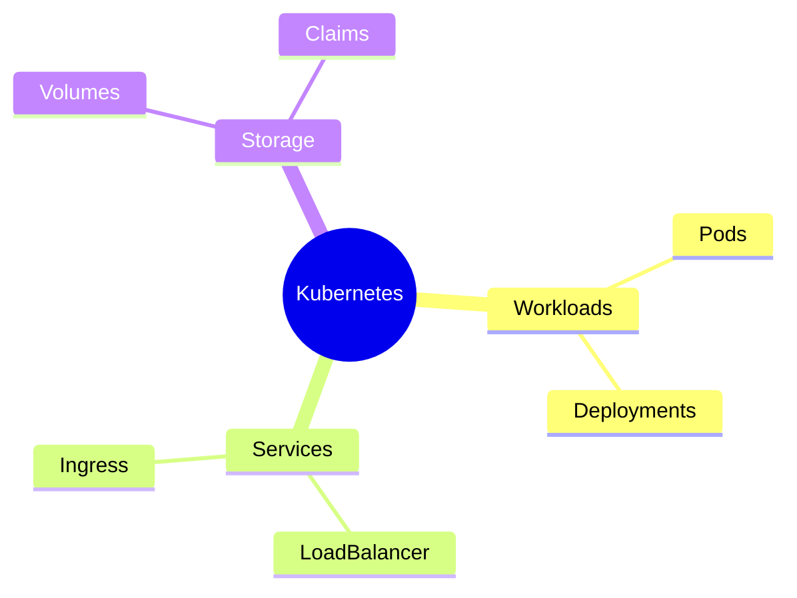
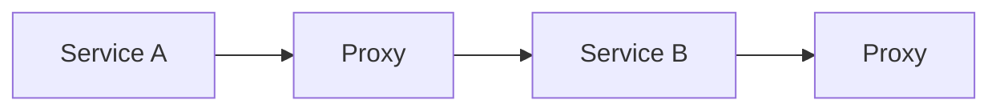
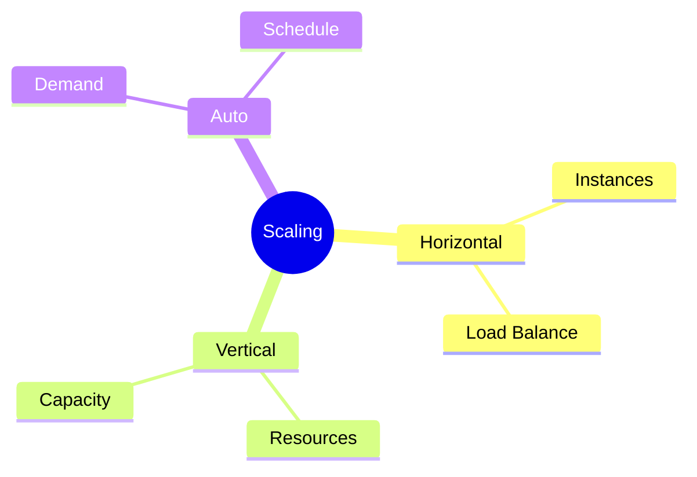
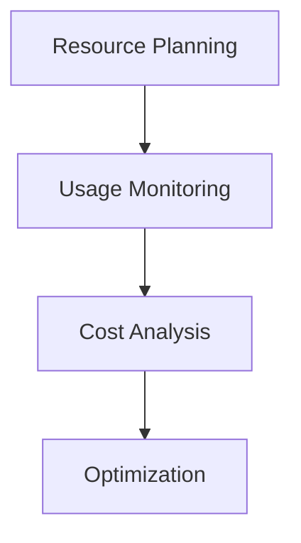
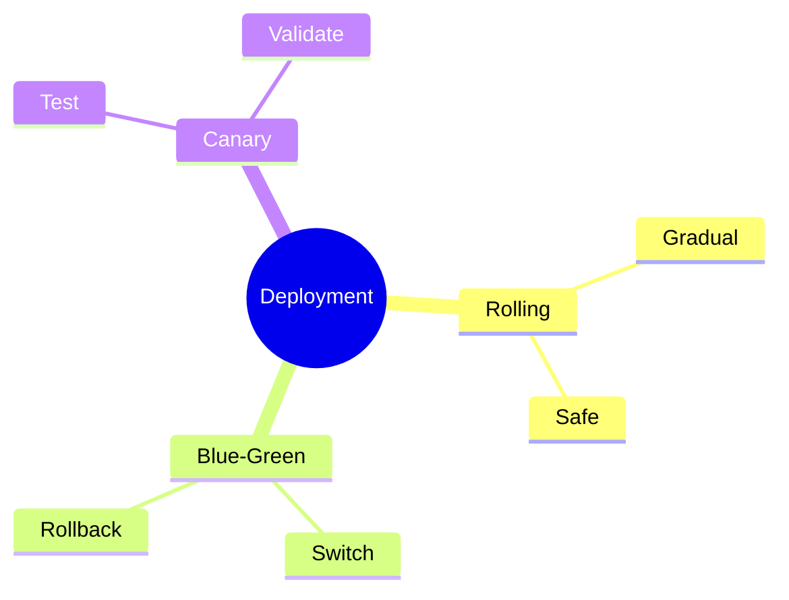

# Cloud-Native DevOps
Modern cloud architecture and practices

---

## Serverless Architecture

---

## Function as a Service

1. Event-driven execution
1. Automatic scaling
1. Pay-per-use
1. Zero maintenance
1. Quick deployment

---

## Serverless Benefits

---

## Microservices Architecture

---

## Service Components

1. Independent deployment
1. Loose coupling
1. API contracts
1. Data ownership
1. Service discovery

---

## Container Orchestration

---

## Cloud Platforms

1. AWS services
1. Azure platform
1. Google Cloud
1. Private cloud
1. Hybrid solutions

---

## Service Mesh

---

## Monitoring Strategy

1. Metrics collection
1. Distributed tracing
1. Log aggregation
1. Performance monitoring
1. Health checks

---

## Scalability Patterns

---

## Security Implementation

1. Identity management
1. Network policies
1. Secret management
1. Access control
1. Encryption

---

## Cost Optimization

---

## Best Practices

1. Infrastructure as code
1. Immutable infrastructure
1. Automatic scaling
1. Security first
1. Continuous monitoring

---

## Deployment Strategies

