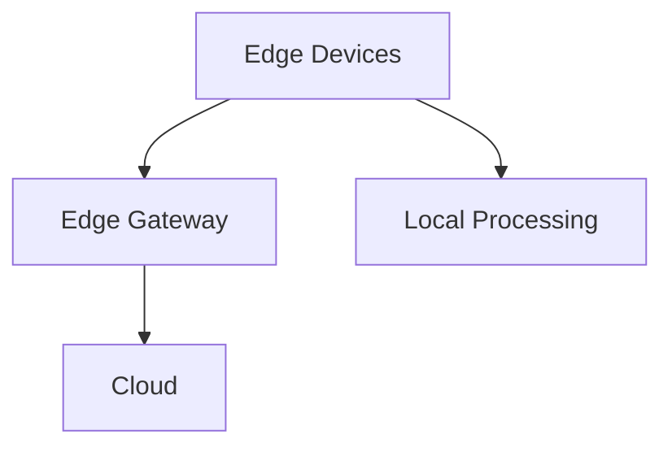
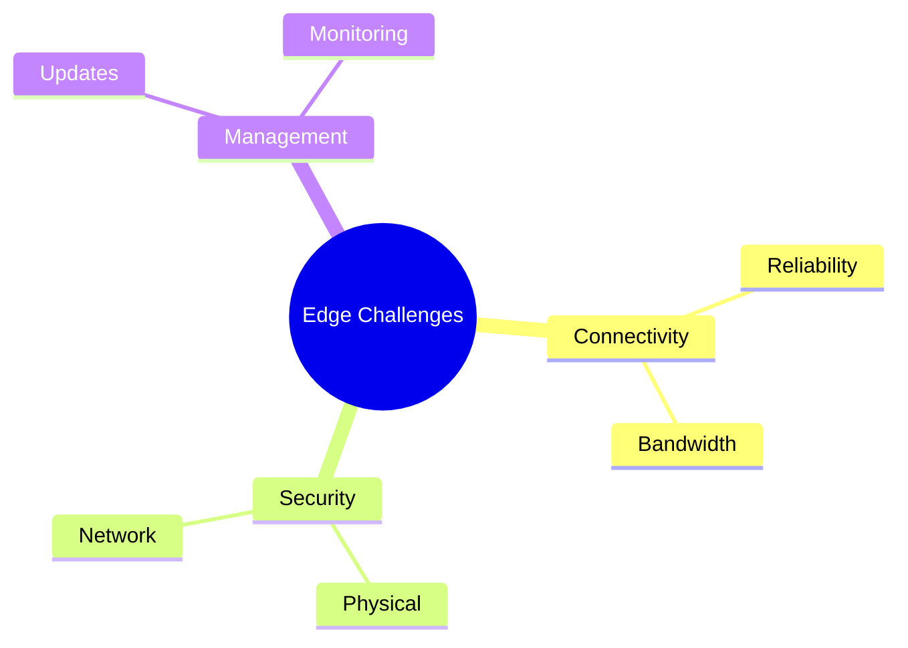
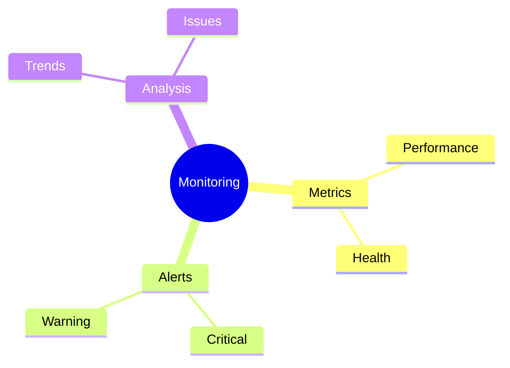
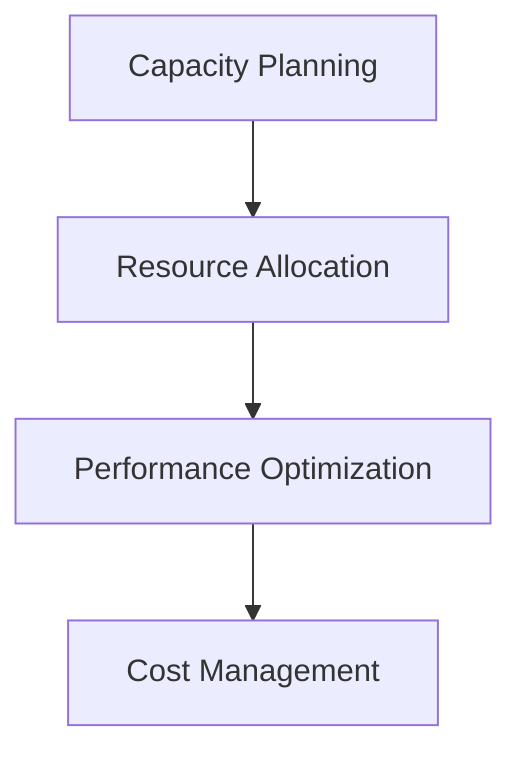
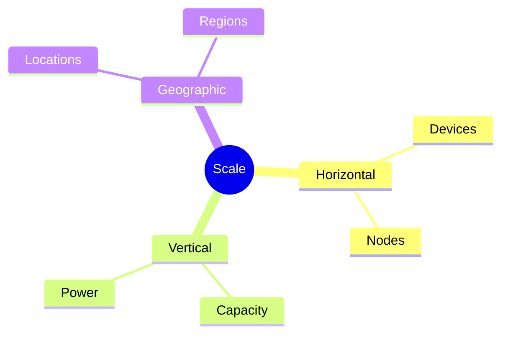

# Edge Computing and IoT
Managing distributed infrastructure and DevOps at the edge

---

## Edge Architecture

---

## Edge Components

1. IoT devices
1. Edge gateways
1. Local storage
1. Processing units
1. Network infrastructure

---

## Deployment Challenges

---

## Data Management

1. Local processing
1. Data filtering
1. Storage optimization
1. Synchronization
1. Backup strategies

---

## Security At Edge

---

## Network Architecture

1. Mesh networking
1. Failover systems
1. Load balancing
1. Traffic routing
1. Bandwidth management

---

## Monitoring Strategy

---

## Automation Tools

1. Configuration management
1. Deployment automation
1. Update management
1. Health checks
1. Recovery procedures

---

## Resource Management

---

## DevOps Practices

1. Local testing
1. Distributed CI/CD
1. Version control
1. Configuration sync
1. Remote debugging

---

## Scalability

---

## Maintenance Strategy

1. Remote updates
1. Health monitoring
1. Failure detection
1. Automated recovery
1. Performance tuning

---

## Disaster Recovery

---

## Future Trends

1. 5G integration
1. AI at edge
1. Autonomous systems
1. Green computing
1. Edge analytics
