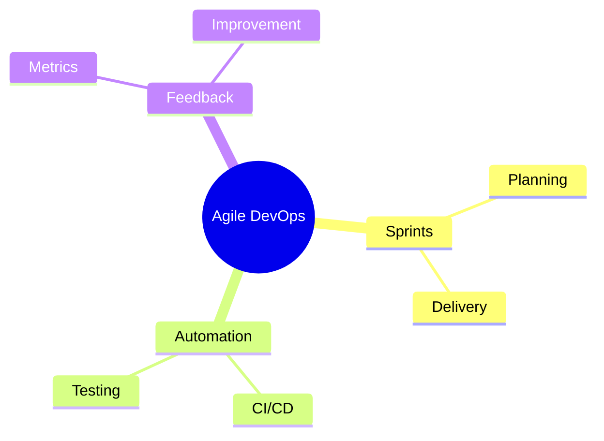
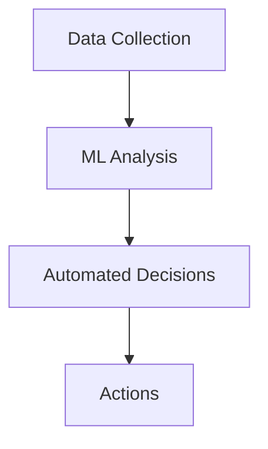
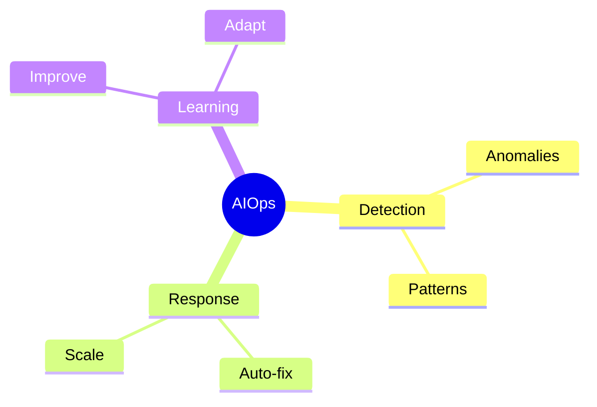
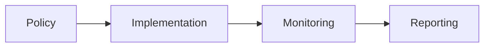
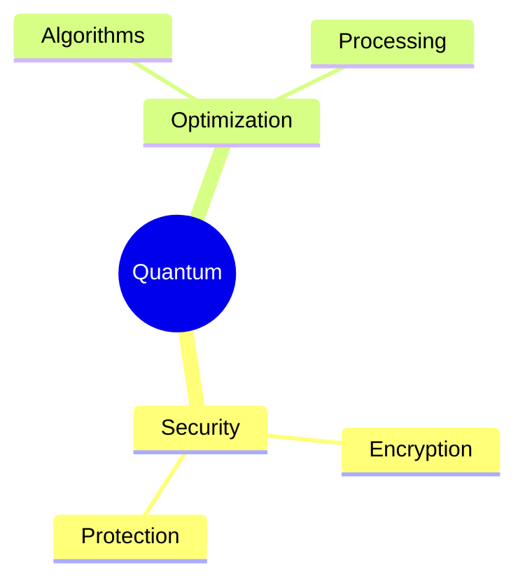
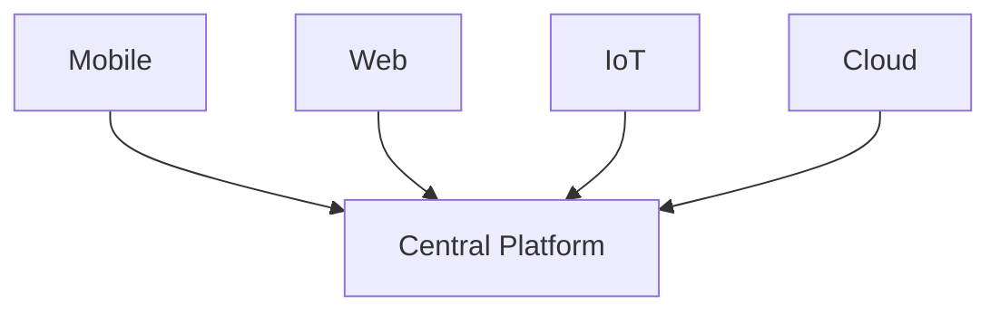
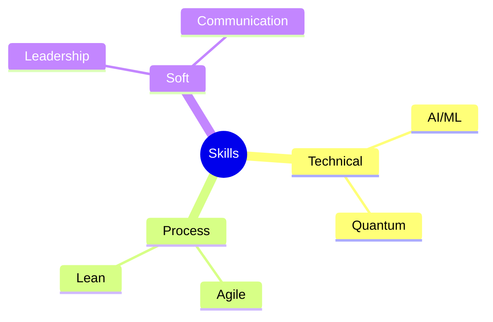

# Future Directions in DevOps
Emerging trends and methodologies

---

## Integration with Agile

---

## Lean Methodology

1. Value stream mapping
1. Waste elimination
1. Continuous flow
1. Pull systems
1. Perfection pursuit

---

## AI Integration

---

## Machine Learning Ops

1. Model training
1. Deployment automation
1. Version control
1. Performance monitoring
1. Feedback loops

---

## Automated Operations

---

## Regulated Environments

1. Compliance automation
1. Audit trails
1. Security controls
1. Risk management
1. Documentation

---

## Compliance Integration

---

## Green DevOps

1. Energy efficiency
1. Resource optimization
1. Carbon footprint
1. Sustainable practices
1. Environmental metrics

---

## Quantum Computing

---

## Platform Engineering

1. Developer experience
1. Self-service platforms
1. Automation frameworks
1. Tool integration
1. Standard workflows

---

## Cross-Platform DevOps

---

## Blockchain Integration

1. Smart contracts
1. Automated governance
1. Secure deployments
1. Distributed systems
1. Immutable audits

---

## Future Skills

---

## Ethics and Responsibility

1. Data privacy
1. Environmental impact
1. Social responsibility
1. Ethical AI
1. Sustainable practices
