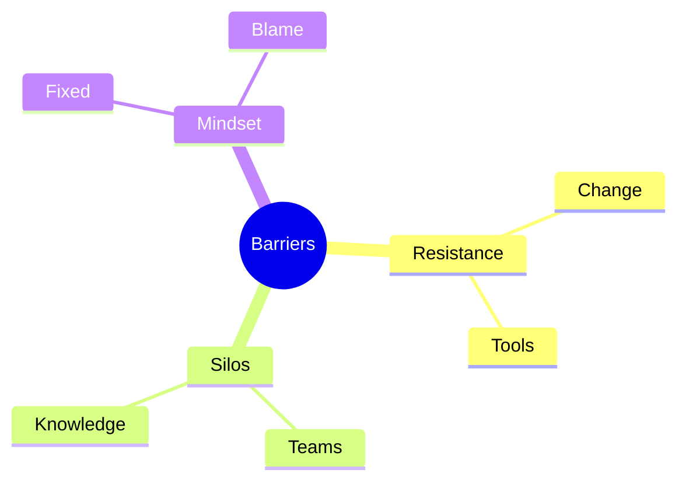
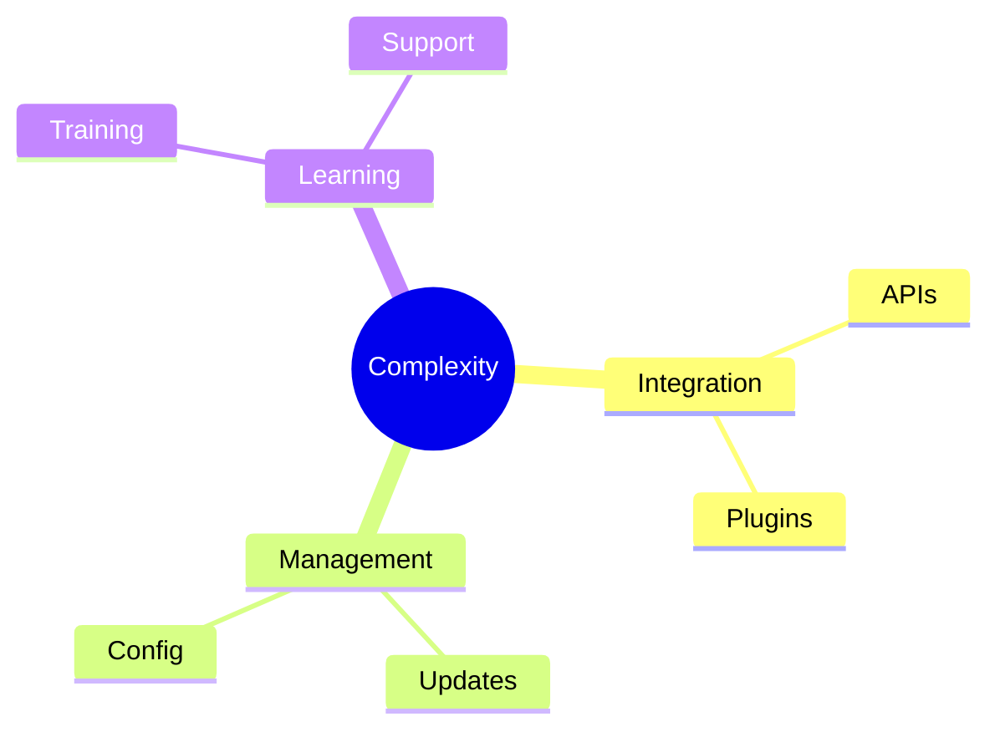
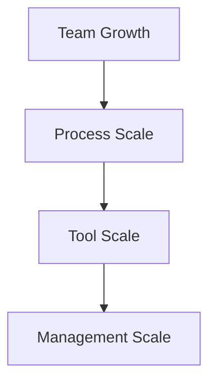
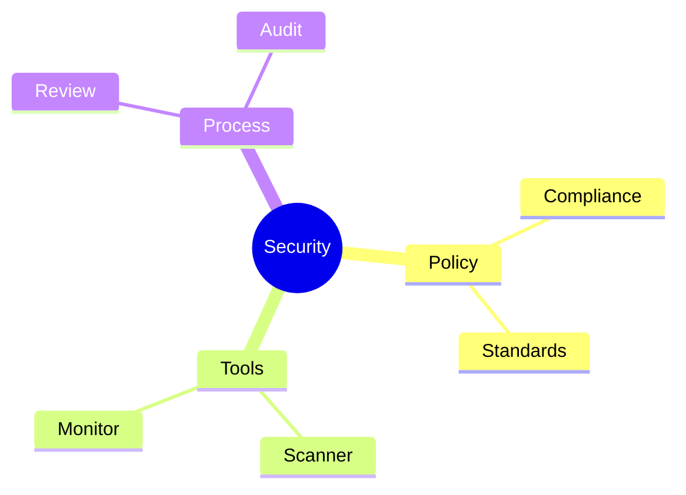
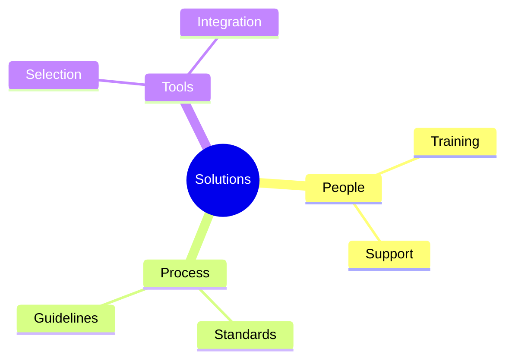

# Challenges in DevOps Adoption
Common obstacles and solutions in DevOps transformation

---

## Cultural Barriers

---

## Change Management

1. Leadership support
1. Clear communication
1. Training programs
1. Measurable goals
1. Feedback loops

---

## Technical Debt

---

## Skill Gaps

1. Technical training
1. Tool expertise
1. Process knowledge
1. Security awareness
1. Cloud skills

---

## Tool Complexity

---

## Process Adaptation

1. Workflow changes
1. New methodologies
1. Tool adoption
1. Best practices
1. Standard procedures

---

## Scaling Challenges

---

## Resource Constraints

1. Budget limitations
1. Time constraints
1. Staff shortage
1. Tool costs
1. Training expenses

---

## Security Integration

---

## Legacy Integration

1. System compatibility
1. Data migration
1. API integration
1. Process alignment
1. Risk management

---

## Measurement Issues

---

## Team Collaboration

1. Communication gaps
1. Tool preferences
1. Process conflicts
1. Responsibility overlap
1. Knowledge sharing

---

## Solution Strategies

---

## Success Factors

1. Clear vision
1. Strong leadership
1. Adequate resources
1. Proper training
1. Regular feedback
