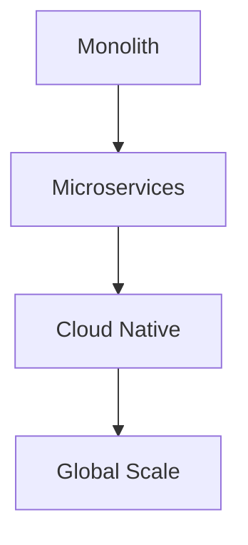
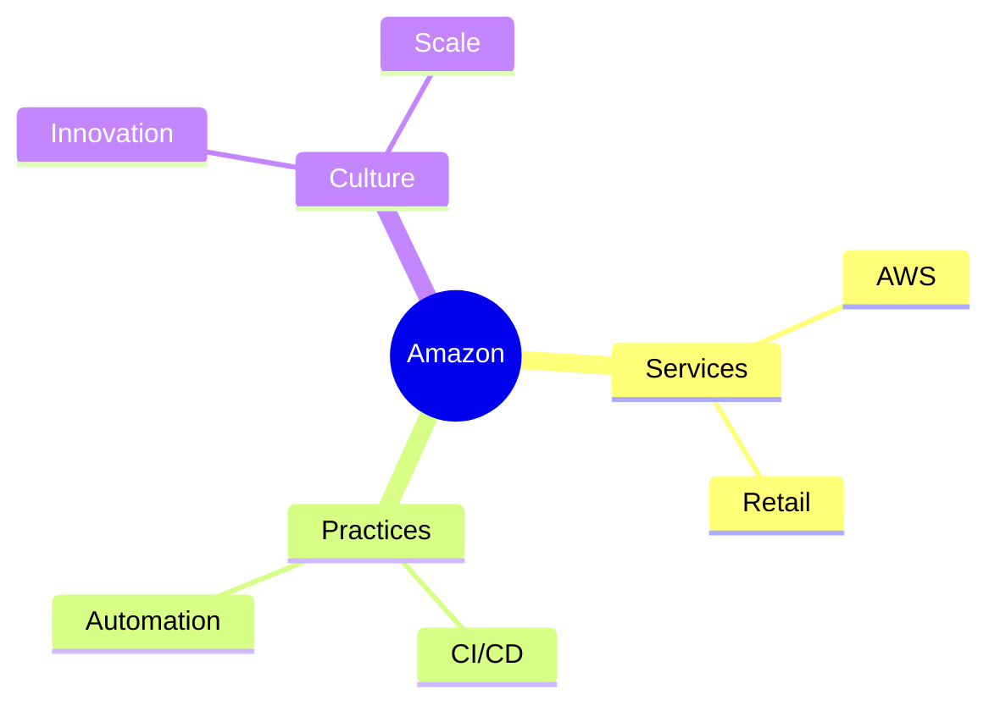
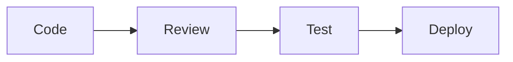
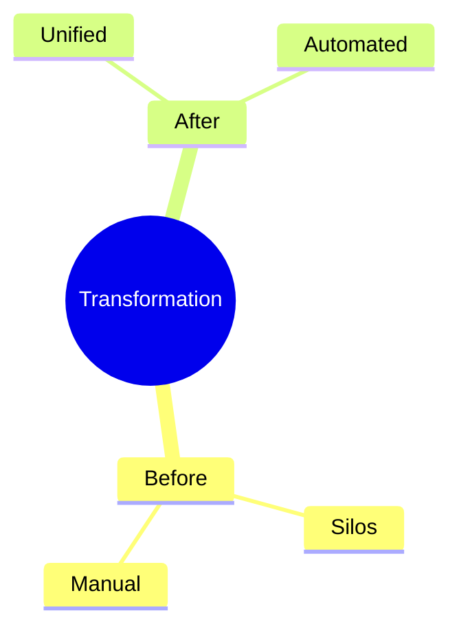
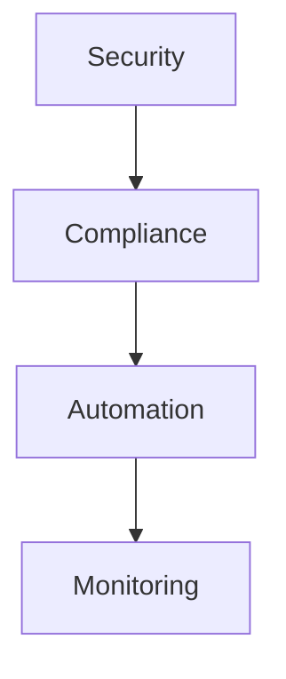
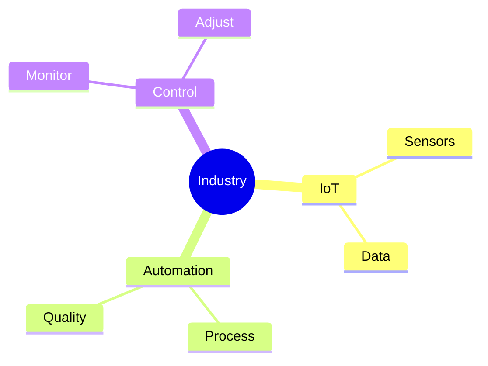
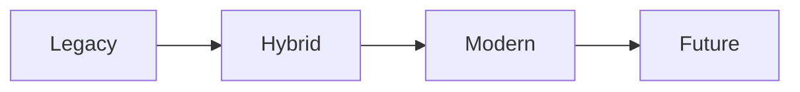

# Case Studies
Real-world DevOps transformation examples

---

## Netflix DevOps Journey

---

## Netflix Success Factors

1. Microservices architecture
1. Automated testing
1. Chaos engineering
1. Cloud-first approach
1. Culture of innovation

---

## Amazon's Transformation

---

## Google SRE Model

1. Service level objectives
1. Error budgets
1. Automated operations
1. Incident management
1. Continuous improvement

---

## Facebook Infrastructure

---

## Spotify Squad Model

1. Autonomous teams
1. Cross-functional skills
1. Aligned autonomy
1. Rapid iteration
1. Knowledge sharing

---

## Traditional to DevOps

---

## Financial Sector Case

1. Compliance integration
1. Security automation
1. Risk management
1. Audit trails
1. Regulated deployment

---

## Healthcare Implementation

---

## Retail Evolution

1. Scalable infrastructure
1. Peak management
1. Customer focus
1. Data analytics
1. Rapid deployment

---

## Manufacturing Integration

---

## Startup Success Story

1. Cloud adoption
1. Automation focus
1. Rapid iteration
1. Cost optimization
1. Team empowerment

---

## Enterprise Transformation

---

## Key Learnings

1. Culture first
1. Start small
1. Measure progress
1. Continuous learning
1. Regular feedback
