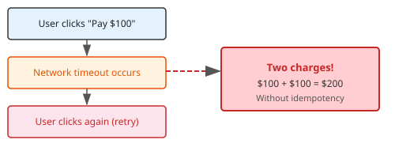
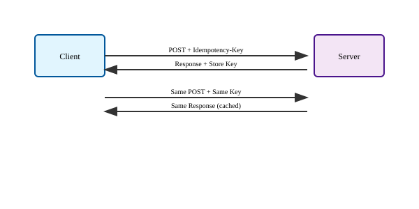
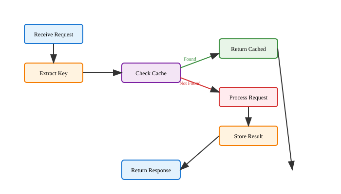

# Idempotency in Web Services
## Building Reliable APIs

Building robust APIs that handle failures gracefully

---

## What is Idempotency?

**Idempotent**: An operation that can be performed multiple times with the same result

> "No matter how many times you call it, the outcome is the same"

Mathematical example: `f(f(x)) = f(x)`

---

## Why Does Idempotency Matter?

- **Network failures** are inevitable
- **Timeouts** cause uncertainty
- **Retry mechanisms** are essential
- **Double-clicks** happen
- **Distributed systems** amplify these issues

Without idempotency: chaos and data corruption

---

## Real-World Example: Payment Processing



**With idempotency**: Second click is safe, only one $100 charge

---

## HTTP Methods and Idempotency

| Method | Idempotent? | Safe? |
|--------|-------------|-------|
| GET    | ✅ Yes      | ✅ Yes |
| PUT    | ✅ Yes      | ❌ No  |
| DELETE | ✅ Yes      | ❌ No  |
| POST   | ❌ No       | ❌ No  |
| PATCH  | ❌ Usually No | ❌ No |

---

## The POST Problem

```http
POST /api/orders
{
  "product_id": 123,
  "quantity": 2,
  "total": 50.00
}
```

Each call creates a **new order**
- First call: Order #1001
- Second call: Order #1002
- Third call: Order #1003

---

## Idempotency Keys: The Solution

```http
POST /api/orders
Idempotency-Key: 550e8400-e29b-41d4-a716-446655440000

{
  "product_id": 123,
  "quantity": 2,
  "total": 50.00
}
```

Same key = same result, regardless of how many times called

---

## How Idempotency Keys Work



---

## Implementation Strategy

1. **Generate unique keys** (UUID, hash, etc.)
1. **Store key-response pairs** (database, cache)
1. **Check for existing keys** before processing
1. **Return cached response** if key exists
1. **Clean up old keys** periodically

---

## Basic Implementation Pattern

```python
def handle_request(request, idempotency_key):
    # Check if we've seen this key before
    cached_response = get_cached_response(idempotency_key)
    if cached_response:
        return cached_response

    # Process the request
    result = process_request(request)

    # Cache the response
    cache_response(idempotency_key, result)

    return result
```

---

## Database Schema Example

```sql
CREATE TABLE idempotency_keys (
    key VARCHAR(255) PRIMARY KEY,
    response_status INTEGER NOT NULL,
    response_body TEXT,
    response_headers JSON,
    created_at TIMESTAMP DEFAULT CURRENT_TIMESTAMP,
    expires_at TIMESTAMP
);

CREATE INDEX idx_expires_at ON idempotency_keys(expires_at);
```

---

## Key Generation Strategies

- **Client-generated (Recommended)**
```javascript
const key = crypto.randomUUID();
// 550e8400-e29b-41d4-a716-446655440000
```

- **Content-based**
```python
import hashlib
key = hashlib.sha256(json.dumps(request_data, sort_keys=True).encode()).hexdigest()
```

- **Timestamp + User ID**
```python
key = f"{user_id}:{timestamp}:{hash(request_content)}"
```

---

## Request Flow with Idempotency



---

## Flask Implementation Example

```python
from flask import Flask, request, jsonify
import redis
import json
import uuid

app = Flask(__name__)
redis_client = redis.Redis(host='localhost', port=6379, db=0)

@app.route('/api/orders', methods=['POST'])
def create_order():
    idempotency_key = request.headers.get('Idempotency-Key')

    if not idempotency_key:
        return jsonify({'error': 'Idempotency-Key required'}), 400

    # Check cache
    cached = redis_client.get(f"idem:{idempotency_key}")
    if cached:
        return json.loads(cached)

    # Process order
    order = process_order(request.json)
    response = jsonify(order)

    # Cache for 24 hours
    redis_client.setex(f"idem:{idempotency_key}", 86400,
                      json.dumps(order))

    return response
```

---

## Express.js Implementation

```javascript
const express = require('express');
const redis = require('redis');
const app = express();
const client = redis.createClient();

app.post('/api/orders', async (req, res) => {
    const idempotencyKey = req.headers['idempotency-key'];

    if (!idempotencyKey) {
        return res.status(400).json({error: 'Idempotency-Key required'});
    }

    // Check cache
    const cached = await client.get(`idem:${idempotencyKey}`);
    if (cached) {
        return res.json(JSON.parse(cached));
    }

    // Process order
    const order = await processOrder(req.body);

    // Cache result
    await client.setex(`idem:${idempotencyKey}`, 86400,
                      JSON.stringify(order));

    res.json(order);
});
```

---

## Key Management Best Practices

- **Expiration**
    - Set reasonable TTL (24-48 hours typical)
    - Clean up expired keys regularly
- **Storage**
    - Use fast storage (Redis, Memcached)
    - Consider database for persistence
- **Scope**
    - Keys should be scoped to user/tenant
    - Avoid global key conflicts

---

## Error Handling in Idempotent Services

```python
def handle_idempotent_request(key, request_data):
    try:
        # Check cache first
        cached = get_cached_response(key)
        if cached:
            return cached

        # Process request
        result = process_request(request_data)

        # Only cache successful responses
        if result.status_code < 400:
            cache_response(key, result)

        return result

    except Exception as e:
        # Don't cache errors
        log_error(e)
        raise
```

---

## Race Conditions and Atomic Operations

**Problem**: Two requests with same key arrive simultaneously

**Solution**: Use atomic operations

```python
def atomic_idempotent_check(key, process_func):
    # Try to acquire lock
    lock_acquired = redis_client.set(f"lock:{key}", "1", nx=True, ex=30)

    if lock_acquired:
        try:
            result = process_func()
            cache_response(key, result)
            return result
        finally:
            redis_client.delete(f"lock:{key}")
    else:
        # Wait and check cache
        time.sleep(0.1)
        return get_cached_response(key)
```

---

## Testing Idempotency

```python
def test_idempotent_order_creation():
    key = str(uuid.uuid4())
    order_data = {"product_id": 123, "quantity": 2}

    # First request
    response1 = client.post('/api/orders',
                           json=order_data,
                           headers={'Idempotency-Key': key})

    # Second request with same key
    response2 = client.post('/api/orders',
                           json=order_data,
                           headers={'Idempotency-Key': key})

    assert response1.status_code == 201
    assert response2.status_code == 201
    assert response1.json['id'] == response2.json['id']
    assert get_order_count() == 1  # Only one order created
```

---

## Common Pitfalls

- **Caching errors**
```python
# Wrong - caches 500 errors
cache_response(key, error_response)
```

- **No key validation**
```python
# Wrong - accepts any key format
idempotency_key = request.headers.get('key')
```

- **Infinite TTL**
```python
# Wrong - keys never expire
redis_client.set(key, response)  # No expiration
```

---

## Monitoring and Observability

- **Key Metrics**
    - Cache hit rate for idempotency keys
    - Key storage size and growth
    - Response time difference (cached vs fresh)
- **Alerting**
    - High cache miss rates
    - Storage capacity issues
    - Failed key lookups
- **Logging**
    ```python
    logger.info(f"Idempotency key {key}: {'HIT' if cached else 'MISS'}")
    ```

---

## Advanced Patterns

- **Conditional Idempotency**
```python
# Only idempotent for certain operations
if request.json.get('amount', 0) > 1000:
    require_idempotency_key()
```

- **Fingerprinting**
```python
# Generate key from request content
def generate_fingerprint(user_id, request_data):
    content = f"{user_id}:{json.dumps(request_data, sort_keys=True)}"
    return hashlib.sha256(content.encode()).hexdigest()
```

---

## Key Takeaways

- **Always implement idempotency for state-changing operations**
- **Use client-generated UUIDs for keys**
- **Store successful responses only**
- **Set appropriate TTL**
- **Handle race conditions**
- **Monitor cache performance**
- **Test thoroughly**

Idempotency = reliability in distributed systems
