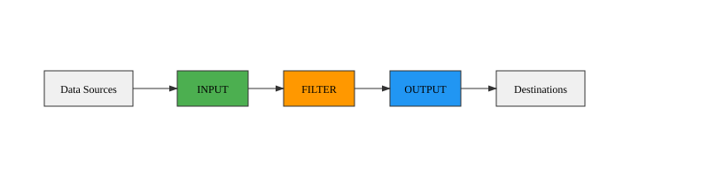
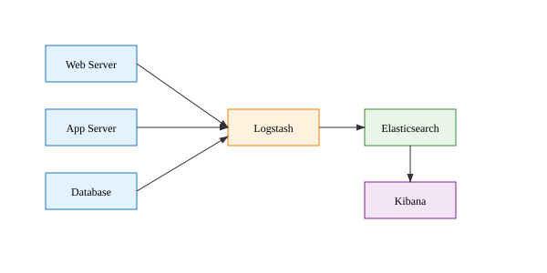
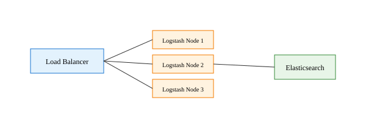

# Logstash

## Data Processing Pipeline
## The "L" in ELK Stack

---

## What is Logstash?

1. **Data Processing Pipeline** that ingests data from multiple sources
1. **Transforms** and **enriches** data in real-time
1. **Routes** data to various destinations
1. **Part of the Elastic Stack** (ELK/Elastic)
1. **Open source** and horizontally scalable

---

## Why Use Logstash?

**Problems it Solves:**
1. **Data silos** - Data scattered across different systems
1. **Format inconsistency** - Different log formats and structures
1. **Real-time processing** - Need to process data as it arrives
1. **Data enrichment** - Adding context to raw data
1. **Routing complexity** - Sending data to multiple destinations

---

## Logstash Architecture



**Core Components:**
1. **Input Plugins** - Collect data from sources
1. **Filter Plugins** - Process and transform data
1. **Output Plugins** - Send data to destinations
1. **Codec Plugins** - Encode/decode data

---

## Input Plugins

**Common Input Sources:**
1. **File** - Log files, CSV files
1. **Beats** - Filebeat, Metricbeat, etc.
1. **HTTP** - REST API endpoints
1. **TCP/UDP** - Network streams
1. **Database** - JDBC connections
1. **Message Queues** - Redis, RabbitMQ, Kafka

---

## Input Plugin Example

```ruby
input {
  file {
    path => "/var/log/apache2/access.log"
    start_position => "beginning"
    type => "apache_access"
  }

  tcp {
    port => 5514
    type => "syslog"
  }

  http {
    port => 8080
    type => "api_data"
  }
}
```

---

## Filter Plugins

**Data Processing & Transformation:**
1. **Grok** - Parse unstructured data with patterns
1. **Mutate** - Modify fields (add, remove, rename)
1. **Date** - Parse timestamps
1. **GeoIP** - Add geographic information
1. **JSON** - Parse JSON data
1. **CSV** - Parse CSV data

---

## Grok Filter - The Star

**`Grok`** extracts structured data from unstructured text

```ruby
filter {
  grok {
    match => {
      "message" => "%{IP:client_ip} - - \[%{HTTPDATE:timestamp}\] \"%{WORD:method} %{URIPATHPARAM:request} HTTP/%{NUMBER:http_version}\" %{NUMBER:response_code} %{NUMBER:bytes}"
    }
  }
}
```

**Input:** `192.168.1.1 - - [25/Dec/2023:10:00:00 +0000] "GET /index.html HTTP/1.1" 200 1234`

**Output:** Structured fields: `client_ip`, `timestamp`, `method`, `request`, etc.

---

## Common Grok Patterns

| Pattern | Matches | Example |
|---------|---------|---------|
| `%{IP}` | IP Address | `192.168.1.1` |
| `%{WORD}` | Single word | `GET` |
| `%{NUMBER}` | Integer/Float | `200`, `1.5` |
| `%{TIMESTAMP_ISO8601}` | ISO timestamp | `2023-12-25T10:00:00Z` |
| `%{GREEDYDATA}` | Everything | `any text here` |
| `%{COMBINEDAPACHELOG}` | Apache log | Complete log line |

---

## Mutate Filter

### Modify field values and structure

```ruby
filter {
  mutate {
    # Add new fields
    add_field => { "environment" => "production" }

    # Remove fields
    remove_field => [ "sensitive_data", "temp_field" ]

    # Rename fields
    rename => { "old_name" => "new_name" }

    # Convert data types
    convert => { "response_code" => "integer" }

    # Replace values
    gsub => [ "message", "/", "_" ]
  }
}
```

---

## Date Filter

### Parse timestamps and set `@timestamp`

```ruby
filter {
  date {
    match => [ "timestamp", "dd/MMM/yyyy:HH:mm:ss Z" ]
    target => "@timestamp"
  }

  date {
    match => [ "custom_date", "ISO8601" ]
    target => "parsed_date"
  }
}
```

**Why Important?**
1. Proper time-based indexing in Elasticsearch
1. Time-series analysis and visualization
1. Log correlation across systems

---

## Conditional Processing

### Apply filters based on conditions

```ruby
filter {
  if [type] == "apache_access" {
    grok {
      match => { "message" => "%{COMBINEDAPACHELOG}" }
    }
  }

  if [response_code] >= 400 {
    mutate {
      add_tag => [ "error" ]
    }
  }

  if "production" in [tags] {
    mutate {
      add_field => { "priority" => "high" }
    }
  }
}
```

---

## Output Plugins

**Common Destinations:**
1. **Elasticsearch** - Primary destination for ELK stack
1. **File** - Write to local files
1. **HTTP** - Send to web endpoints
1. **Email** - Send alerts via email
1. **Slack** - Team notifications
1. **S3** - Archive to AWS S3

---

## Output Plugin Examples

```ruby
output {
  elasticsearch {
    hosts => ["localhost:9200"]
    index => "logs-%{+YYYY.MM.dd}"
    template_name => "logstash"
  }

  if [loglevel] == "ERROR" {
    email {
      to => "admin@company.com"
      subject => "Critical Error: %{message}"
    }
  }

  stdout {
    codec => rubydebug
  }
}
```

---

## Complete Configuration Example

```ruby
input {
  file {
    path => "/var/log/nginx/access.log"
    start_position => "beginning"
    type => "nginx"
  }
}

filter {
  if [type] == "nginx" {
    grok {
      match => { "message" => "%{NGINXACCESS}" }
    }

    date {
      match => [ "timestamp", "dd/MMM/yyyy:HH:mm:ss Z" ]
    }

    mutate {
      convert => { "response" => "integer" }
      convert => { "bytes" => "integer" }
    }
  }
}

output {
  elasticsearch {
    hosts => ["localhost:9200"]
    index => "nginx-logs-%{+YYYY.MM.dd}"
  }
}
```

---

## Logstash Performance

**Optimization Strategies:**
1. **Pipeline Workers** - Increase parallel processing
1. **Batch Size** - Process multiple events together
1. **Queue Management** - Handle backpressure
1. **Memory Allocation** - JVM heap sizing
1. **Filter Optimization** - Efficient pattern matching

---

## Pipeline Configuration

```yaml
# logstash.yml
pipeline:
  workers: 4
  batch:
    size: 1000
    delay: 50

queue:
  type: persisted
  max_bytes: 1GB

node:
  name: logstash-server-01
```

---

## Multiple Pipelines

### Run different pipelines simultaneously

```yaml
# pipelines.yml
- pipeline.id: web-logs
  path.config: "/etc/logstash/conf.d/web-logs.conf"
  pipeline.workers: 2

- pipeline.id: system-logs
  path.config: "/etc/logstash/conf.d/system-logs.conf"
  pipeline.workers: 1

- pipeline.id: application-logs
  path.config: "/etc/logstash/conf.d/app-logs.conf"
  pipeline.workers: 3
```

---

## Installation Methods

**Package Managers:**

```bash
# Ubuntu/Debian
apt install logstash

# CentOS/RHEL
yum install logstash

# macOS
brew install logstash
```

**Manual Installation:**

```bash
wget https://artifacts.elastic.co/downloads/logstash/logstash-8.11.0.tar.gz
tar -xzf logstash-8.11.0.tar.gz
```

---

## Running Logstash

**Command Line:**

```bash
# Test configuration
logstash --config.test_and_exit -f myconfig.conf

# Run with config file
logstash -f /path/to/config.conf

# Run with specific settings
logstash -f config.conf --pipeline.workers 8

# Run in background
nohup logstash -f config.conf &
```

---

## Configuration Testing

```bash
# Syntax validation
logstash --config.test_and_exit -f config.conf

# Dry run (no outputs)
logstash --config.test_and_exit --config.reload.automatic -f config.conf

# Debug mode
logstash -f config.conf --log.level debug

# Specific log output
logstash -f config.conf --path.logs /var/log/logstash/
```

---

## Monitoring Logstash

**Built-in Monitoring:**
1. **Node Stats API** - Performance metrics
1. **Hot Threads API** - CPU usage analysis
1. **Plugins API** - Plugin information
1. **Pipeline Stats** - Throughput metrics

```bash
# Get node statistics
curl -X GET "localhost:9600/_node/stats"

# Get pipeline statistics
curl -X GET "localhost:9600/_node/stats/pipelines"
```

---

## Common Use Cases

### Log Aggregation
1. Collect logs from multiple servers
1. Centralize in Elasticsearch
1. Analyze with Kibana

### Data Transformation
1. Convert CSV to JSON
1. Enrich data with external sources
1. Normalize different formats

### Real-time Analytics
1. Process streaming data
1. Calculate metrics on-the-fly
1. Trigger alerts

---

## Log Aggregation Architecture



**Benefits:**
1. Centralized logging
1. Consistent format
1. Real-time search
1. Historical analysis

---

## Working with Beats

**`Beats`** are lightweight data shippers that send data to Logstash

```ruby
input {
  beats {
    port => 5044
  }
}

filter {
  if [@metadata][beat] == "filebeat" {
    # Process filebeat data
  }

  if [@metadata][beat] == "metricbeat" {
    # Process metrics
  }
}
```

---

## Security Considerations

**Best Practices:**
1. **Encrypt data in transit** - Use SSL/TLS
1. **Secure configuration files** - Restrict file permissions
1. **Filter sensitive data** - Remove passwords, tokens
1. **Network security** - Firewall rules, VPNs
1. **Access control** - Authentication and authorization

---

## Data Privacy & Compliance

```ruby
filter {
  # Remove sensitive fields
  mutate {
    remove_field => [ "password", "ssn", "credit_card" ]
  }

  # Anonymize IP addresses
  mutate {
    gsub => [ "client_ip", "\.\d+$", ".XXX" ]
  }

  # Hash personal identifiers
  fingerprint {
    source => "user_id"
    target => "user_hash"
    method => "SHA256"
  }
}
```

---

## Error Handling

**Strategies:**
1. **Dead Letter Queues** - Capture failed events
1. **Conditional Processing** - Handle different scenarios
1. **Retry Logic** - Automatic retry mechanisms
1. **Monitoring** - Track error rates

```ruby
output {
  elasticsearch {
    hosts => ["localhost:9200"]
    index => "logs-%{+YYYY.MM.dd}"
  }

  # Send failed events to separate index
  if "_grokparsefailure" in [tags] {
    elasticsearch {
      hosts => ["localhost:9200"]
      index => "failed-logs-%{+YYYY.MM.dd}"
    }
  }
}
```

---

## Debugging Techniques

**Common Debug Methods:**
1. **stdout output** - See processed events
1. **rubydebug codec** - Detailed event structure
1. **Conditional outputs** - Test specific scenarios
1. **Log levels** - Increase verbosity
1. **Small datasets** - Test with sample data

```ruby
output {
  stdout {
    codec => rubydebug
  }
}
```

---

## Performance Tuning

**Key Metrics:**
1. **Throughput** - Events per second
1. **Latency** - Processing delay
1. **Memory usage** - Heap utilization
1. **CPU usage** - Processing efficiency

**Tuning Parameters:**
1. Pipeline workers: `pipeline.workers: 8`
1. Batch size: `pipeline.batch.size: 1000`
1. JVM heap: `-Xms4g -Xmx4g`

---

## Scaling Logstash

**Horizontal Scaling:**



**Vertical Scaling:**
1. Increase CPU cores
1. Add more RAM
1. Faster storage (SSD)
1. Network bandwidth

---

## Persistent Queues

### Handle backpressure and ensure data durability

```yaml
# logstash.yml
queue.type: persisted
queue.max_bytes: 1GB
queue.checkpoint.writes: 1024
```

**Benefits:**
1. **Data protection** - Survive crashes
1. **Backpressure handling** - Manage load spikes
1. **Replay capability** - Reprocess events

---

## Plugin Development

### Create custom plugins for specific needs

```ruby
# Custom filter plugin structure
class LogStash::Filters::MyCustomFilter < LogStash::Filters::Base
  config_name "my_custom_filter"

  def register
    # Initialization code
  end

  def filter(event)
    # Processing logic
    filter_matched(event)
  end
end
```

---

## Integration with Other Tools

**Elastic Stack:**
1. **Elasticsearch** - Primary data store
1. **Kibana** - Visualization and dashboards
1. **Beats** - Lightweight data shippers

**Third-party:**
1. **Kafka** - Message streaming
1. **Redis** - Caching and queuing
1. **Prometheus** - Metrics collection
1. **Grafana** - Additional visualization

---

## Real-world Example: E-commerce

```ruby
input {
  file {
    path => "/var/log/ecommerce/orders.log"
    type => "orders"
  }
  file {
    path => "/var/log/ecommerce/user_activity.log"
    type => "user_activity"
  }
}

filter {
  if [type] == "orders" {
    json { source => "message" }
    mutate {
      add_field => { "revenue" => "%{price}" }
      convert => { "revenue" => "float" }
    }
  }

  if [type] == "user_activity" {
    grok {
      match => { "message" => "%{IP:user_ip} %{WORD:action} %{GREEDYDATA:details}" }
    }
  }
}

output {
  if [type] == "orders" {
    elasticsearch {
      index => "ecommerce-orders-%{+YYYY.MM}"
    }
  }
  if [type] == "user_activity" {
    elasticsearch {
      index => "ecommerce-activity-%{+YYYY.MM}"
    }
  }
}
```

---

## Troubleshooting Common Issues

### High Memory Usage
1. Reduce batch size
1. Increase pipeline workers
1. Check for memory leaks in filters

### Slow Processing
1. Optimize Grok patterns
1. Use conditional processing
1. Monitor queue depth

### Connection Issues
1. Check network connectivity
1. Verify authentication
1. Review firewall rules

---

## Best Practices

**Configuration:**
1. **Version control** - Track config changes
1. **Environment separation** - Dev/test/prod configs
1. **Documentation** - Comment complex logic
1. **Validation** - Test before deployment

**Operations:**
1. **Monitoring** - Track performance metrics
1. **Backup** - Persistent queue data
1. **Logging** - Centralized log management
1. **Alerting** - Automated notifications

---

## Common Patterns

### Multi-line Processing

```ruby
input {
  file {
    path => "/var/log/app.log"
    codec => multiline {
      pattern => "^%{TIMESTAMP_ISO8601}"
      negate => true
      what => "previous"
    }
  }
}
```

### Data Enrichment

```ruby
filter {
  translate {
    field => "user_id"
    destination => "user_name"
    dictionary_path => "/etc/logstash/users.csv"
  }
}
```

---

## Logstash vs Alternatives

| Tool | Strengths | Use Cases |
|------|-----------|-----------|
| **Logstash** | Rich plugins, flexible | Complex transformations |
| **Fluentd** | Lightweight, Ruby | Container environments |
| **Fluent Bit** | Very lightweight | Resource-constrained |
| **Vector** | Performance focused | High throughput |
| **FileBeat** | Simple setup | Basic log shipping |

---

## Future of Logstash

**Recent Developments:**
1. **Performance improvements** - Better throughput
1. **New input plugins** - Cloud services integration
1. **Enhanced monitoring** - Better observability
1. **Security features** - Improved data protection
1. **Cloud integration** - Better cloud-native support

---

## Hands-on Exercise

### Exercise: Process Web Server Logs

1. **Setup** Logstash configuration
1. **Parse** Apache/Nginx access logs
1. **Enrich** with GeoIP data
1. **Filter** error responses (4xx, 5xx)
1. **Send** to Elasticsearch
1. **Visualize** in Kibana

**Goal:** Create real-time web analytics dashboard

---

## Exercise Solution Overview

```ruby
input {
  file {
    path => "/var/log/nginx/access.log"
    start_position => "beginning"
  }
}

filter {
  grok {
    match => { "message" => "%{NGINXACCESS}" }
  }

  geoip {
    source => "clientip"
    target => "geoip"
  }

  if [response] >= 400 {
    mutate { add_tag => [ "error" ] }
  }
}

output {
  elasticsearch {
    hosts => ["localhost:9200"]
    index => "web-logs-%{+YYYY.MM.dd}"
  }
}
```

---

## Key Takeaways

**Logstash is Essential for:**
1. **Data pipeline creation** - Flexible and powerful
1. **Log processing** - Parse any format
1. **Real-time transformation** - Process as data flows
1. **Integration** - Connect diverse systems
1. **Scalability** - Handle growing data volumes

**Remember:**
1. Start simple, add complexity gradually
1. Test configurations thoroughly
1. Monitor performance continuously
1. Document your pipeline logic

---

## Resources & Next Steps

**Documentation:**
1. [Elastic Logstash Guide](https://www.elastic.co/guide/en/logstash/)
1. [Plugin Documentation](https://www.elastic.co/guide/en/logstash/current/input-plugins.html)
1. [Grok Patterns](https://github.com/elastic/logstash/tree/master/patterns)

**Community:**
1. [Elastic Community Forums](https://discuss.elastic.co/)
1. [Stack Overflow](https://stackoverflow.com/questions/tagged/logstash)
1. [GitHub Repository](https://github.com/elastic/logstash)

**Next:** Learn Elasticsearch indexing and Kibana visualization!
