# Spark Reports Guide
---
## Overview of Spark Reports
1. Data processing outputs
1. Analysis results
1. Performance metrics
1. Business insights
---
## Core Components
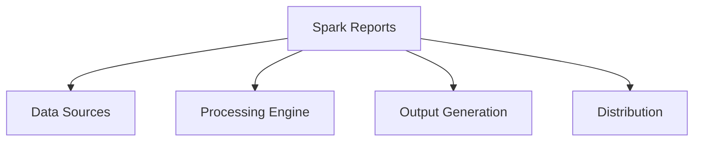
---
## Data Source Integration
1. Structured databases
1. File systems
1. Streaming platforms
1. External APIs
---
## Processing Capabilities
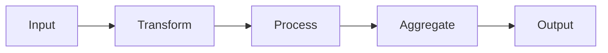
---
## Report Types
1. Batch reports
1. Streaming reports
1. Interactive dashboards
1. Automated alerts
---
## Architecture Overview
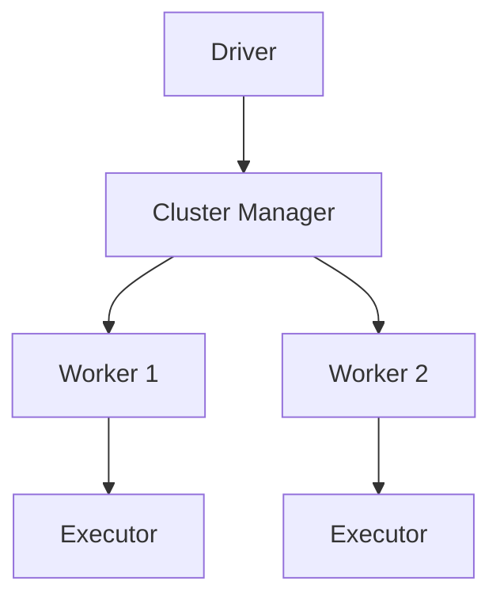
---
## Data Flow Patterns
1. ETL processes
1. Real-time streaming
1. Interactive queries
1. Batch processing
---
## Performance Optimization
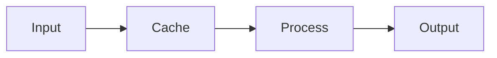
---
## Memory Management
1. Cache settings
1. Heap configuration
1. Off-heap storage
1. Memory fractions
---
## Resource Allocation
1. CPU cores
1. Memory limits
1. Disk space
1. Network bandwidth
---
## Execution Models
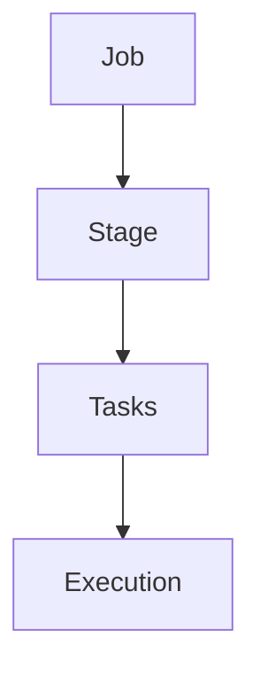
---
## Data Formats
1. CSV files
1. Parquet files
1. JSON documents
1. Avro records
---
## Processing Modes
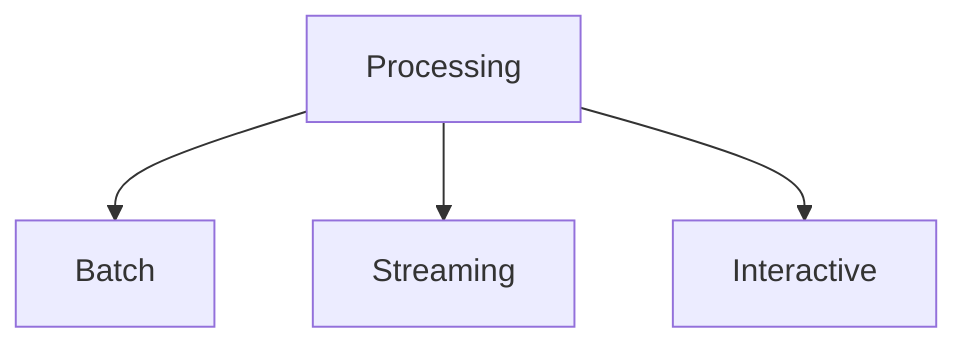
---
## Output Generation
1. PDF reports
1. Excel sheets
1. Web dashboards
1. API responses
---
## Security Features
1. Authentication
1. Authorization
1. Encryption
1. Audit logging
---
## Monitoring System

---
## Error Handling
1. Retry logic
1. Fallback options
1. Error logging
1. Alert systems
---
## Data Quality
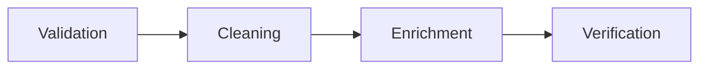
---
## Scheduling Options
1. Cron-based
1. Event-driven
1. On-demand
1. Continuous
---
## Performance Metrics
1. Execution time
1. Resource usage
1. Throughput
1. Latency
---
## Integration Points
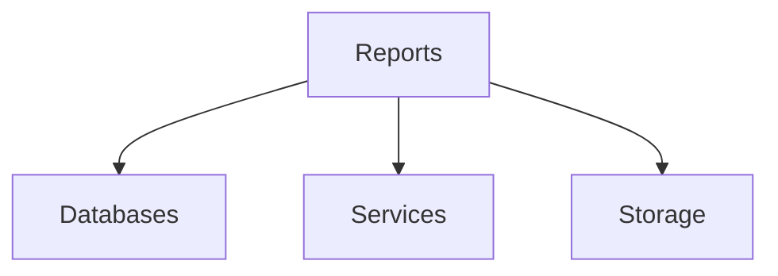
---
## Optimization Techniques
1. Partition tuning
1. Query optimization
1. Caching strategies
1. Resource management
---
## Deployment Models

---
## Configuration Management
1. Environment settings
1. Resource allocation
1. Security policies
1. Performance tuning
---
## Testing Approaches
1. Unit tests
1. Integration tests
1. Performance tests
1. Load tests
---
## Monitoring Tools
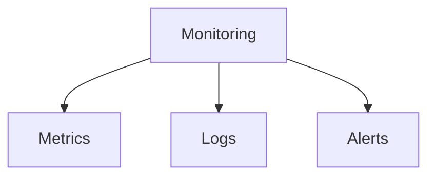
---
## Maintenance Tasks
1. Version updates
1. Configuration changes
1. Resource optimization
1. Security patches
---
## Report Templates
1. Standard layouts
1. Custom designs
1. Dynamic elements
1. Interactive components
---
## Data Governance
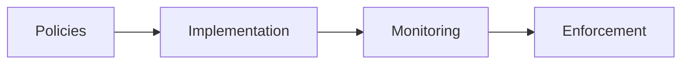
---
## Best Practices
1. Code organization
1. Error handling
1. Performance tuning
1. Security measures
---
## Development Workflow
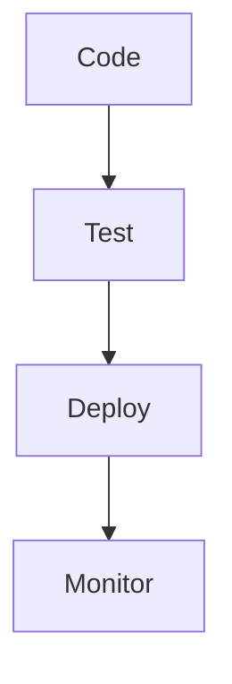
---
## Scalability Features
1. Horizontal scaling
1. Vertical scaling
1. Load balancing
1. Resource elasticity
---
## Data Pipeline Design

---
## Version Control
1. Code versioning
1. Configuration management
1. Deployment tracking
1. Rollback procedures
---
## Documentation Requirements
1. Architecture docs
1. API specifications
1. User guides
1. Operation manuals
---
## Troubleshooting Guide
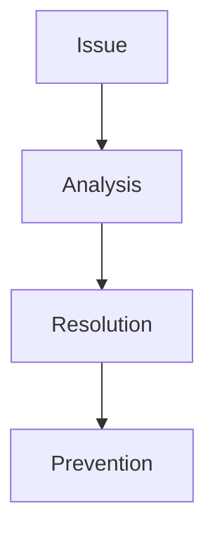
---
## Performance Tuning
1. Query optimization
1. Resource allocation
1. Caching strategies
1. Execution planning
---
## Deployment Options

---
## Security Measures
1. Access control
1. Data encryption
1. Audit logging
1. Compliance checks
---
## Testing Strategy
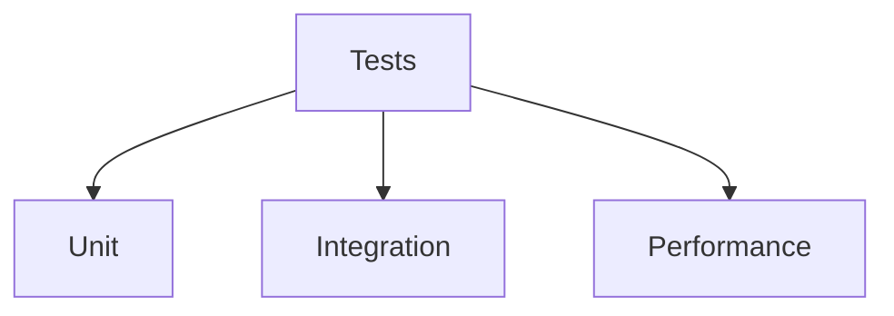
---
## Monitoring Setup
1. Metrics collection
1. Log aggregation
1. Alert configuration
1. Dashboard setup
---
## Resource Management

---
## Data Lifecycle
1. Ingestion
1. Processing
1. Storage
1. Archival
---
## Quality Assurance
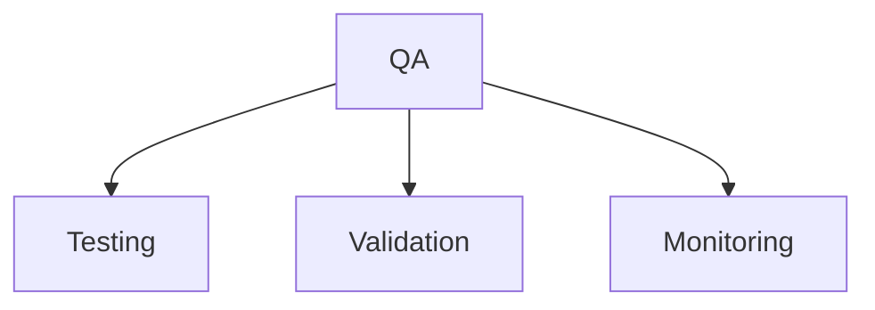
---
## Performance Metrics
1. Response time
1. Throughput
1. Resource usage
1. Error rates
---
## Maintenance Procedures

---
## Future Considerations
1. Scalability needs
1. Technology updates
1. Performance improvements
1. Feature additions
